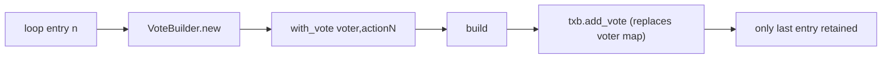
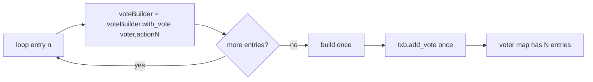

# Fix bulk vote tx losing all but the last vote

## Root cause

In [src/functions/bulkVote.ts](src/functions/bulkVote.ts) lines 126-136 the loop creates a fresh `VoteBuilder` per entry, builds a single-vote result, and calls `txb.add_vote(result)` again and again with the same DRep voter. Conway's `voting_procedures` is `{ + voter => { + gov_action_id => voting_procedure } }`, so each `add_vote` for the same voter replaces the voter's inner action map. Only the last vote survives — confirmed by `eternl-debug-b0e37a59…-unsigned.json` whose body shows one voter with exactly one entry in `votes`.



After the fix:



## Change (single file: [src/functions/bulkVote.ts](src/functions/bulkVote.ts))

Replace the per-iteration `VoteBuilder.new().with_vote(...).build()` + `txb.add_vote(...)` pattern with a single accumulating builder.

Current loop (lines 126-136):

```ts
for (const entry of votes) {
  const txHashNorm = normalizeHashHex(entry.txHash);
  if (!/^[0-9a-fA-F]{64}$/.test(txHashNorm)) {
    throw new Error(`Invalid governance action tx hash: ${entry.txHash}`);
  }
  const govActionId = CML.GovActionId.new(CML.TransactionHash.from_hex(txHashNorm), BigInt(entry.certIndex));
  const voteEnum = mapVote(entry.vote);
  const procedure = cmlAnchor ? CML.VotingProcedure.new(voteEnum, cmlAnchor) : CML.VotingProcedure.new(voteEnum);
  const voteResult = CML.VoteBuilder.new().with_vote(voter, govActionId, procedure).build();
  txb.add_vote(voteResult);
}
```

New loop:

```ts
let voteBuilder = CML.VoteBuilder.new();
for (const entry of votes) {
  const txHashNorm = normalizeHashHex(entry.txHash);
  if (!/^[0-9a-fA-F]{64}$/.test(txHashNorm)) {
    throw new Error(`Invalid governance action tx hash: ${entry.txHash}`);
  }
  const govActionId = CML.GovActionId.new(
    CML.TransactionHash.from_hex(txHashNorm),
    BigInt(entry.certIndex),
  );
  const voteEnum = mapVote(entry.vote);
  const procedure = cmlAnchor
    ? CML.VotingProcedure.new(voteEnum, cmlAnchor)
    : CML.VotingProcedure.new(voteEnum);
  voteBuilder = voteBuilder.with_vote(voter, govActionId, procedure);
}
txb.add_vote(voteBuilder.build());
```

Notes:
- `with_vote` is typed `(voter, gov_action_id, procedure) => VoteBuilder` in [node_modules/@anastasia-labs/cardano-multiplatform-lib-browser/cardano_multiplatform_lib.d.ts](node_modules/@anastasia-labs/cardano-multiplatform-lib-browser/cardano_multiplatform_lib.d.ts) line 14599, so capturing the return value is required.
- `txb.add_vote` is called exactly once with the fully populated builder, so the voter's inner action map is never clobbered.
- No other changes — `voter`, `cmlAnchor`, coin selection, change balancing, signing, witness check, and submit logic stay as-is.

## Verification

After the patch, build a tx with multiple non-skip votes and inspect the unsigned CBOR (e.g. the Eternl debug dump or `builtTx.body().to_json()`). Expect:

- `voting_procedures` contains exactly one voter entry (the DRep key hash).
- That voter's `votes` array has exactly N entries (N = number of non-skip selections), one per `(txHash, certIndex)`.
- Witness count is unaffected by N.

## Out of scope

- The coin-selection plan in [.cursor/plans/coin_selection_for_vote_tx_9f94e68b.plan.md](.cursor/plans/coin_selection_for_vote_tx_9f94e68b.plan.md), no-collateral plan, and canonical-CBOR plan are independent and unchanged here.
- No de-duplication of `(txHash, certIndex)` is added; the UI already builds entries from unique actions. If desired, that can be a follow-up.