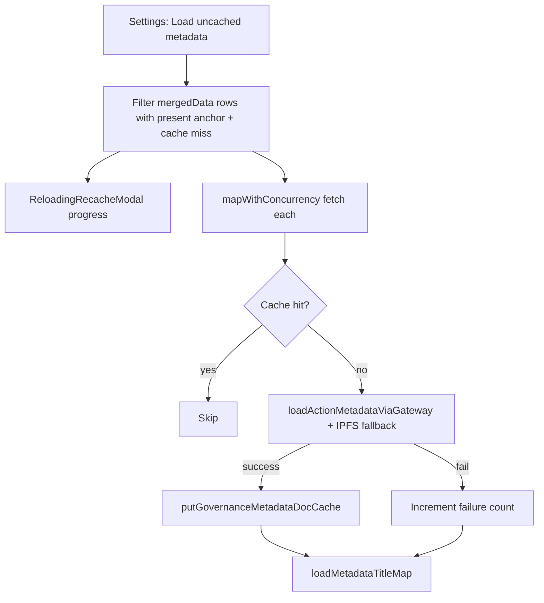

# Bulk-load uncached governance metadata (DRep Voting History)

## Context (wiki + code)

Per [wiki/pages/ctools-drep-voting-history-blockfrost.md](wiki/pages/ctools-drep-voting-history-blockfrost.md), the page has **two metadata layers**:

1. **Anchor pointers** (`proposals` IndexedDB store) — on-chain URL + hash from Blockfrost; already on each row as `actionMetadataAnchor`.
2. **Full CIP-108 documents** (`metadataDocs` store) — populated only when the user clicks **View full metadata**; see [wiki/pages/ctools-governance-actions-live.md](wiki/pages/ctools-governance-actions-live.md) step-2 fetch.

The **View full metadata** button ([`src/components/DRepVotingHistoryRowDetails.tsx`](src/components/DRepVotingHistoryRowDetails.tsx)) opens [`GovernanceActionMetadataModal`](src/components/GovernanceActionMetadataModal.tsx), which:

1. Checks IndexedDB via `getGovernanceMetadataDocCache` + `isGovernanceMetadataDocCacheHit(entry, anchorUrl)`.
2. On miss, calls `loadActionMetadataViaGateway(anchorUrl, IPFS_GATEWAYS[0])` — **not** raw `loadActionMetadata`, because IPFS anchors must be resolved through a gateway ([`resolveMetadataFetchUrl`](src/functions/governanceActionsFetch.ts)).
3. On success, writes `putGovernanceMetadataDocCache` and triggers `onCacheUpdated` → `loadMetadataTitleMap()` for collapsed-row titles.

IPFS error handling in the modal: if `parseIpfsLink(anchorUrl)` is non-null, the user can pick another gateway and **Try again**. Bulk prefetch must auto-retry gateways for IPFS anchors (see below).



## Scope of "uncached"

From current [`mergedData`](src/pages/DRepVotingHistory.tsx) (all mainnet governance proposals, with DRep vote overlay):

Include a row when:
- `actionMetadataAnchor.status === 'present'`
- `actionMetadataAnchor.url` is set
- **Not** a cache hit: `!isGovernanceMetadataDocCacheHit(cache.get(key), anchorUrl)`

Skip rows with `unknown` / `absent` anchors (nothing to fetch). This may be a large set (every GA with metadata on-chain); concurrency limits keep it manageable.

## Implementation

### 1. Extract shared fetch-and-cache helper

**New file:** [`src/utils/governanceMetadataDocFetch.ts`](src/utils/governanceMetadataDocFetch.ts)

Extract logic currently duplicated in the modal into reusable functions:

```typescript
// Pseudocode — mirror modal behavior exactly
async function fetchGovernanceMetadataDocViaGateways(anchorUrl: string) {
  const gateways = parseIpfsLink(anchorUrl) ? IPFS_GATEWAYS : [IPFS_GATEWAYS[0]];
  let last;
  for (const gateway of gateways) {
    const result = await loadActionMetadataViaGateway(anchorUrl, gateway);
    if (!result.metadataError) return result;
    last = result;
    if (!result.metadataError.retryable) break; // schema_mismatch, invalid_json — same on all gateways
  }
  return last!;
}

async function ensureGovernanceMetadataDocCached(params: {
  cacheKey: string;
  anchorUrl: string;
  hashHex?: string;
}): Promise<'cached' | 'fetched' | 'failed'>
```

- Cache hit → return `'cached'` (no network).
- Success → `putGovernanceMetadataDocCache` (same entry shape as modal) → `'fetched'`.
- Failure → `'failed'` (do **not** cache errors; same rule as existing cache plan).

**Refactor** [`GovernanceActionMetadataModal.tsx`](src/components/GovernanceActionMetadataModal.tsx) to call `ensureGovernanceMetadataDocCached` / `fetchGovernanceMetadataDocViaGateways` so single-view and bulk paths stay identical. Modal keeps its gateway picker for manual retry on error (bulk auto-fallback covers the common case).

### 2. Bulk orchestrator

**Same file:** `governanceMetadataDocFetch.ts`

```typescript
export interface MetadataPrefetchItem {
  cacheKey: string;
  anchorUrl: string;
  hashHex?: string;
}

export interface MetadataPrefetchProgress {
  current: number;
  total: number;
  fetched: number;
  failed: number;
  skipped: number; // already cached
}

export async function prefetchUncachedGovernanceMetadataDocs(
  items: MetadataPrefetchItem[],
  options: { concurrency?: number; onProgress?: (p: MetadataPrefetchProgress) => void }
): Promise<{ fetched: number; failed: number; skipped: number }>
```

- Default concurrency **6** (matches Live Governance Actions step-2 in [`governanceActionsFetch.ts`](src/functions/governanceActionsFetch.ts)).
- Process sequentially numbered items; call `onProgress` after each completes.
- No Blockfrost batch cooldown (these are IPFS/HTTP fetches, not Blockfrost).

Add lightweight unit tests (gateway fallback stops on non-retryable errors; progress counts).

### 3. Page state and handler

**File:** [`src/pages/DRepVotingHistory.tsx`](src/pages/DRepVotingHistory.tsx)

- Extend `loadMetadataTitleMap` → `refreshMetadataDocCacheState` to also store `metadataDocCache: Map<string, CachedGovernanceMetadataDoc>` (needed for accurate uncached count, since `metadataTitleByKey` omits entries without titles).
- Add `useMemo` for `uncachedMetadataCount` from `mergedData` + `metadataDocCache`.
- Add state: `prefetchingMetadata`, reuse `recacheModalOpen` + `recacheProgress` **or** parallel state with same `ReloadingRecacheModal` (prefer separate `prefetchingMetadata` flag to avoid collision with recache, but reuse the same modal component).
- Handler `handleLoadUncachedMetadata`:
  1. Build item list from `mergedData` (filter as above).
  2. If empty, show brief modal message and return.
  3. Close settings modal; open progress modal with title e.g. **Loading governance metadata**.
  4. Run `prefetchUncachedGovernanceMetadataDocs` with `onProgress` → `"Fetching metadata 12 of 47 (3 failed)…"`.
  5. On finish: `refreshMetadataDocCacheState()`, close modal, optionally surface summary in UI if failures > 0.

Disable settings gear / buttons while `prefetchingMetadata || recaching || loading`.

### 4. Settings modal button

**File:** [`src/components/DRepVotingHistorySettingsModal.tsx`](src/components/DRepVotingHistorySettingsModal.tsx)

New props:

| Prop | Purpose |
|------|---------|
| `uncachedMetadataCount` | Rows with anchor but no doc cache |
| `onLoadUncachedMetadata` | Trigger bulk prefetch |
| `loadUncachedDisabled` | No uncached rows or busy |

Add stat line and button (between existing stats and actions):

- Stat: `Uncached metadata documents: **{uncachedMetadataCount}**`
- Button: **Load {uncachedMetadataCount} uncached governance metadata documents** (disabled when count is 0)
- On click: call handler and close modal (same pattern as other buttons)

Wire props from `DRepVotingHistory.tsx` with `loadUncachedDisabled={uncachedMetadataCount === 0 || loading || recaching || prefetchingMetadata || anchorLoading}`.

### 5. Progress modal copy

**File:** [`src/utils/drepVotingHistoryRecacheHelpers.ts`](src/utils/drepVotingHistoryRecacheHelpers.ts) (or co-locate with prefetch util)

Add helpers:

- `METADATA_PREFETCH_MODAL_TITLE = 'Loading governance metadata'`
- `formatMetadataPrefetchDescription(current, total, failed)` → e.g. `Fetching metadata 5 of 23…` (append failure count when > 0)

Reuse [`ReloadingRecacheModal`](src/components/ReloadingRecacheModal.tsx) — no new modal component.

## Files touched

| File | Change |
|------|--------|
| [`src/utils/governanceMetadataDocFetch.ts`](src/utils/governanceMetadataDocFetch.ts) | **New** — shared fetch/cache + bulk orchestrator |
| [`src/utils/governanceMetadataDocFetch.test.ts`](src/utils/governanceMetadataDocFetch.test.ts) | **New** — unit tests |
| [`src/components/GovernanceActionMetadataModal.tsx`](src/components/GovernanceActionMetadataModal.tsx) | Refactor to use shared fetch helper |
| [`src/pages/DRepVotingHistory.tsx`](src/pages/DRepVotingHistory.tsx) | Cache state, uncached count, handler, modal wiring |
| [`src/components/DRepVotingHistorySettingsModal.tsx`](src/components/DRepVotingHistorySettingsModal.tsx) | New stat + button |

## Testing checklist

- Settings shows correct uncached count after page load and after clearing cache / viewing one doc manually.
- Button disabled when count is 0 or page is loading/recaching.
- Bulk run populates IndexedDB; collapsed rows show cached titles without opening modal.
- **View full metadata** still works (cache hit instant; miss fetches same as before).
- IPFS anchor: bulk retries alternate gateways on retryable failures; non-retryable (schema mismatch) stops after first gateway.
- Non-IPFS anchor: single direct fetch (gateway index 0 path returns anchor URL unchanged).
- Progress modal shows current/total; completes and refreshes title subtitles.

## Out of scope

- Prefetching vote **rationale** documents (different anchor type; `IpfsLinkModal` only, no CIP-108 cache).
- Cancelling mid-prefetch (same as recache — no abort UI today).
- Wiki page update (feature addition; optional follow-up to [ctools-drep-voting-history-blockfrost.md](wiki/pages/ctools-drep-voting-history-blockfrost.md)).
