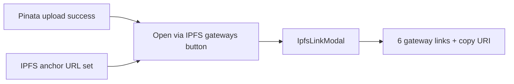

# Bulk vote: IPFS gateway modal after upload

## Problem

After a successful Pinata upload, [`DRepBulkVote.tsx`](src/pages/DRepBulkVote.tsx) shows the uploaded URI as a plain anchor:

```717:723:src/pages/DRepBulkVote.tsx
{pinataUploadResult && (
  <div style={{ color: '#bbf7d0', fontSize: '0.85rem', display: 'grid', gap: '0.25rem' }}>
    <div>
      Uploaded:{' '}
      <a href={pinataUploadResult.url} target="_blank" rel="noopener noreferrer" style={{ color: '#93c5fd' }}>
        {pinataUploadResult.url}
```

`ipfs://` URLs do not open usefully in the browser. DRep Voting History already solves this with [`IpfsLinkModal`](src/components/IpfsLinkModal.tsx), which lists six public gateways (IPFS.io, Cloudflare, dweb.link, Pinata, w3s.link, 4everland), copy-URI, and anchor hash display.

## Approach

**Reuse `IpfsLinkModal` unchanged** — no new component or gateway logic. Wire it into bulk vote the same way [`DRepVotingHistory.tsx`](src/pages/DRepVotingHistory.tsx) does (state + modal at page bottom).



## Changes (single file)

**[`src/pages/DRepBulkVote.tsx`](src/pages/DRepBulkVote.tsx)**

1. **Imports**
   - `IpfsLinkModal` from `../components/IpfsLinkModal`
   - `../components/IpfsLinkModal.css`
   - `parseIpfsLink` from `../utils/ipfsGateways` (to conditionally show the button for IPFS URLs only)

2. **State**
   ```ts
   const [ipfsModal, setIpfsModal] = useState<{
     url: string;
     hashHex?: string;
     title: string;
   } | null>(null);
   ```

3. **Upload success UI** (replace the `<a href={ipfs://…}>` link)
   - Show the URI as `<code>` (read-only, word-break)
   - Add a button, e.g. **Open via IPFS gateways**, that calls:
     ```ts
     setIpfsModal({
       url: pinataUploadResult.url,
       hashHex: pinataUploadResult.hashHex,
       title: 'Open uploaded vote rationale',
     })
     ```
   - Keep the hash line and “anchor fields updated” message as-is

4. **Optional CIP-100 anchor section** (small UX win, same pattern as voting history)
   - When `attachAnchor` is on and `parseIpfsLink(anchorUrl)` is non-null, show the same **Open via IPFS gateways** button next to the URL/hash inputs (uses current `anchorUrl` + `anchorHashHex`)
   - Non-IPFS URLs (https metadata hosts) stay unchanged — `IpfsLinkModal` already handles those with a fallback “open original URL” panel

5. **Modal render** (near end of JSX, alongside other overlays)
   ```tsx
   <IpfsLinkModal
     open={ipfsModal !== null}
     url={ipfsModal?.url ?? ''}
     hashHex={ipfsModal?.hashHex}
     title={ipfsModal?.title}
     onClose={() => setIpfsModal(null)}
   />
   ```

## Button styling

Match voting history: transparent background, underlined `#7dd3fc` text button (or reuse existing `Button` component for consistency with the upload panel — either is fine; prefer the voting-history link style for “open metadata” actions).

## Out of scope

- No changes to `IpfsLinkModal`, gateway list, or Pinata upload flow
- No inline gateway fetch / metadata preview (that is `GovernanceActionMetadataModal`, CIP-108 only)
- No new tests (no existing bulk-vote page tests; component is already covered indirectly via `ipfsGateways.test.ts`)

## Verification

Manual check on bulk vote page:
1. Upload rationale via Pinata → success area shows URI + gateway button → modal lists all gateways and opens correct URLs
2. Manually set `ipfs://…` in anchor fields → gateway button appears and works
3. Escape / overlay click closes modal
4. Non-IPFS https anchor URL → no gateway button in anchor section (upload path still works for Pinata `ipfs://` results)
