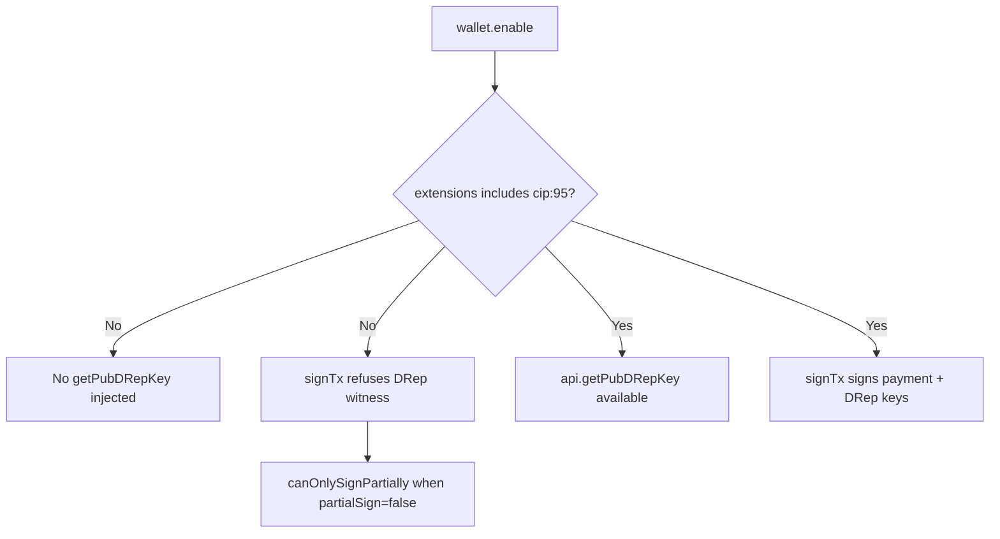

# Fix CIP-95 DRep auto-detect and signing on DRepBulkVote

## Root cause

Both errors in `DRepBulkVote.tsx` stem from never opting into the CIP-95 extension when calling `wallet.enable()`. Eternl (and Lace) only inject the CIP-95 methods and only sign with the DRep key when the dapp passes `{ extensions: [{ cip: 95 }] }` to `enable()`.



Secondary, latent bugs that would still bite once the extension is on:

- [src/functions/drepCredential.ts](src/functions/drepCredential.ts) line 25 only looks at `api.cip95.getPubDRepKey`. Eternl and Lace expose it at the top of `api` (e.g. `api.getPubDRepKey`).
- The returned value is CBOR-encoded (`5820...` for 32-byte raw pubkey or `5840...` for a 64-byte Bip32 extended pubkey). Hashing the raw hex without stripping the CBOR header produces the wrong key hash, which would still cause `canOnlySignPartially` because the on-chain Voter would not match the wallet's DRep key.

## Changes

### 1. New helper to request CIP-95 at enable time

In [src/functions/drepCredential.ts](src/functions/drepCredential.ts) add:

```ts
export async function enableWalletWithCip95(walletName: string): Promise<any> {
  const wallet = (window as any).cardano?.[walletName];
  if (!wallet) throw new Error(`Wallet ${walletName} is not available`);
  try {
    return await wallet.enable({ extensions: [{ cip: 95 }] });
  } catch (err) {
    console.warn('enable({extensions:[{cip:95}]}) failed, falling back to plain enable', err);
    return await wallet.enable();
  }
}
```

We keep the fallback for wallets that throw on unknown extension args, so the page still loads for non-CIP-95 wallets.

### 2. Robust `deriveDRepFromWallet`

Replace the body of `deriveDRepFromWallet` in [src/functions/drepCredential.ts](src/functions/drepCredential.ts) so it:

- Looks up `getPubDRepKey` at `api.getPubDRepKey`, then `api.cip95?.getPubDRepKey`, then `api.experimental?.getPubDRepKey`.
- Strips a leading CBOR bytestring header (`0x58 0xXX` for short bytestrings) before hashing.
- If the resulting bytes are 64 long (Bip32 extended pubkey: 32-byte pubkey + 32-byte chaincode), hash only the first 32 bytes. If 32, hash all 32. Anything else: throw a clear error.

Sketch:

```ts
function decodeCborBytestring(hex: string): Uint8Array {
  const all = hexToBytes(hex.trim());
  if (all.length >= 2 && all[0] === 0x58) {
    const len = all[1];
    if (all.length === 2 + len) return all.slice(2);
  }
  return all;
}

function rawDRepPubKeyBytes(decoded: Uint8Array): Uint8Array {
  if (decoded.length === 32) return decoded;
  if (decoded.length === 64) return decoded.slice(0, 32);
  throw new Error(`Unexpected DRep pubkey length ${decoded.length}; expected 32 or 64 bytes`);
}
```

Then `blake2b_224(rawDRepPubKeyBytes(decodeCborBytestring(pubHex)))` → `CML.Ed25519KeyHash.from_raw_bytes(...)` for the bech32 + hex hash, unchanged.

### 3. Use the new helper on DRep page

In [src/pages/DRepBulkVote.tsx](src/pages/DRepBulkVote.tsx) replace both `await wallet.enable()` calls (lines 177 and 332) with `await enableWalletWithCip95(walletName)`. Drop the now-unused `wallet = (window as any).cardano[...]` lookups at those two sites.

Update the failure message around line 183 to reflect the new reality:

```ts
'This wallet does not expose CIP-95 getPubDRepKey (extension may have been declined). Use manual DRep override or approve CIP-95 in a CIP-95-capable wallet (e.g. Eternl, Lace).'
```

### 4. Clearer signing error in `bulkVote.ts`

In [src/functions/bulkVote.ts](src/functions/bulkVote.ts) around line 173, wrap `await api.signTx(unsignedTxHex, false)` in a `try/catch` and re-throw with a friendlier message when the wallet returns the CIP-30 "partial sign" code, e.g.:

> The wallet signed only the payment witnesses, not the DRep witness. Usually this means the CIP-95 extension was not enabled on this connection, or the DRep ID does not match the wallet's DRep key.

We keep `partialSign=false` because we need the DRep witness for the votes to be valid; switching to `partialSign=true` would just push the failure to node submission.

### Out of scope

- Refactoring [src/components/ConnectWallet.tsx](src/components/ConnectWallet.tsx) global wallet selection to opt into CIP-95 — the bulk-vote page does its own targeted re-enable, which is enough.
- Hardware wallet quirks (Ledger Cardano app + CIP-95 — Eternl proxies this transparently).