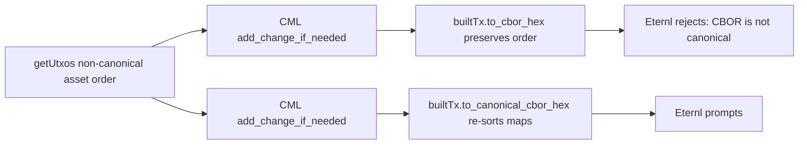

# Fix: Eternl "CBOR is not canonical" on bulk vote tx

## Root cause

In the debug capture, the change output's multiasset policy map is `[01fb..., f0ff..., d768...]`. Canonical CBOR requires map keys sorted by lexicographic byte order, so the correct order is `[01fb..., d768..., f0ff...]`. Eternl validates canonical encoding and rejects the unsigned tx before showing the prompt.

[src/functions/bulkVote.ts](src/functions/bulkVote.ts) currently serializes via `to_cbor_hex()`, which CML documents as encoding-preserving:

```
* Serialize this type to CBOR bytes encoded as a hex string (useful for working with CIP30).
* This type type supports encoding preservation so this will preserve round-trip CBOR formats.
```

So whatever asset order Eternl's `getUtxos()` happens to use bleeds through into the change output we hand back to it.

CML also exposes the canonical sibling:

```
* Serialize this type to CBOR bytes using canonical CBOR encodings as hex bytes
to_canonical_cbor_hex(): string;
```



## Change

In [src/functions/bulkVote.ts](src/functions/bulkVote.ts) (only file affected):

- Line 171: `const unsignedTxHex = builtTx.to_cbor_hex();` becomes `const unsignedTxHex = builtTx.to_canonical_cbor_hex();`.
- Around line 200: `const signedTxHex = signedTx.to_cbor_hex();` becomes `const signedTxHex = signedTx.to_canonical_cbor_hex();`.

Why both: the wallet signs the blake2b-256 hash of the canonical body bytes. We must submit the same canonical encoding to the node so the signatures match.

## Out of scope

- [src/functions/treasuryDonation.ts](src/functions/treasuryDonation.ts) still calls `to_cbor_hex()` in two places. The user reports donations work in practice (single change output, single policy), so we leave it alone unless they want a defensive sweep.
- No UI changes; `submitError` already surfaces wallet error messages.