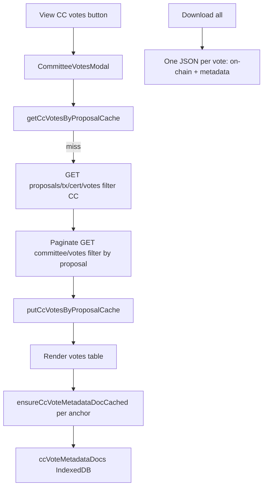

# Constitutional Committee votes modal (DRep Voting History)

## Context

The expanded row UI lives in [`DRepVotingHistoryRowDetails.tsx`](src/components/DRepVotingHistoryRowDetails.tsx) under the **Governance action** section. CC vote display does **not** exist in `src/` today.

Blockfrost exposes two relevant endpoints (v0.1.88+):

| Endpoint | Use |
|----------|-----|
| `GET /governance/proposals/{tx_hash}/{cert_index}/votes` | Proposal-scoped vote list; filter `voter_role === 'constitutional_committee'` |
| `GET /governance/committee/votes` | Global CC vote history with `metadata_url` / `metadata_hash` per vote |

The proposal-votes endpoint is complete for a single action but lacks anchor fields. The committee-votes endpoint has anchors but is global — merge by matching `tx_hash` (vote tx) and `proposal_tx_hash` + `proposal_index` (maps to `cert_index`).



## Data layer

### 1. Types and fetch (`src/utils/ccVotesFetch.ts`)

```ts
interface BlockfrostProposalVote {
  tx_hash: string;
  cert_index: number;
  voter_role: 'constitutional_committee' | 'drep' | 'spo';
  voter: string;
  vote: 'yes' | 'no' | 'abstain';
}

interface BlockfrostCommitteeVote {
  tx_hash: string;
  voter_hot_id: string;
  proposal_tx_hash: string;
  proposal_index: number;
  vote: 'yes' | 'no' | 'abstain';
  metadata_url: string | null;
  metadata_hash: string | null;
  block_time: number;
  // ...
}

interface CcVoteForProposal {
  voteTxHash: string;
  voterHotId: string;       // from committee votes when available, else voter from proposal votes
  vote: string;
  metadataUrl: string | null;
  metadataHash: string | null;
  blockTime?: number;
}
```

**`fetchCcVotesForProposal({ apiKey, proposalTxHash, proposalCertIndex })`**:

1. Reuse [`fetchAllPages`](src/functions/governanceActionsFetch.ts) on `/governance/proposals/{tx}/{cert}/votes` → keep `constitutional_committee` rows.
2. Paginate `/governance/committee/votes` (reuse `fetchAllPages`, `order=desc`) and collect rows where `proposal_tx_hash` matches (normalized hex) and `proposal_index === proposalCertIndex`.
3. Merge by vote `tx_hash`: committee-vote row supplies `voter_hot_id`, `metadata_url`, `metadata_hash`, `block_time`; proposal-vote row is fallback when committee row missing.
4. Return sorted list (e.g. by `block_time` desc, then `voter_hot_id`).

**Cache** — new IndexedDB store in [`drepVotingHistoryCache.ts`](src/utils/drepVotingHistoryCache.ts):

- Bump `DREP_VOTING_HISTORY_DB_VERSION` `4` → `5`
- Add `STORE_CC_VOTES_BY_PROPOSAL` (key = `proposalCacheKey(txHash, certIndex)`)

```ts
interface CachedCcVotesByProposal {
  votes: CcVoteForProposal[];
  cachedAtSec: number;
}
```

No TTL; invalidate only via settings clear (same as other doc caches).

### 2. CIP-136 metadata parser (`src/functions/cip136VoteMetadata.ts`)

CIP-136 extends CIP-100. Add `CcVoteMetadata` + `parseCip136VoteMetadata(payload)`:

- Read `body` (fallback root), same pattern as [`parseCip100RationaleMetadata`](src/functions/cip100RationaleDocument.ts)
- Fields: `summary`, `rationaleStatement`, `precedentDiscussion`, `counterargumentDiscussion`, `conclusion`, `internalVote` (constitutional / unconstitutional / abstain / didNotVote / againstVote)
- Return `null` only when no recognizable CIP-136/CIP-100 body content
- Unit tests with the [CIP-169 committee-vote example](https://github.com/cardano-foundation/CIPs/commit/a9e0a7d6f3d52eed3443fd3d7c2700a266183ec8)

### 3. Metadata doc cache + fetch

Mirror the vote-rationale stack:

| Layer | File |
|-------|------|
| Cache | `src/utils/ccVoteMetadataDocCache.ts` |
| Fetch | `src/utils/ccVoteMetadataDocFetch.ts` |

- Store: `STORE_CC_VOTE_METADATA_DOCS` (key = `${proposalKey}|${voteTxHash}`)
- Entry: `{ metadata, rawPayload, anchorUrl, hashHex?, cachedAtSec }` + absent sentinel (`metadata: null`, `anchorUrl: ''`)
- Cache-hit rule: `entry.anchorUrl === currentAnchorUrl`
- `ensureCcVoteMetadataDocCached`: cache-first → IPFS gateway fallback via existing [`resolveMetadataFetchUrl`](src/functions/governanceActionsFetch.ts) / `IPFS_GATEWAYS` pattern from [`voteRationaleDocFetch.ts`](src/utils/voteRationaleDocFetch.ts)
- Concurrency `6` when prefetching all anchored votes on modal load

### 4. Download bundle helper (`src/functions/ccVoteDownload.ts`)

```ts
export function ccVoteDownloadFilename(
  voterHotId: string,
  proposalLabel: string,
): string {
  const voter = voterHotId.replace(/^cc_hot1/, '').slice(0, 12);
  return `cc-vote-${voter}-${proposalLabel}.json`;
}

export function buildCcVoteDownloadBundle(
  vote: CcVoteForProposal,
  metadataEntry: CachedCcVoteMetadataDoc | null,
): object {
  return {
    proposal: { /* txHash, certIndex, proposalId if passed */ },
    onChain: { ...vote fields },
    metadata: metadataEntry?.metadata ?? null,
    rawMetadata: metadataEntry?.rawPayload ?? null,
    metadataAnchor: vote.metadataUrl ? { url: vote.metadataUrl, hash: vote.metadataHash } : null,
  };
}
```

**Download all** loops votes and calls [`downloadJson`](src/functions/downloadJson.ts) once per vote (stagger ~100ms between clicks to avoid browser blocking). Include votes without metadata (on-chain fields only, `metadata: null`).

## UI

### 5. Button in expanded governance action section

In [`DRepVotingHistoryRowDetails.tsx`](src/components/DRepVotingHistoryRowDetails.tsx), add a field after **Action metadata**:

- Label: **Constitutional committee**
- Button: **View CC votes** (`btn text-xs py-1 px-2`, same as "View full metadata")
- New callback prop: `onOpenCcVotesModal({ proposalId, proposalTxHash, proposalCertIndex })`

Wire state in [`DRepVotingHistory.tsx`](src/pages/DRepVotingHistory.tsx) (same pattern as `metadataModal` / `GovernanceActionMetadataModal`).

### 6. `CommitteeVotesModal.tsx` (new)

Pattern: [`GovernanceActionMetadataModal.tsx`](src/components/GovernanceActionMetadataModal.tsx) shell (`createPortal`, `IpfsLinkModal.css` overlay/panel, Escape to close).

**Props**: `open`, `proposalId`, `proposalTxHash`, `proposalCertIndex`, `proposalLabel`, `apiKey`, `onClose`, `onCacheUpdated?`

**States**:

| Phase | UI |
|-------|-----|
| Loading votes | Spinner + "Loading constitutional committee votes…" |
| Votes loaded | Table + toolbar |
| Error | Message + Retry |

**Toolbar**:

- **Download all** — bundled JSON per vote (user-selected format)
- Optional: vote count badge

**Table columns** (reuse `.drep-voting-history-table` styling inside modal scroll area):

| Column | Content |
|--------|---------|
| Member | Truncated `voter_hot_id` (`cc_hot1…`) |
| Vote | Colored badge (reuse vote color pattern from row details) |
| Vote tx | Cardanoscan link |
| Metadata | Loading / Summary excerpt / "—" / Error |
| Actions | **View** opens nested formatted/JSON sub-view (inline expand or small secondary modal); IPFS gateway retry on fetch failure |

On open:

1. Load vote list from cache or `fetchCcVotesForProposal`
2. For votes with `metadata_url`, prefetch metadata docs (concurrency 6)
3. Update table rows as each metadata doc resolves

**Formatted view** (`CcVoteMetadataView.tsx`): render CIP-136 fields — `summary` as heading, markdown-ish long fields as pre-wrapped text (match [`VoteRationaleView.tsx`](src/components/VoteRationaleView.tsx) simplicity).

### 7. Settings modal

Update [`DRepVotingHistorySettingsModal.tsx`](src/components/DRepVotingHistorySettingsModal.tsx):

- Stat: "CC vote lists cached: **n**"
- Stat: "CC vote metadata documents cached: **n**"
- Clear buttons for both stores
- Intro copy mentions CC votes / CIP-136

## Files to touch

| File | Change |
|------|--------|
| `src/utils/drepVotingHistoryCache.ts` | DB v5 + two new stores |
| `src/utils/ccVotesByProposalCache.ts` (new) | Vote-list cache CRUD |
| `src/utils/ccVotesFetch.ts` (new) | Blockfrost fetch + merge |
| `src/utils/ccVotesFetch.test.ts` (new) | Merge logic unit tests |
| `src/functions/cip136VoteMetadata.ts` (new) | CIP-136 parser |
| `src/functions/cip136VoteMetadata.test.ts` (new) | Parser tests |
| `src/utils/ccVoteMetadataDocCache.ts` (new) | Metadata doc cache |
| `src/utils/ccVoteMetadataDocFetch.ts` (new) | ensure-cached fetch |
| `src/functions/ccVoteDownload.ts` (new) | Bundle + filename helpers |
| `src/functions/ccVoteDownload.test.ts` (new) | Filename tests |
| `src/components/CcVoteMetadataView.tsx` (new) | Formatted CIP-136 renderer |
| `src/components/CommitteeVotesModal.tsx` (new) | Modal + table + download |
| `src/components/DRepVotingHistoryRowDetails.tsx` | Button + callback prop |
| `src/pages/DRepVotingHistory.tsx` | Modal state + wiring |
| `src/components/DRepVotingHistorySettingsModal.tsx` | Cache stats + clear |

## Scope boundaries

**In scope**: CC votes for the selected governance action; IndexedDB caching; table display; per-vote bundled JSON download; CIP-136 metadata load/cache/display.

**Out of scope**: SPO votes; DRep votes beyond existing page; zip archive download; wiki updates; prefetching CC votes for all proposals on page load.

## Verification

1. Open DRep Voting History → expand a governance action with known CC votes → **View CC votes**
2. Table shows member IDs, vote disposition, tx links; metadata column fills in as docs load
3. Reload page → reopen modal → vote list and cached metadata load without refetch
4. **Download all** saves one `.json` per vote with `onChain` + `metadata`/`rawMetadata` fields
5. Settings → clear CC caches → next open refetches
6. Action with zero CC votes shows empty state (not an error)
7. Run new unit tests for merge, parser, and filename helpers

## Risk note

First open for a proposal paginates `/governance/committee/votes` to enrich anchors. This is cached per proposal afterward. If Blockfrost committee endpoints are unavailable on a given API tier, surface a clear error in the modal with Retry.
