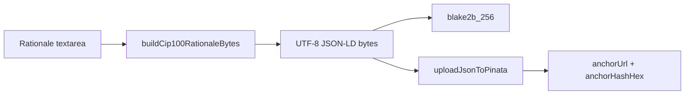

# Refine CIP-100 vote metadata JSON

## Problem

[`src/functions/cip100RationaleDocument.ts`](src/functions/cip100RationaleDocument.ts) currently builds:

```ts
{ hashAlgorithm: 'blake2b-256', body: { rationale: '<text>' } }
```

Your bad example ([`vote-metadata-bad-example.json`](vote-metadata-bad-example.json)) matches that output: no JSON-LD, wrong field name, missing `authors`, compact serialization.

Your good examples ([`vote-metadata-example-1.json`](vote-metadata-example-1.json), [`vote-metadata-example-2.json`](vote-metadata-example-2.json)) are proper **CIP-100** vote-comment anchors:

| Field | Good examples | Current code |
|-------|---------------|--------------|
| `@context` | Full inline CIP-100 JSON-LD map | Absent |
| `authors` | `[]` | Absent |
| `body` | `{ "comment": "<markdown>" }` | `{ "rationale": "..." }` |
| `hashAlgorithm` | Last top-level key | First |
| Bytes | Pretty-printed (`JSON.stringify(..., null, 2)`) | Minified `JSON.stringify(doc)` |

**Wiki grounding:** [Governance metadata framework (CIP-100)](wiki/pages/governance-metadata-framework-cip100.md) defines `body.comment` as freeform author commentary. `rationale` belongs to **CIP-108 governance action** metadata ([wiki/pages/governance-action-metadata-cip108.md](wiki/pages/governance-action-metadata-cip108.md)), which is why [`governanceActionsFetch.ts`](src/functions/governanceActionsFetch.ts) parses `body.rationale` when fetching **proposal** anchors—not for DRep vote rationale documents.

Anchor hashing remains **blake2b-256 of raw uploaded bytes** (same bytes for Pinata upload and on-chain hash); changing serialization changes the hash, so users must re-upload after this fix.



## Implementation (single file + light UI copy)

### 1. Fix document builder — [`src/functions/cip100RationaleDocument.ts`](src/functions/cip100RationaleDocument.ts)

- Add a module-level constant `CIP100_INLINE_CONTEXT` copied verbatim from your example files (both examples share the same `@context` block).
- Build the document in **insertion order** to match your examples:

```ts
{
  '@context': CIP100_INLINE_CONTEXT,
  authors: [],
  body: { comment: rationaleText },
  hashAlgorithm: 'blake2b-256',
}
```

- Serialize with **`JSON.stringify(doc, null, 2)`** (2-space indent, no trailing newline unless examples include one—they do not).
- Update the TypeScript interface: `body.comment` instead of `body.rationale`; include `@context` and `authors`.
- Keep exported API unchanged: `buildCip100RationaleBytes(rationale: string)` and `hashGovernanceAnchorBytes(bytes)` so [`DRepBulkVote.tsx`](src/pages/DRepBulkVote.tsx) wiring stays the same.

### 2. Optional sanity check (recommended, small)

Add a focused unit test file (e.g. `src/functions/cip100RationaleDocument.test.ts`) if the project test runner is already configured, OR a dev-only assertion in the module guarded behind a comment—prefer a test if Jest is available via CRA:

- Given fixed input `"test"`, assert output parses as JSON and has:
  - `@context.CIP100` string present
  - `authors` === `[]`
  - `body.comment` === `"test"`
  - no `body.rationale`
  - `hashAlgorithm` === `"blake2b-256"`
- Optionally snapshot-hash against a known string to catch accidental serialization drift.

(No test file exists today; skip if adding Jest config is out of scope.)

### 3. Minor UI copy — [`src/pages/DRepBulkVote.tsx`](src/pages/DRepBulkVote.tsx)

Update help text only (no behavior change):

- Panel description: “CIP-100 JSON-LD document with `body.comment`” instead of implying a CIP-108 `rationale` field.
- Placeholder can stay user-friendly (“Explain why you are voting this way”).

### 4. Wiki (optional follow-up)

Not required for the code fix. If you want durable project docs, add a short note under `wiki/pages/` (e.g. extend [ctools DRep bulk vote](.cursor/plans/pinata_rationale_upload_1eb3c84e.plan.md) or a new `ctools-drep-bulk-vote-metadata.md`) stating bulk-vote IPFS uploads use CIP-100 `body.comment`, not CIP-108 `rationale`.

## Out of scope

- CIP-100 author `witness` / wallet `signData` (unsigned `authors: []` matches your examples and wiki note on CIP-119-style empty authors).
- Changing [`governanceActionsFetch.ts`](src/functions/governanceActionsFetch.ts) CIP-108 parsing (correct for governance **actions**).
- Migrating already-uploaded IPFS CIDs (users re-upload to get new hash).

## Manual verification

1. Enter markdown in DRep bulk vote rationale textarea, upload via Pinata.
2. Download/view the IPFS JSON: structure should match example files (context, `authors: []`, `body.comment`, trailing `hashAlgorithm`).
3. Confirm anchor hash on Cardanoscan matches `blake2b-256` of the **exact** downloaded file bytes.
4. Manual anchor URL/hash entry (without Pinata) still works unchanged.
