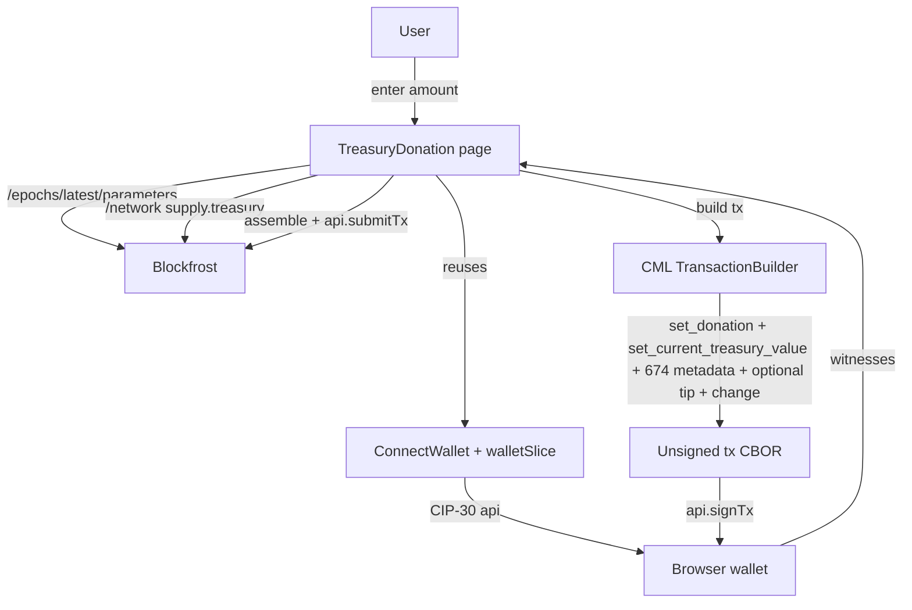

# CML-Based Treasury Donation Page

## Scope

Build a new `/donate-treasury` page where users can:

1. Connect a Cardano CIP-30 wallet through the existing `ConnectWallet` component.
2. Enter a donation amount (ADA) for the Cardano treasury.
3. Optionally include a CIP-20 (label 674) metadata note and an optional tip to `$computerman`, mirroring the existing Tools/Commit pages.
4. Sign & submit the donation transaction.

Transaction construction uses **CML's `TransactionBuilder` directly** (not `lucid.newTx()`). Lucid is only used for the wallet/CIP-30 connection plumbing already present in the app.

## Why CML for this transaction

Treasury donations require setting two fields that lucid-evolution's high-level `TxBuilder` doesn't expose:

- `TransactionBuilder.set_donation(amountLovelace: bigint)`
- `TransactionBuilder.set_current_treasury_value(currentTreasuryLovelace: bigint)`

Both are present on the already-installed `@anastasia-labs/cardano-multiplatform-lib-browser` build (lines 12487–12501 of `node_modules/@anastasia-labs/cardano-multiplatform-lib-browser/cardano_multiplatform_lib.d.ts`). The ledger checks that `current_treasury_value` matches the live treasury at submission, so it must be fetched per-tx.

## High-level data flow



## Files to create

### `src/pages/TreasuryDonation.tsx`
Standalone page modeled after `src/pages/Tools.tsx`:

- Reuses `ConnectWallet` (and the Blockfrost-key UI inside it) for connection.
- Required preconditions before showing the donate button:
  - `isWalletConnected && walletAddress`
  - `useBlockfrost && apiKey` (treasury value & protocol params need a real provider; show an inline notice if missing)
- Inputs:
  - Donation amount in ADA (number input, > 0)
  - Optional checkbox + textarea: "Include CIP-20 note" (defaults to `["donating to Cardano treasury", "using the $computerman donation tool"]`)
  - Optional checkbox + amount: "Tip $computerman" (same UX as `Tools.tsx` lines 198–219)
- Shows live "Current treasury value" (fetched once on mount + on key change), and a small disclaimer that submission must happen before the treasury value changes (rare, but possible).
- Submit handler calls a helper from `src/functions/treasuryDonation.ts` and shows the resulting tx hash with a Cardanoscan link.

### `src/functions/treasuryDonation.ts`
All CML-only logic. Exports two things:

- `fetchTreasuryContext(apiKey: string)` — calls Blockfrost `/network` and `/epochs/latest/parameters`, returns `{ currentTreasuryLovelace: bigint, params: ProtoParams }` already shaped for the CML config builder.
- `buildAndSubmitDonation({ api, donationLovelace, currentTreasuryLovelace, params, changeAddressBech32, metadata?, tip? })`:
  1. `TransactionBuilderConfigBuilder.new()` → fee_algo (LinearFee), coins_per_utxo_byte, key_deposit, pool_deposit, max_value_size, max_tx_size, ex_unit_prices, cost_models (empty for non-script tx), collateral_percentage, max_collateral_inputs → `build()`.
  2. `TransactionBuilder.new(cfg)`.
  3. Pull UTxOs from `api.getUtxos()`, decode each via `CML.TransactionUnspentOutput.from_cbor_hex(...)`, wrap in `SingleInputBuilder.from_transaction_unspent_output(...).payment_key()` and `txb.add_input(...)`.
  4. Optional tip: build a `SingleOutputBuilderResult` paying `williamDetails.paymentAddress` and `txb.add_output(...)`.
  5. Optional metadata: `CML.AuxiliaryData.new()` + `Metadata` + label 674 → `txb.add_auxiliary_data(...)`.
  6. `txb.set_donation(donationLovelace)` and `txb.set_current_treasury_value(currentTreasuryLovelace)`.
  7. `txb.add_change_if_needed(CML.Address.from_bech32(changeAddressBech32))`.
  8. `const signedBuilder = txb.build(ChangeSelectionAlgo.Default, address)` → get `Transaction` body bytes.
  9. CIP-30 sign: `api.signTx(unsignedTxHex, false)` → witness set hex. Assemble final tx with `CML.Transaction.new(body, witnessSet, true, auxData?)` (same pattern already used in `src/functions/index.tsx` lines 4–32).
  10. `api.submitTx(signedTxHex)` → return tx hash.

Imports come **directly from the CML browser package** (no `from '@lucid-evolution/lucid'`):

```typescript
import * as CML from '@anastasia-labs/cardano-multiplatform-lib-browser';
```

### Notes on existing CML usage
`signAndSubmitTx` in [src/functions/index.tsx](src/functions/index.tsx) already does CIP-30 witness assembly via `CML.*` — we mirror that approach but using the browser build directly. We will not call it for this page (it expects a lucid `tx` object).

## Files to modify

### `package.json`
Promote the CML browser build from transitive to a direct dependency so the version is pinned independently of lucid-evolution:

```json
"@anastasia-labs/cardano-multiplatform-lib-browser": "6.0.2-3"
```

(Already installed at this version under `node_modules/`.)

### `src/index.tsx`
Add route(s) for the new page (lines 27–62):

```tsx
import TreasuryDonation from './pages/TreasuryDonation';
// inside <Routes>:
<Route path="donate-treasury" element={<TreasuryDonation />} />
<Route path="treasury-donation" element={<TreasuryDonation />} />
<Route path="donate" element={<TreasuryDonation />} />
```

### `src/pages/Home.tsx`
Add a new tile to `TOOL_LINKS` (lines 3–35):

```tsx
{
  title: 'Treasury Donation',
  description: 'Donate ADA directly to the Cardano treasury. Built with CML for fine-grained tx control.',
  to: '/donate-treasury',
},
```

## Important details / gotchas

- **Treasury value freshness:** `current_treasury_value` is verified by the ledger at submission. Fetch it just before building the tx (not at page mount) to minimize the chance of mismatch. Refresh on error and let the user retry.
- **Emulator path:** The Emulator branch in `setupLucid` ([src/functions/index.tsx](src/functions/index.tsx) lines 49–53) can't supply a real treasury value or protocol params, so the page will hard-require Blockfrost. If `useBlockfrost && apiKey` is false, render an inline note pointing the user at the Blockfrost toggle inside `ConnectWallet`.
- **Cost models:** For a wallet-to-treasury tx there are no scripts, so we pass `CML.CostModels.new()` (empty) into the config and skip collateral inputs. The builder still requires `ex_unit_prices`, `collateral_percentage`, `max_collateral_inputs` to be set — we'll fill from Blockfrost params for correctness.
- **UTxO encoding:** CIP-30 `api.getUtxos()` returns an array of CBOR hex strings already in `TransactionUnspentOutput` format; we decode each directly with CML, avoiding any Lucid conversion utilities.
- **No tests / no docs:** README/wiki updates are intentionally out of scope for this change (keeping it focused on the page itself).