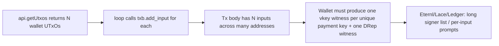
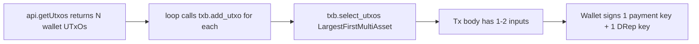

---
name: coin selection for vote tx
overview: Switch the bulk vote tx from "spend every wallet UTxO" to CIP-2 coin selection so the wallet only has to authorize one (or a few) signatures instead of one per wallet UTxO.
todos:
  - id: use-add-utxo
    content: In `buildAndSubmitBulkVotes` (src/functions/bulkVote.ts) change the wallet UTxO loop from `txb.add_input(inputResult)` to `txb.add_utxo(inputResult)` so the UTxOs go into the candidate pool instead of being forced inputs
    status: pending
  - id: call-select-utxos
    content: After the loop and before `add_change_if_needed`, call `txb.select_utxos(CML.CoinSelectionStrategyCIP2.LargestFirstMultiAsset)` so CML picks the minimum inputs needed to cover the fee
    status: pending
isProject: false
---

## Root cause

[src/functions/bulkVote.ts](src/functions/bulkVote.ts) lines 142-146 push every wallet UTxO into the tx as an actual input:

```142:146:src/functions/bulkVote.ts
for (const utxoHex of walletUtxoHexes) {
  const utxo = CML.TransactionUnspentOutput.from_cbor_hex(utxoHex);
  const inputResult = CML.SingleInputBuilder.from_transaction_unspent_output(utxo).payment_key();
  txb.add_input(inputResult);
}
```

`add_change_if_needed` only adds a change output, it does not prune inputs. So if the wallet has, say, 80 UTxOs spread across 80 receive/change addresses, the vote body ends up with 80 inputs. Each unique payment key hash among those inputs requires its own `vkey` witness, plus one for the DRep key. That is what Eternl/Lace/Ledger is showing as an "enormous number of witnesses" - one per unique address it controls in the inputs.

CML exposes two distinct APIs that are easy to confuse:

- `txb.add_input(result)` - forces the UTxO to be a real input.
- `txb.add_utxo(result)` + `txb.select_utxos(strategy)` - puts the UTxO in a candidate pool and lets CML pick only what's needed.

The vote tx has no real outputs (just change), so a CIP-2 selection will normally settle on one input (occasionally two if a UTxO is dust).



After the fix:



## Change (single file: [src/functions/bulkVote.ts](src/functions/bulkVote.ts))

1. Change the wallet UTxO loop body from:

```ts
txb.add_input(inputResult);
```

to:

```ts
txb.add_utxo(inputResult);
```

2. Immediately after the loop (still before `txb.add_change_if_needed(...)` on line 148), add:

```ts
txb.select_utxos(CML.CoinSelectionStrategyCIP2.LargestFirstMultiAsset);
```

Rationale for `LargestFirstMultiAsset`: a vote tx has no explicit outputs and the change carries every native asset on the wallet. `LargestFirst` (ada-only) errors when outputs contain non-ADA assets, so the multi-asset variant is the correct choice. Largest-first also minimises input count, which is exactly what we want for the witness-count problem.

Everything else (anchor handling, DRep witness check, canonical CBOR serialization, no-collateral build path) stays unchanged.

## Verification

After the change, the unsigned tx body should normally contain a single input from the wallet (occasionally two), one change output, and the `voting_procedures` map. The wallet signing UI should ask for a small, fixed number of signatures: one for the spending payment key plus one for the DRep key. Ledger should no longer cycle through per-input confirmations.

If the wallet ever returns a UTxO set that cannot cover the fee, `select_utxos` will throw; that surfaces through the existing `submitError`/`signTx` error paths.

## Out of scope

- [src/functions/treasuryDonation.ts](src/functions/treasuryDonation.ts): not touched here. If it uses the same `add_input`-everything pattern it should be addressed in a separate plan, but the user has not reported a problem there.
- The no-collateral fix in [.cursor/plans/no_collateral_on_vote_tx_3ea35d3a.plan.md](.cursor/plans/no_collateral_on_vote_tx_3ea35d3a.plan.md) and the canonical-CBOR fix in [.cursor/plans/canonical_cbor_for_vote_tx_3a4e30f1.plan.md](.cursor/plans/canonical_cbor_for_vote_tx_3a4e30f1.plan.md) stay as-is; this change is independent of both.
