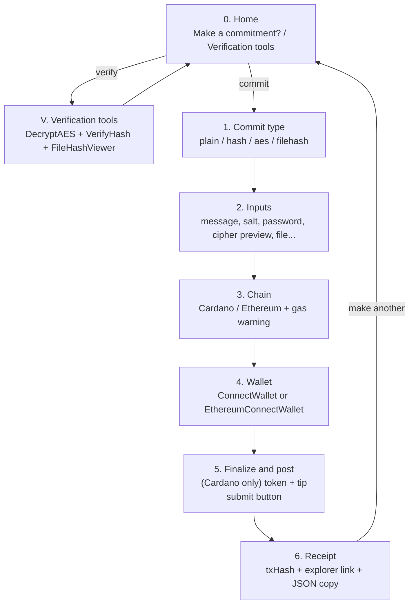

## Goal

Turn the current single long page at [src/pages/Commit.tsx](src/pages/Commit.tsx) + [src/components/UnifiedCommit.tsx](src/components/UnifiedCommit.tsx) into a step-by-step wizard that only displays one choice/input at a time, with Back buttons on every step and no loss of existing functionality.

## Step map

All "Back" transitions are the reverse arrows; `home` has no Back.

## Architecture

Create a single stateful component `src/components/CommitWizard.tsx` that owns:

- `step`: the union `'home' | 'verify' | 'type' | 'inputs' | 'chain' | 'wallet' | 'finalize' | 'done'`.
- All form state currently inside [src/components/UnifiedCommit.tsx](src/components/UnifiedCommit.tsx) lines 39–69 (`commitType`, `message`, `password`, `cipherText`, `includeSalt`, `salt`, `messageToUse`, `selectedFile`, `fileHash`, `includeTip`, `tipAmount`, `attachToken`, `tokens`, `selectedTokenUnit`, `tokenLoading`, `tokenError`, `isSubmitting`, `downloadedRecord`, plus `gitInfo`).
- The `chain` state currently in [src/pages/Commit.tsx](src/pages/Commit.tsx) line 18.
- `handleCommit` ported verbatim from [src/components/UnifiedCommit.tsx](src/components/UnifiedCommit.tsx) lines 224–391 (no logic changes), moved so it can set `step` to `'done'` on success.
- `handleChainChange` ported from [src/pages/Commit.tsx](src/pages/Commit.tsx) lines 28–34 (still dispatches `setIsWalletConnected(false)`, `resetWallet()`, `resetEthWallet()` when chain changes).

The page [src/pages/Commit.tsx](src/pages/Commit.tsx) becomes thin: hero title/description, `<CommitWizard />`, footer. Everything else is removed from that file.

## Per-step rendering (inside `CommitWizard.tsx`)

- `home`: two big buttons (reuse `wallet-select-button` class) — "Make a commitment" and "Verification tools".
- `verify`: stack `<DecryptAES />`, `<VerifyHash />`, `<FileHashViewer />` (existing imports in [src/pages/Commit.tsx](src/pages/Commit.tsx) lines 4–6) with a Back button to `home`.
- `type`: four buttons for `plain | hash | aes | filehash`; clicking sets `commitType` and advances to `inputs`. Keep the collapsible "About this commit type" description block from [src/components/UnifiedCommit.tsx](src/components/UnifiedCommit.tsx) lines 420–479 on this step so users understand each option before choosing.
- `inputs`: only the inputs for the current `commitType` (the branches currently at [src/components/UnifiedCommit.tsx](src/components/UnifiedCommit.tsx) lines 481–551, including `includeSalt` + `VerifyHash` preview for hash, password + cipher preview for aes, file input for filehash). "Next" is disabled until the minimum required inputs are present (same checks currently in `handleCommit` lines 250, 265, 282, 299).
- `chain`: reuse `<ChainPicker chain={chain} onChange={handleChainChange} />`. "Next" advances to `wallet`.
- `wallet`: if `chain === 'cardano'` render the existing `<ConnectWallet />`; else render `<EthereumConnectWallet />`. Show the connect-prompt copy from [src/pages/Commit.tsx](src/pages/Commit.tsx) lines 64–73 / 80–90. Auto-advance to `finalize` via `useEffect` when `isActiveWalletConnected` flips true.
- `finalize`: brief summary (chain, commit type, short input digest), then:
  - Cardano: render the attach-token block and tip block from [src/components/UnifiedCommit.tsx](src/components/UnifiedCommit.tsx) lines 553–611.
  - Ethereum: show a one-line note "No optional extras on Ethereum".
  - A single `Commit on Cardano` / `Commit on Ethereum` button that calls `handleCommit`.
- `done`: show the alert message inline (no `alert()`), `downloadedRecord` copy-to-clipboard button (existing at lines 617–628), explorer link (`cardanoscan` or `etherscan`), and a "Make another commitment" button that resets form state and sends `step` back to `home`.

## Files to add

- [src/components/CommitWizard.tsx](src/components/CommitWizard.tsx) — the new wizard described above. Holds the `step` state machine, all commit form state, `handleCommit`, and renders one panel at a time inside a single bordered card (`border border-gray-300 p-4 rounded-md` to match current styling).

## Files to change

- [src/pages/Commit.tsx](src/pages/Commit.tsx): replace everything between the hero title and the footer with `<CommitWizard />`. Remove the imports of `ConnectWallet`, `EthereumConnectWallet`, `ChainPicker`, `UnifiedCommit`, `DecryptAES`, `VerifyHash`, `FileHashViewer`, `AddressDisplay`, `setIsWalletConnected`, `resetWallet`, `resetEthWallet`, and the local `chain` state — they all move into the wizard.
- [src/components/UnifiedCommit.tsx](src/components/UnifiedCommit.tsx): delete. It's only referenced from [src/pages/Commit.tsx](src/pages/Commit.tsx) (confirmed via ripgrep).

## Navigation rules

- A small `WizardNav` at the bottom of every step except `home` and `done` with a Back button (no Next for `type` and `wallet` which auto-advance on selection/connection; Next for `inputs`, `chain`).
- Back from `wallet` does NOT dispatch `resetWallet`/`resetEthWallet` — chain choice is preserved, only the wallet connection persists. Back from `chain` likewise keeps wallet state untouched.
- `handleChainChange` (when the user edits the chain on the `chain` step) still resets wallet state, matching today's behavior.
- On submit success, `step` moves to `done`; the existing `alert(...)` calls on lines 341 and 376 are replaced by in-page state so the wizard stays the source of truth.
- Form reset only happens on "Make another commitment" (from `done`) or when the user goes Back past `type`.

## Validation summary

- `inputs` Next disabled when: plain → `!message.trim()`; hash → `!messageToUse.trim()`; aes → `!message.trim() || !password.trim()`; filehash → `!selectedFile || !fileHash`.
- `wallet` cannot auto-advance until `isWalletConnected && (chain==='cardano' ? walletAddress : ethAddress)` — matches today's `isActiveWalletConnected` on [src/pages/Commit.tsx](src/pages/Commit.tsx) lines 24–26.
- `finalize` submit is disabled while `isSubmitting` (already in place).

## Non-goals

- No change to `handleCommit` submission logic, Lucid or Ethereum transaction building, metadata label 674, ethereum helpers in [src/functions/ethereum.ts](src/functions/ethereum.ts), or any Redux slice.
- No routing change; the wizard remains a single page. `step` lives in local React state, not the URL.
- No new npm dependencies.
- Styling stays on existing Tailwind + `simple.css` classes; no new CSS files.

## Risks / watch-outs

- The chain-change reset logic must stay exactly where the user edits chain (inside the `chain` step), not on every re-render of the wizard, or the wallet connect step will loop.
- EIP-6963 provider listeners in [src/components/EthereumConnectWallet.tsx](src/components/EthereumConnectWallet.tsx) lines 58–84 assume the component stays mounted while connected. Keep that component mounted on the `wallet` and `finalize` steps for Ethereum (e.g. render it hidden on `finalize`) OR accept that subscriptions reattach on remount — acceptable either way since Redux state persists; simplest is to just remount.
- The `gitInfo` fetch (lines 89–122) is used to stamp the downloaded JSON; it must fire on wizard mount, not per-step, so keep that `useEffect` at the top level of `CommitWizard`.