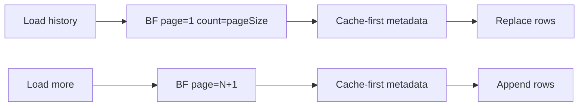

# Conch pagination: Load more

## Approach

Treat each load as one Blockfrost asset-tx page (`order=desc`), not a one-shot hard cap. **Load history** resets to page 1; **Load more** fetches the next page and appends. Mirror the Popular DReps pattern in [`PopularDreps.tsx`](src/pages/PopularDreps.tsx) (`loadingMore` / `hasMore` / append).

Label the field **Transactions per page** (not “entries”) — it controls how many asset txs are scanned per request, not how many CIP-20 messages appear.

Defaults: page size **40**, max **100** (Blockfrost `count` max per request → one HTTP call per page). URL param: **`pageSize`**, with legacy **`txLimit`** still read on mount for old bookmarks.

## Fetch layer — [`src/utils/cip20AssetHistory.ts`](src/utils/cip20AssetHistory.ts)

1. Change `fetchAssetTransactions` to accept `{ page, count }` and make a **single** request:
   - `/assets/{id}/transactions?page={page}&count={count}&order=desc`
2. Extend `Cip20HistoryResult` with `hasMore: boolean` (`history.length === count`) and `scannedTxCount`.
3. Change `getAssetCip20History(assetId, apiKey, { page, count })` to use that single-page fetch; keep the existing IndexedDB cache-first metadata path unchanged.

## UI — [`src/pages/AssetCip20Messages.tsx`](src/pages/AssetCip20Messages.tsx)

1. Rename field label/state to **Transactions per page**; constants `DEFAULT_PAGE_SIZE = 40`, `MAX_PAGE_SIZE = 100`.
2. URL sync: write `pageSize`; on mount read `pageSize` or fall back to `txLimit`.
3. State: `page`, `hasMore`, `loadingMore`.
4. **Load history**: reset `page=1`, replace `rows`, set `hasMore`.
5. **Load more**: `page+1`, append rows (dedupe by `tx` hash), update `hasMore`. Show below the table (and when `hasLoaded && hasMore` even if the first page had zero CIP-20 messages).
6. Separate `loading` vs `loadingMore` so the table stays visible while appending.

## Docs

Brief update to the Conch section in [`wiki/pages/ctools-drep-voting-history-blockfrost.md`](wiki/pages/ctools-drep-voting-history-blockfrost.md): `pageSize` + Load more; note `txLimit` as legacy; append a short `wiki/log.md` entry.
