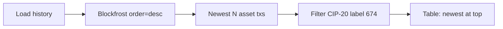

# Conch messages: newest first

## Problem

[`fetchAssetTransactions`](src/utils/cip20AssetHistory.ts) calls Blockfrost with `order=asc`. With a transaction limit (default 40), that loads the **oldest** window of asset txs and the UI lists CIP-20 messages oldest → newest.

## Change

In [`src/utils/cip20AssetHistory.ts`](src/utils/cip20AssetHistory.ts), switch the asset-transactions query to descending order:

```ts
// fetchAssetTransactions
const path = `/assets/${enc}/transactions?page=${page}&count=${count}&order=desc`;
```

Also update the function JSDoc from “ascending” to “descending (newest first).”

No client-side `.sort()` is needed: [`getAssetCip20History`](src/utils/cip20AssetHistory.ts) already preserves the Blockfrost list order when building rows, and the table in [`AssetCip20Messages.tsx`](src/pages/AssetCip20Messages.tsx) renders that array as-is.

Cache behavior is unchanged: IndexedDB keys by tx hash, and the asset tx list is always refetched.

## Copy

Update the intro sentence in [`AssetCip20Messages.tsx`](src/pages/AssetCip20Messages.tsx) from “lists those messages in time order” to something like “lists those messages newest first,” so the page text matches behavior.

## Effect



With a limit of 40, the tool now scans the 40 most recent asset transactions and shows Conch messages from that window with the latest first.
