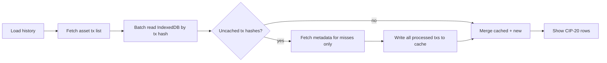

# Conch tool: transaction cache + settings modal

## Problem today

[`AssetCip20Messages.tsx`](src/pages/AssetCip20Messages.tsx) calls [`getAssetCip20History`](src/utils/cip20AssetHistory.ts) on every **Load history** click. That always:

1. Paginates `GET /assets/{assetId}/transactions` (cheap)
2. Calls `GET /txs/{txHash}/metadata` for **every** tx in the scan window (expensive — up to `txLimit`, concurrency 8)

There is no persistence; refreshing the page or clicking Load again repeats all metadata fetches.

## Target behavior (mirror DRep pattern)

Same philosophy as DRep Voting History: **lists stay live, enrichment is cached**.



- **Always fetch** the asset transaction list (needed to discover txs in the current scan window).
- **Skip metadata API** for tx hashes already in cache (including txs confirmed to have **no** label-674 metadata — negative cache).
- **Settings gear** opens a modal (reuse [`IpfsLinkModal.css`](src/components/IpfsLinkModal.css) overlay pattern from [`DRepVotingHistorySettingsModal.tsx`](src/components/DRepVotingHistorySettingsModal.tsx)) showing cache count and a **Clear {n} cached Conch transactions** button only (no reload action per your preference).

## Cache design

**New IndexedDB database** (separate from DRep — unrelated domain):

| Constant | Value |
|----------|-------|
| DB name | `ctools-conch-history` |
| DB version | `1` |
| Store | `transactions` |

**Key:** normalized tx hash (`trim`, strip `0x`, lowercase) — export `conchTxCacheKey(txHash)`.

**Entry shape** (store raw data, format timestamps on read):

```ts
interface CachedConchTx {
  blockTime: number;
  hasCip20: boolean;
  message: string;       // empty when !hasCip20
  cachedAtSec: number;
}
```

**Exported API** in new [`src/utils/conchHistoryCache.ts`](src/utils/conchHistoryCache.ts):

| Function | Purpose |
|----------|---------|
| `getConchTxCacheBatch(txHashes)` | `Map<string, CachedConchTx>` for a scan window |
| `putConchTxCacheBatch(entries)` | Write after successful metadata fetch |
| `countConchTxCache()` | Global count for modal label |
| `clearConchTxCache()` | Delete all entries |

IDB failures → `console.warn`, degrade to uncached network fetch (same as [`governanceMetadataDocCache.ts`](src/utils/governanceMetadataDocCache.ts)).

## Fetch layer changes

**File:** [`src/utils/cip20AssetHistory.ts`](src/utils/cip20AssetHistory.ts)

Extend `getAssetCip20History` return type:

```ts
interface Cip20HistoryResult {
  rows: Cip20MessageRow[];
  cachedTxCount: number;   // metadata skipped
  fetchedTxCount: number;  // metadata fetched this run
}
```

Updated flow inside `getAssetCip20History`:

1. `fetchAssetTransactions(assetId, apiKey, amount)` — unchanged (`order=asc`, oldest-first window preserved).
2. `getConchTxCacheBatch(history.map(h => h.tx_hash))`.
3. For each tx **not** in cache: `fetchTxMetadata` via existing `mapWithConcurrency(..., 8)`.
4. Build cache entries for **all** newly fetched txs (both CIP-20 and non-CIP-20).
5. `putConchTxCacheBatch` for new entries.
6. Merge cached + new into rows; filter `hasCip20`; map to `Cip20MessageRow` (format `timestamp` with `toLocaleString()` at read time).
7. Return rows + counts.

No change to Blockfrost endpoints or scan order.

## Page UI changes

**File:** [`src/pages/AssetCip20Messages.tsx`](src/pages/AssetCip20Messages.tsx)

**New component:** [`src/components/ConchHistorySettingsModal.tsx`](src/components/ConchHistorySettingsModal.tsx)

- Props: `open`, `onClose`, `cachedTxCount`, `onClearCache`, `clearDisabled`
- Stats: `Cached transactions: {n}` (counts all stored lookups, including non-message txs)
- Single action: **Clear {n} cached Conch transactions** → `clearConchTxCache()` → reset count to 0
- Reuse `.voting-history-settings-panel`, `.voting-history-settings-stats`, `.voting-history-settings-actions` CSS classes from [`IpfsLinkModal.css`](src/components/IpfsLinkModal.css)

**Page wiring:**

- Import `Settings` from `lucide-react`, modal component, cache count helpers
- State: `settingsModalOpen`, `cachedTxCount`, `lastLoadCachedCount` (optional inline hint)
- On mount: `countConchTxCache()` → set `cachedTxCount`
- Update `handleLoadHistory`:
  - Destructure `{ rows, cachedTxCount, fetchedTxCount }` from `getAssetCip20History`
  - Refresh global `cachedTxCount` via `countConchTxCache()` after load
  - Optionally show inline hint when `cachedTxCount > 0` on that load: `Cached N transactions` (mirrors DRep badge)
- **Settings gear** in the button row next to **Load history** (always visible, disabled while `loading`):
  - `className="voting-history-settings-icon-btn"`
  - `aria-label="Open Conch history settings"`

**Minor UX tweak:** stop calling `setRows([])` at load start so previous results stay visible while refreshing (optional but low-cost improvement).

## Tests

**New file:** [`src/utils/conchHistoryCache.test.ts`](src/utils/conchHistoryCache.test.ts)

Pure helper tests (mirror lightweight style of [`drepVotingHistoryCache.test.ts`](src/utils/drepVotingHistoryCache.test.ts)):

- `conchTxCacheKey` normalizes hex (`0x` prefix, case, trim)
- Optional pure helper for building rows from cache entries if extracted

No full IDB round-trip required unless trivial.

## Wiki (brief)

Append a short Conch cache section to [`wiki/pages/ctools-drep-voting-history-blockfrost.md`](wiki/pages/ctools-drep-voting-history-blockfrost.md) (already documents Conch URL params) + one line in [`wiki/log.md`](wiki/log.md).

## Files touched

| File | Change |
|------|--------|
| [`src/utils/conchHistoryCache.ts`](src/utils/conchHistoryCache.ts) | New IndexedDB module |
| [`src/utils/cip20AssetHistory.ts`](src/utils/cip20AssetHistory.ts) | Cache-first metadata fetch; new result type |
| [`src/components/ConchHistorySettingsModal.tsx`](src/components/ConchHistorySettingsModal.tsx) | Settings popup |
| [`src/pages/AssetCip20Messages.tsx`](src/pages/AssetCip20Messages.tsx) | Gear button, modal wiring, load counts |
| [`src/utils/conchHistoryCache.test.ts`](src/utils/conchHistoryCache.test.ts) | Key/helper tests |
| Wiki files | Short doc note |

## Out of scope

- Caching the asset tx **list** endpoint (list stays live every load)
- Force-reload / invalidate-per-asset action (clear-all only)
- TTL or automatic expiry
- Per-tx delete from settings
- Changing scan order or default tx limit behavior
