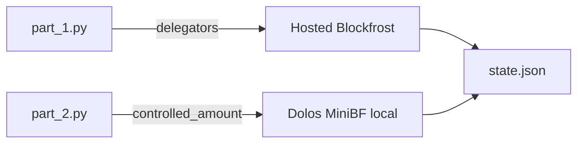

# LittleBoy Part 2: Local Dolos Balances

## Architecture



- **`part_1.py`**: unchanged — still uses `BLOCKFROST_API_KEY` + hosted Blockfrost for `GET /governance/dreps/{id}/delegators` (Dolos MiniBF does not expose this endpoint today).
- **`part_2.py`**: switch balance source to Dolos MiniBF `GET /accounts/{stake_address}` → `controlled_amount` (same field, same semantics as Blockfrost; not UTxO summation).

## Code changes

### [`LittleBoy/part_2.py`](LittleBoy/part_2.py)

1. **Replace Blockfrost config with Dolos config**
   - Remove hardcoded `BLOCKFROST_BASE` and `blockfrost_headers()`.
   - Read `DOLOS_BASE_URL` from [`LittleBoy/.env`](LittleBoy/.env) (e.g. `http://127.0.0.1:3000/api/v0`).
   - Default to `http://127.0.0.1:3000/api/v0` if unset (Dolos with `base_path = "/api/v0"` per [MiniBF docs](https://docs.txpipe.io/dolos/apis/minibf)).
   - Strip trailing slashes before building URLs.

2. **No API key for Dolos**
   - Drop `BLOCKFROST_API_KEY` requirement from `part_2.py`.
   - Send no `project_id` header (local MiniBF does not require it).

3. **Startup health check**
   - Before processing pending balances, `GET {DOLOS_BASE_URL}/health`.
   - Exit with a clear error if Dolos is unreachable or unhealthy (saves hours of opaque failures on ~22k lookups).

4. **`fetch_ada_balance()`**
   - `GET {DOLOS_BASE_URL}/accounts/{stake_address}`
   - 404 → `0.0` (unregistered / unknown stake account)
   - Parse `controlled_amount` (lovelace) → ADA float (same as today)
   - Update docstring/error messages to say "Dolos" not "Blockfrost"

5. **Resume behavior unchanged**
   - Still only fetches entries where `ada_balance == "pending"`.
   - Progress output with padded percentage stays as-is.

### [`LittleBoy/part_1.py`](LittleBoy/part_1.py)

No changes.

### Environment

Update your local [`LittleBoy/.env`](LittleBoy/.env) (gitignored) to add:

```bash
BLOCKFROST_API_KEY=...          # part_1 only
DOLOS_BASE_URL=http://127.0.0.1:3000/api/v0
```

If your Dolos instance omits `base_path`, use `http://127.0.0.1:3000` instead.

## Dolos operator checklist (you run separately)

For `part_2` to work, your Dolos instance needs:

| Requirement | Why |
|-------------|-----|
| MiniBF enabled on port 3000 | Serves Blockfrost-compatible HTTP |
| `base_path = "/api/v0"` (recommended) | Matches `DOLOS_BASE_URL` default |
| Account/stake state tracked | `GET /accounts/{stake_address}` must return `controlled_amount` |
| Synced to mainnet tip | Balances must reflect current ledger |
| Ledger-only storage mode (optional) | Minimizes disk if you only need current state |

Bootstrap via Mithril snapshot per [Dolos docs](https://docs.txpipe.io/dolos/what) — no repo deployment files per your preference.

## Verification

After Dolos is synced and healthy:

```bash
curl -s http://127.0.0.1:3000/api/v0/health
curl -s http://127.0.0.1:3000/api/v0/accounts/stake1... | jq .controlled_amount
cd LittleBoy && source .venv/bin/activate && python part_2.py
```

Confirm:
- Resume skips already-loaded numeric balances
- Pending entries resolve without rate-limit errors
- `state.json` `uuid` unchanged across `part_2` reruns

## Out of scope

- Dolos docker-compose / `dolos.toml` in repo
- `part_1` local migration
- Shared Python client module (single-script change is sufficient)
- `.env.example` file (manual `.env` update only)
