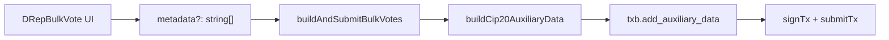

# Optional CIP-20 message for DRep bulk voting

## Context (wiki + codebase)

**Wiki:** CIP-20 in ctools is **label 674** `msg` strings on transaction auxiliary data ([`wiki/pages/ctools-drep-voting-history-blockfrost.md`](wiki/pages/ctools-drep-voting-history-blockfrost.md)). That is separate from the optional **CIP-100 anchor** already on bulk vote (per-vote rationale URL + hash). HW wallets hash `auxiliary_data_hash` only ([`wiki/pages/hardware-wallet-transaction-interop-cip21.md`](wiki/pages/hardware-wallet-transaction-interop-cip21.md)) — adding CIP-20 does not conflict with CIP-21’s one-vote-per-tx rule.

**Existing attach pattern (CML):** [`src/functions/treasuryDonation.ts`](src/functions/treasuryDonation.ts) builds label-674 metadata with UTF-8 chunking (64-byte ledger text limit), `buildAuxiliaryData`, and `txb.add_auxiliary_data` before `build()`. It also **serializes aux to CBOR once** and rehydrates for each `CML.Transaction.new` to avoid WASM consuming the same `AuxiliaryData` handle (orphan-hash bug — see [`.cursor/plans/fix-treasury-orphan-aux-hash_c0736d44.plan.md`](.cursor/plans/fix-treasury-orphan-aux-hash_c0736d44.plan.md)).

**Bulk vote today:** [`src/pages/DRepBulkVote.tsx`](src/pages/DRepBulkVote.tsx) + [`src/functions/bulkVote.ts`](src/functions/bulkVote.ts) — no metadata; optional CIP-100 anchor only. Final tx uses a **single** `CML.Transaction.new(..., aux)` (lines 180–183), so rehydration is still wise when attaching metadata (defensive, matches treasury fix).

**UI precedent:** [`src/pages/TreasuryDonation.tsx`](src/pages/TreasuryDonation.tsx) — checkbox “Attach CIP-20 metadata note (label 674)” + textarea; submits `metadata: string[]` (user line + contextual second line). [`src/pages/Tools.tsx`](src/pages/Tools.tsx) uses Lucid `.attachMetadata(674, ["…", "using the $computerman … tool"])` for the same two-string convention.



## Implementation

### 1. Shared CIP-20 helper (extract from treasury)

Add [`src/functions/cip20Metadata.ts`](src/functions/cip20Metadata.ts):

- Move `MAX_METADATA_TEXT_UTF8_BYTES`, `chunkMetadatumText`, and `buildAuxiliaryData` from [`treasuryDonation.ts`](src/functions/treasuryDonation.ts) (rename export to `buildCip20AuxiliaryData`).
- Export `buildCip20AuxiliaryData(metadata: string[]): CML.AuxiliaryData`.

Update [`treasuryDonation.ts`](src/functions/treasuryDonation.ts) to import the helper (behavior unchanged).

### 2. Extend bulk vote builder

In [`bulkVote.ts`](src/functions/bulkVote.ts):

- Add `metadata?: string[]` to `BuildAndSubmitBulkVotesOptions`.
- After `txb.add_vote(...)` and before UTxO/coin selection (same placement as treasury):

```ts
let auxDataCborHex: string | undefined;
if (metadata && metadata.length > 0) {
  const auxData = buildCip20AuxiliaryData(metadata);
  auxDataCborHex = auxData.to_cbor_hex();
  txb.add_auxiliary_data(auxData);
}
```

- When assembling the signed tx, prefer rehydrated aux over `builtTx.auxiliary_data()`:

```ts
const auxForSigned = auxDataCborHex
  ? CML.AuxiliaryData.from_cbor_hex(auxDataCborHex)
  : builtTx.auxiliary_data();
const signedTx = CML.Transaction.new(finalBody, finalWits, true, auxForSigned);
```

Unsigned CBOR for `signTx` already comes from `builtTx.to_canonical_cbor_hex()` and will include aux when present.

### 3. DRepBulkVote UI + submit wiring

In [`DRepBulkVote.tsx`](src/pages/DRepBulkVote.tsx), add a panel **below** “Optional CIP-100 anchor” (mirror treasury styling):

| Control | Behavior |
|---------|----------|
| Checkbox | “Attach CIP-20 metadata note (label 674)” — default **off** (unlike treasury default on) so bulk vote behavior stays unchanged unless opted in |
| Textarea (when checked) | User message; default e.g. `casting drep votes — using $computerman bulk vote tool` |
| Submit | If enabled and trimmed text non-empty: `metadata = [noteText.trim(), \`bulk vote: ${entries.length} action(s)\`]` (same two-string pattern as treasury/Tools) |
| Pass to builder | `buildAndSubmitBulkVotes({ ..., metadata })` |

Extend `BulkVoteReceipt`:

- `metadataAttached: boolean`
- `metadata674: string[] | null`

**Out of scope (unless you want it):** URL query persistence for CIP-20 (anchor already has `anchor`, `anchorUrl`, `anchorHash` params). Session-only state is enough for v1.

### 4. Wiki documentation (light touch)

Update [`wiki/pages/cip95-wallet-bridge.md`](wiki/pages/cip95-wallet-bridge.md) (bulk-vote section) or add a short bullet to [`wiki/pages/ctools-governance-actions-live.md`](wiki/pages/ctools-governance-actions-live.md): bulk vote supports optional label-674 CIP-20 note via shared CML helper; distinct from CIP-100 vote anchor. Append one line to [`wiki/log.md`](wiki/log.md). No new durable synthesis page unless you want a dedicated `ctools-drep-bulk-vote.md` later.

## Files touched

| File | Change |
|------|--------|
| `src/functions/cip20Metadata.ts` | **New** — shared label-674 builder |
| `src/functions/treasuryDonation.ts` | Import helper; remove duplicated private functions |
| `src/functions/bulkVote.ts` | Optional `metadata`, `add_auxiliary_data`, safe aux rehydration |
| `src/pages/DRepBulkVote.tsx` | Checkbox + textarea, submit + receipt fields |
| `wiki/pages/cip95-wallet-bridge.md` | One paragraph on optional CIP-20 |
| `wiki/log.md` | Ingest log entry |

## Manual test plan

1. Connect CIP-95 wallet + Blockfrost; select 1–2 actions; submit **without** CIP-20 — should match current behavior.
2. Enable CIP-20, submit — Cardanoscan tx should show metadata label **674** with `msg` chunks; receipt JSON includes `metadata674`.
3. Enable **both** CIP-100 anchor and CIP-20 — tx should include vote anchors and label 674.
4. Long note (>64 UTF-8 bytes) — should chunk without submit error (same as treasury).
5. Eternl + Ledger (if available): confirm HW still signs when metadata present (body has `auxiliary_data_hash` only per CIP-21); multi-vote batching limitation unchanged.
