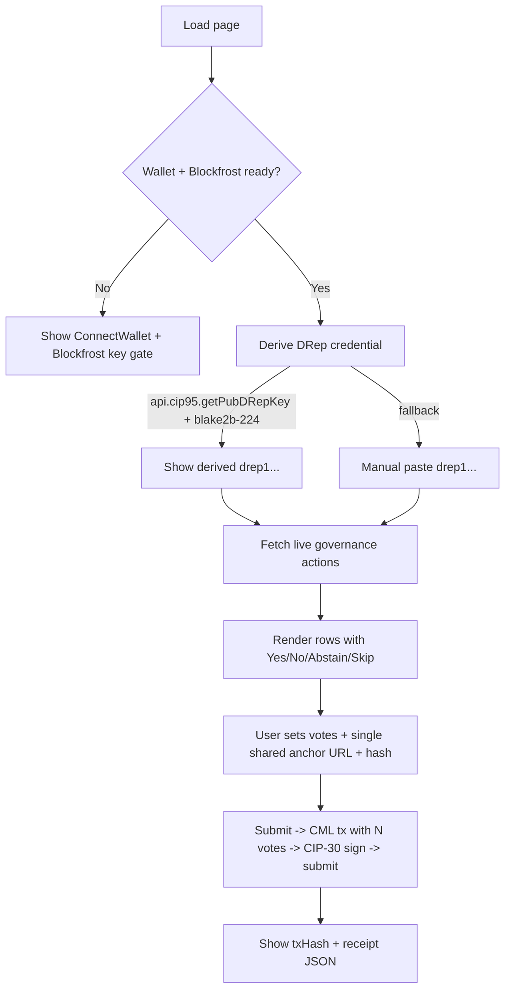

## New page: `DRepBulkVote`

Create [src/pages/DRepBulkVote.tsx](src/pages/DRepBulkVote.tsx). Mirrors the layout of [src/pages/TreasuryDonation.tsx](src/pages/TreasuryDonation.tsx) (wallet + Blockfrost gating) plus the live-action listing from [src/pages/GovernanceActions.tsx](src/pages/GovernanceActions.tsx).

### High-level flow



### Shared helpers — small extraction

Move the live-action listing logic out of [src/pages/GovernanceActions.tsx](src/pages/GovernanceActions.tsx) so the new page can reuse it without duplication. New module:

- [src/functions/governanceActionsFetch.ts](src/functions/governanceActionsFetch.ts) — exports `fetchLiveGovernanceActions(apiKey, { onPartial? })`, `LiveGovernanceAction`, `GovernanceType`, `formatGovActionType`, `truncateHash`, plus the `parseSummary` / `extractGovernanceTitle` / `discoverMetadataAnchor` / `loadActionMetadata` / `parseCip108Metadata` helpers currently inside `GovernanceActions.tsx`.

[src/pages/GovernanceActions.tsx](src/pages/GovernanceActions.tsx) is then trimmed to UI only and imports from the new module. Behavior unchanged.

### DRep credential resolution

New helper in [src/functions/drepCredential.ts](src/functions/drepCredential.ts):

```ts
export type ResolvedDRep =
  | { source: 'wallet' | 'manual'; kind: 'key'; keyHashHex: string; drepIdBech32: string }
  | { source: 'manual'; kind: 'script'; scriptHashHex: string; drepIdBech32: string };

export async function deriveDRepFromWallet(api: any): Promise<ResolvedDRep | null>;
export function resolveManualDRep(drepIdBech32: string): ResolvedDRep;
```

- Wallet path: call `api.cip95?.getPubDRepKey()` (CIP-95). If present, hash with blake2b-224 (use `@harmoniclabs/crypto` already in `package.json`) to get the 28-byte key hash; encode as `drep1...` for display.
- Manual path: parse via `drepIDToCredential` from `@lucid-evolution/lucid` (already used in [src/pages/Tools.tsx](src/pages/Tools.tsx) line 4) — gives `{ type: 'Key' | 'Script', hash }`.
- v1 supports key-hash DReps only for tx building; script-hash DReps display a clear error ("script-hash DReps not supported yet").

### Vote tx builder (CML)

New module [src/functions/bulkVote.ts](src/functions/bulkVote.ts), modeled on [src/functions/treasuryDonation.ts](src/functions/treasuryDonation.ts):

- Reuse `fetchTreasuryContext`'s protocol-params logic — extract `fetchProtocolParams(apiKey)` from `treasuryDonation.ts` into a shared helper or just re-export it.
- `buildAndSubmitBulkVotes({ api, params, changeAddressBech32, voter, votes, anchor })`:
  - `voter`: CML `Voter` built from the resolved key hash via `CML.Voter.new_d_rep_key_hash(Ed25519KeyHash.from_hex(...))`.
  - For each vote: `CML.VoteBuilder.new().with_vote(voter, govActionId, votingProcedure).build()` then `txb.add_vote(result)`.
    - `govActionId` = `CML.GovActionId.new(TransactionHash.from_hex(txHash), BigInt(certIndex))`.
    - `votingProcedure` = `CML.VotingProcedure.new(vote, anchor?)` where `vote` is the `CML.Vote` enum value (`Yes=0, No=1, Abstain=2`).
    - `anchor` (optional, shared for the whole batch) = `CML.Anchor.new(URL, AnchorDocHash.from_hex(hash32hex))`.
  - Add wallet UTxOs as inputs, `add_change_if_needed(changeAddress, false)`, `build(ChangeSelectionAlgo.Default, changeAddress)`, then sign via `api.signTx(unsignedHex, false)` and submit via `api.submitTx(signedHex)`.
  - DRep signs as a `Voter`, so the wallet must also include the DRep key witness. For most browser wallets, the wallet automatically signs with all known keys when `signTx` is called; CIP-95 wallets sign the DRep key too. If a wallet refuses, surface a clear error.

### Page UI

[src/pages/DRepBulkVote.tsx](src/pages/DRepBulkVote.tsx) state:

- `votes: Map<actionKey, 'yes' | 'no' | 'abstain' | 'skip'>` (default `'skip'`).
- `anchorUrl: string`, `anchorHashHex: string`, `attachAnchor: boolean`.
- `manualDRepOverride: string | null`.
- `submitting`, `submittedTxHash`, `submitError`.

UI sections (top to bottom):

1. Header + `ConnectWallet` (same pattern as [TreasuryDonation.tsx](src/pages/TreasuryDonation.tsx)).
2. DRep identity panel — shows derived bech32 DRep ID with an "Override" toggle that swaps in a manual `drep1...` input.
3. Shared rationale panel — checkbox "Attach CIP-100 rationale anchor", URL field, 32-byte hex hash field. Disabled by default; shown as required-pair when enabled.
4. Filter strip — reuse the same type `<select>` from [GovernanceActions.tsx](src/pages/GovernanceActions.tsx). Add "Show only unvoted" toggle.
5. Action list — one card per live action with: type badge, title, summary, metadata link, plus a horizontal Yes/No/Abstain/Skip radio group. Add "Apply to all visible" shortcut buttons (Vote all Yes / No / Abstain / Reset to Skip).
6. Submit bar — sticky button `Vote on N actions` (disabled when N=0 or DRep not resolved). Below it: tx-hash success block + downloadable JSON receipt (reuse `downloadJson` pattern).

### Routes & home tile

Register the new page in [src/index.tsx](src/index.tsx) next to the `governance-actions` group:

```tsx
<Route path="drep-vote" element={<DRepBulkVote />} />
<Route path="bulk-vote" element={<DRepBulkVote />} />
<Route path="drep-bulk-vote" element={<DRepBulkVote />} />
<Route path="vote" element={<DRepBulkVote />} />
```

Add a tile to `TOOL_LINKS` in [src/pages/Home.tsx](src/pages/Home.tsx):

```ts
{
  title: 'DRep Bulk Voting',
  description: 'Connect your DRep wallet, review every live governance action, and cast Yes/No/Abstain on many of them in a single transaction.',
  to: '/drep-vote',
}
```

### Out of scope for v1

- Script-hash DReps (Plutus or native-script). Will surface a "not supported yet" message.
- Per-vote distinct rationale anchors (single shared anchor only, per your choice).
- Constitutional Committee or SPO voting (DRep voter only).
- Vote rationale CIP-108/CIP-100 JSON building & hashing — user supplies the URL + hash they already published. We can add a follow-up tool that hashes a pasted JSON document if useful.
- Saving partial drafts across page reloads.

### Risks / caveats called out in the UI

- The ledger requires the DRep key signature on the tx. If the connected wallet does not sign with its CIP-95 DRep key when `signTx` is invoked, the tx will be rejected — we will display the wallet error verbatim and recommend trying a CIP-95-compliant wallet (Eternl, Lace, Yoroi >=5).
- One invalid vote fails the whole tx. We will validate inputs locally (anchor hash length 64 hex, votes present) before requesting a signature.