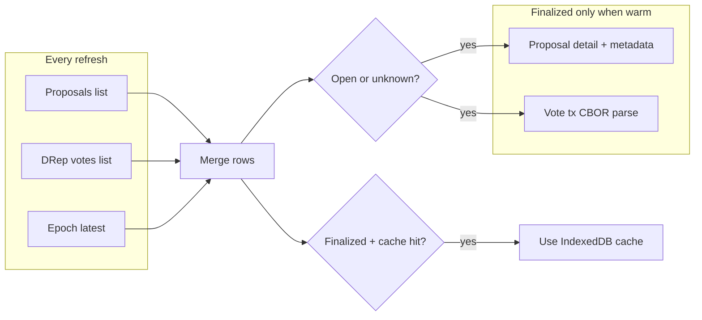

# DRep Voting History: cache closed actions + phased recache

## Problem today

[`DRepVotingHistory.tsx`](src/pages/DRepVotingHistory.tsx) refetches **everything** on each visit:

1. Paginated `GET /governance/proposals` + `GET /governance/dreps/{id}/votes` + `GET /epochs/latest`
2. [`fetchProposalExpirationFields`](src/utils/governanceExpiration.ts) — **2 Blockfrost calls per proposal** (detail + metadata), concurrency 8
3. [`fetchVoteTxAnchorMap`](src/functions/voteTxAnchors.ts) — **1 CBOR call per unique vote tx**, concurrency 8

For a DRep with hundreds of historical actions, most rows are already **finalized** ([`isGovernanceActionFinalized`](src/utils/governanceExpiration.ts): expired, ratified, enacted, dropped). That on-chain data does not change after voting ends; only **open** actions (`countdown` / `unknown`) need live refreshes.



## Finalized vs live

| Status | Refresh behavior |
|--------|------------------|
| `countdown`, `unknown` | Always network (deadline / fields may need epoch context) |
| `expired`, `ratified`, `enacted`, `dropped` | Use cache when present; fetch on miss or after force recache |

Charts already ignore unfinalized rows when `excludeUnfinalized` is on; caching aligns with that semantics.

## Cache design (per your scope)

**Storage:** native **IndexedDB** (no new dependency; avoids `localStorage` size limits). Single DB `ctools-drep-voting-history`, schema version `1`.

**Layer A — global proposal cache** (`proposalKey` = `tx_hash#cert_index`):

```ts
interface CachedProposalEnrichment {
  expiration: BlockfrostProposalExpirationFields;
  metadataAnchor: ProposalMetadataAnchorInfo;
  cachedAtSec: number;
}
```

**Layer B — per-DRep vote cache** (only written when the action is finalized at cache time):

```ts
interface CachedDrepVoteEnrichment {
  vote: string;           // yes | no | abstain
  voteTxHash: string;
  voteAnchor: VoteAnchorInfo;
  cachedAtSec: number;
}
```

Keyed as `drepId → proposalKey → entry`. Vote disposition and CIP-100 anchor are immutable after close, so refresh can skip CBOR (and skip per-proposal detail/metadata) when both layers hit.

**Still fetched every refresh (cheap, may change):**

- Full proposals list (new actions appear)
- Full DRep votes list (new votes on still-open actions)
- `epochs/latest` (for countdown on open rows)

On merge: for each row, resolve `timeStatus` using cached expiration + fresh epoch when cached; for finalized rows with Layer B hit, apply cached `vote` / `voteTxHash` / `voteAnchor` (reconcile with votes list — if list disagrees for a finalized key, trust list once and overwrite cache).

## New modules

| File | Role |
|------|------|
| [`src/utils/drepVotingHistoryCache.ts`](src/utils/drepVotingHistoryCache.ts) | IndexedDB open/read/write, `getProposalCache`, `putProposalCache`, `getDrepVoteCache`, `putDrepVoteCache`, `clearFinalizedCaches` (optional, for recache start) |
| [`src/utils/drepVotingHistoryRecache.ts`](src/utils/drepVotingHistoryRecache.ts) | Phased orchestrator with `onProgress` callback |
| [`src/components/ReloadingRecacheModal.tsx`](src/components/ReloadingRecacheModal.tsx) | Blocking overlay (reuse [`IpfsLinkModal.css`](src/components/IpfsLinkModal.css) overlay pattern): title **Reloading & Recaching**, CSS spinner, dynamic description |

**Refactor (small):** export a shared `fetchSingleProposalEnrichment(apiKey, proposal)` from [`governanceExpiration.ts`](src/utils/governanceExpiration.ts) (extract body of current per-item mapper) so normal load, cache miss, and recache share one code path. Replace the duplicate private `mapWithConcurrency` in that file with the exported one from [`governanceActionsFetch.ts`](src/functions/governanceActionsFetch.ts).

**Extend** [`voteTxAnchors.ts`](src/functions/voteTxAnchors.ts): optional `onProgress` / batching wrapper, or keep parsing in recache module calling existing `fetchVoteTxAnchorMap` per batch.

## Normal load flow (update `fetchData` + `enrichAnchors`)

1. Fetch proposals, votes, epoch (unchanged).
2. Load all cached proposal keys + this DRep’s vote cache from IndexedDB.
3. **Partition** proposals into `needsDetail` (open/unknown or missing Layer A) vs `cachedProposal`.
4. Run `fetchProposalExpirationFields` **only** for `needsDetail` (may be empty on warm cache).
5. Build `merged` rows; set `voteAnchor` from Layer B when finalized + hit, else `initialVoteAnchor`.
6. **Anchor phase:** collect vote tx hashes only for rows that still need CBOR (voted + not finalized-cached). Call `fetchVoteTxAnchorMap` on that subset; persist Layer B entries for newly resolved finalized rows.
7. Persist Layer A for any newly fetched finalized proposals.

Expose lightweight UI hint: e.g. `Cached N closed actions` near summary (optional, helps confirm cache is working).

## Force recache button + phased modal

**Placement:** near summary stats on [`DRepVotingHistory.tsx`](src/pages/DRepVotingHistory.tsx) — e.g. **Reload closed actions** (disabled while `loading`, `anchorLoading`, or recache running).

**Behavior:**

1. Re-run list + votes + epoch (fresh merge keys).
2. Compute `finalizedKeys` from merged rows (after minimal epoch resolve — may need one quick pass: use cache for expiration first, then finalize set).
3. Open modal; run [`drepVotingHistoryRecache`](src/utils/drepVotingHistoryRecache.ts):

| Phase | Work | Progress label examples |
|-------|------|-------------------------|
| 1 | Proposal detail + metadata in batches | `Requesting batch 2 of 12` |
| pause | Fixed delay between batches | `Waiting 10 seconds between batch 3 and 4` |
| 2 | Vote tx CBOR in batches (unique hashes for finalized voted rows) | `Fetching vote CBOR batch 1 of 5` |
| pause | Same delay policy | … |

**Tunable constants** (top of recache module):

- `PROPOSAL_BATCH_SIZE = 12`
- `VOTE_TX_BATCH_SIZE = 8`
- `IN_BATCH_CONCURRENCY = 6` (slightly lower than today’s 8 during bulk invalidation)
- `BATCH_COOLDOWN_MS = 10_000`

`onProgress({ title, description })` drives modal text. On completion: close modal (or brief “Done”), refresh table from cache + state, show non-fatal error count if any batch item failed.

Modal: non-dismissible while running (no backdrop click / Escape), matching loading overlay expectations.

## UI mock (structure)

```
┌─────────────────────────────┐
│  Reloading & Recaching      │
│         [spinner]           │
│  Requesting batch 2 of 12   │
└─────────────────────────────┘
```

## Tests

- [`src/utils/drepVotingHistoryCache.test.ts`](src/utils/drepVotingHistoryCache.test.ts) — key formatting, read/write round-trip with `fake-indexeddb` **if** easy in Jest; otherwise test pure key/helpers and mock IDB
- [`src/utils/drepVotingHistoryRecache.test.ts`](src/utils/drepVotingHistoryRecache.test.ts) — batch partition math + progress message strings (no network)

## Wiki

Short append to [`wiki/pages/ctools-drep-voting-history-blockfrost.md`](wiki/pages/ctools-drep-voting-history-blockfrost.md): finalized-action IndexedDB cache + phased recache button; one line in [`wiki/log.md`](wiki/log.md).

## Out of scope

- Off-chain metadata fetch
- Server-side / shared cache
- Caching paginated list endpoints (lists stay live)
