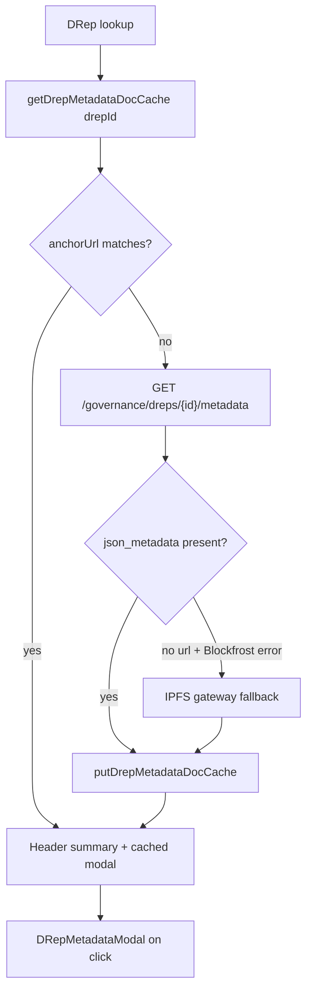

# DRep profile metadata load and cache

## Context

[DRep Voting History](src/pages/DRepVotingHistory.tsx) currently uses the DRep ID only to query votes. It already caches **governance action** metadata (CIP-108) and **vote rationale** metadata (CIP-100) per proposal, but does **not** fetch the DRep's own **registration profile** (CIP-119).

Per [wiki: DRep metadata standard (CIP-119)](wiki/pages/drep-metadata-cip119.md):
- Required field: `givenName`
- Optional: `objectives`, `motivations`, `qualifications`, `paymentAddress`, `image`, `references` (`Link` / `Identity`), `doNotList`
- Anchored on DRep registration/update (not on individual votes)

Blockfrost exposes this via `GET /governance/dreps/{drep_id}/metadata`, returning `url`, `hash`, `json_metadata` (validated CIP-119), `bytes`, and an optional `error` when off-chain fetch fails ([Blockfrost OpenAPI `drep_metadata` schema](https://docs.blockfrost.io/)).



## Architecture (mirror existing doc-cache pattern)

Follow the same layering used by [governanceMetadataDocCache.ts](src/utils/governanceMetadataDocCache.ts) + [governanceMetadataDocFetch.ts](src/utils/governanceMetadataDocFetch.ts):

| Layer | Responsibility |
|-------|----------------|
| Parser | Extract CIP-119 `body` fields from JSON-LD |
| Cache | IndexedDB CRUD, anchor-URL cache-hit rule |
| Fetch | `ensureDrepMetadataDocCached` — cache-first, Blockfrost primary, IPFS fallback |
| UI | Header summary + modal (formatted / JSON / download) |

**IndexedDB:** extend `ctools-drep-voting-history` in [drepVotingHistoryCache.ts](src/utils/drepVotingHistoryCache.ts):
- Bump `DREP_VOTING_HISTORY_DB_VERSION` `3` → `4`
- Add store `drepMetadataDocs` (key = trimmed `drepId`)

**Cache entry:**

```ts
interface CachedDrepMetadataDoc {
  metadata: DrepMetadata;       // parsed CIP-119
  rawPayload: unknown;
  anchorUrl: string;
  hashHex?: string;
  blockfrostError?: { code: string; message: string } | null;
  cachedAtSec: number;
}
```

**Cache-hit rule:** `entry.anchorUrl === currentAnchorUrl` (same as governance/vote doc caches). No TTL.

**Absent metadata:** When Blockfrost returns empty `url`/`hash` and `json_metadata: null`, cache a sentinel entry with `metadata: null` and `anchorUrl: ''` so repeat visits skip the API call.

## 1. CIP-119 parser and types

**New file:** `src/functions/drepMetadata.ts`

Export `DrepMetadata` (parsed profile) and `parseCip119Metadata(payload: unknown): DrepMetadata | null`:

- Read `body` object (fallback to root), same pattern as `parseCip108Metadata` in [governanceActionsFetch.ts](src/functions/governanceActionsFetch.ts)
- Fields: `givenName`, `objectives`, `motivations`, `qualifications`, `paymentAddress`, `doNotList`
- `image`: `contentUrl` + optional `sha256`
- `references`: map `Link` / `Identity` / `Other` entries to `{ type, label, uri }`
- Return `null` only when no recognizable CIP-119 content

**Tests:** `src/functions/drepMetadata.test.ts` — Blockfrost example doc from OpenAPI, missing `givenName`, references with `@set` container.

## 2. IndexedDB cache module

**New file:** `src/utils/drepMetadataDocCache.ts`

Mirror [governanceMetadataDocCache.ts](src/utils/governanceMetadataDocCache.ts) API:

- `getDrepMetadataDocCache(drepId)`
- `putDrepMetadataDocCache(drepId, entry)`
- `isDrepMetadataDocCacheHit(entry, anchorUrl)`
- `clearDrepMetadataDocCache()` / `countDrepMetadataDocCache()`

Reuse `openDrepVotingHistoryDb()` from [drepVotingHistoryCache.ts](src/utils/drepVotingHistoryCache.ts); export `STORE_DREP_METADATA_DOCS`.

## 3. Fetch layer

**New file:** `src/utils/drepMetadataDocFetch.ts`

**Blockfrost response type** (inline):

```ts
interface BlockfrostDrepMetadataResponse {
  drep_id: string;
  hex: string;
  url: string;
  hash: string;
  json_metadata: unknown;
  bytes: string | null;
  error?: { code: string; message: string };
}
```

**`fetchDrepMetadataFromBlockfrost(apiKey, drepId)`** — `GET /governance/dreps/{drepId}/metadata` with `project_id` header (same base URL as existing fetches).

**`ensureDrepMetadataDocCached({ drepId, apiKey, gatewayIndex? })`**:

1. Call Blockfrost metadata endpoint
2. Determine `anchorUrl` / `hashHex` from response
3. Check IndexedDB cache (anchor match)
4. If `json_metadata` parses → persist and return `outcome: 'cached' | 'fetched'`
5. If Blockfrost `error` (or null `json_metadata`) but `url` present → fall back to `fetchGovernanceMetadataDocWithGatewayFallback` pattern from [governanceMetadataDocFetch.ts](src/utils/governanceMetadataDocFetch.ts), but parse with `parseCip119Metadata` instead of CIP-108
6. If no anchor → cache absent sentinel, return `outcome: 'absent'`

Export outcome type for UI: `'cached' | 'fetched' | 'absent' | 'failed'`.

## 4. UI components

### `DRepMetadataView.tsx`

Formatted renderer (like [GovernanceMetadataView.tsx](src/components/GovernanceMetadataView.tsx)):
- Heading: `givenName`
- Optional image (respect remote URL; base64 data URIs allowed per CIP-119)
- Narrative blocks (`objectives`, `motivations`, `qualifications`) — plain text (CIP-119: no markdown in `givenName`; narrative fields are plain text per spec)
- References list with type badges (`Link` / `Identity`)
- `paymentAddress` as monospace copyable text
- `doNotList` warning badge when true

### `DRepMetadataModal.tsx`

Patterned after [GovernanceActionMetadataModal.tsx](src/components/GovernanceActionMetadataModal.tsx):
- Props: `open`, `drepId`, `apiKey`, `onClose`, `onCacheUpdated?`
- States: loading / loaded / error / absent
- Toolbar: Wider view, Formatted, View JSON, Download (reuse `downloadJson` + filename from `givenName` or `drepId`)
- IPFS gateway dropdown + retry when fallback path fails (reuse `IPFS_GATEWAYS`)
- On success, writes cache via `putDrepMetadataDocCache`

### Header summary in [DRepVotingHistory.tsx](src/pages/DRepVotingHistory.tsx)

Replace the bare `<code>{activeDrepId}</code>` block (~lines 1013–1018) with a **DRep profile card**:

| State | Header |
|-------|--------|
| Loading | "Loading DRep profile…" |
| Present | `givenName`, optional thumbnail, **View profile** button → modal |
| Absent | "No CIP-119 profile metadata" + truncated DRep ID |
| Error | Short error + **Retry** |

Load via dedicated `useEffect` on `[activeDrepId, apiKey]` (parallel with `fetchData`, not blocked by vote table load):

```ts
void ensureDrepMetadataDocCached({ drepId: activeDrepId, apiKey })
  .then(/* update drepProfileState */)
```

Keep `activeDrepId` monospace ID visible (smaller, below name).

## 5. Settings modal

Update [DRepVotingHistorySettingsModal.tsx](src/components/DRepVotingHistorySettingsModal.tsx):
- Add stat: "DRep profile documents cached: **n**"
- Add button: **Clear {n} cached DRep profile documents** → `clearDrepMetadataDocCache()`
- Update intro copy to mention CIP-119 alongside CIP-108 / CIP-100

Wire props/handlers in `DRepVotingHistory.tsx` (same pattern as existing metadata doc clear).

## 6. Scope boundaries

**In scope:**
- CIP-119 profile metadata load, cache, header summary, full modal
- IndexedDB persistence across reloads
- IPFS gateway fallback when Blockfrost returns anchor but fetch error

**Out of scope:**
- On-chain DRep stats (`amount`, `retired`, delegators) from `GET /governance/dreps/{id}` — can be added later as a separate header row
- Vote rationale (CIP-100) or governance action (CIP-108) changes
- Wiki page updates (unless you want them in a follow-up)

## Files to touch

| File | Change |
|------|--------|
| `src/functions/drepMetadata.ts` (new) | CIP-119 parser + types |
| `src/functions/drepMetadata.test.ts` (new) | Parser tests |
| `src/utils/drepMetadataDocCache.ts` (new) | IndexedDB CRUD |
| `src/utils/drepMetadataDocCache.test.ts` (new) | Cache-hit tests |
| `src/utils/drepMetadataDocFetch.ts` (new) | Blockfrost + ensure-cached |
| `src/utils/drepMetadataDocFetch.test.ts` (new) | Mocked fetch paths |
| `src/utils/drepVotingHistoryCache.ts` | DB v4 + `STORE_DREP_METADATA_DOCS` |
| `src/components/DRepMetadataView.tsx` (new) | Formatted CIP-119 renderer |
| `src/components/DRepMetadataModal.tsx` (new) | Full profile modal |
| `src/pages/DRepVotingHistory.tsx` | Load effect, header card, modal state |
| `src/components/DRepVotingHistorySettingsModal.tsx` | Cache count + clear button |

## Verification

- Lookup a DRep with known CIP-119 metadata (e.g. Blockfrost docs example) → header shows `givenName`, image if present
- **View profile** opens modal with full fields; reload page → header/modal load instantly from cache (no Blockfrost/IPFS call)
- DRep without metadata anchor → "No CIP-119 profile metadata", no error loop on reload
- Settings → clear DRep profile cache → next load refetches
- Run new unit tests for parser and cache-hit logic
