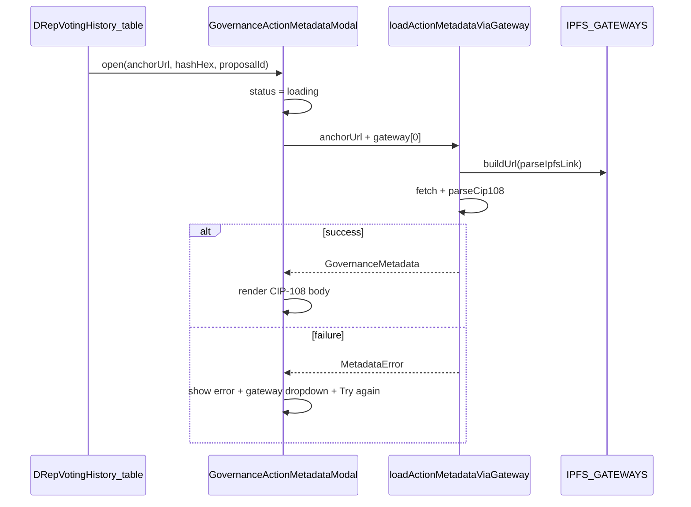

# DRep Voting History: governance metadata popup column

## Goal

Add a column **immediately left of "Governance Action"** on [`DRepVotingHistory.tsx`](src/pages/DRepVotingHistory.tsx). Each row with a known metadata anchor (`actionMetadataAnchor.status === 'present'`) gets a compact button that opens a popup. The popup **fetches and renders** CIP-108 fields (`title`, `abstract`, `motivation`, `rationale`, `references`) using [`IPFS_GATEWAYS`](src/utils/ipfsGateways.ts). On first open it tries **IPFS.io only**; if that fails, show a gateway `<select>` and **Try again** button.

The existing **"Action metadata"** column (opens [`IpfsLinkModal`](src/components/IpfsLinkModal.tsx) for external browsing) stays unchanged.

## Architecture



## 1. Gateway-aware metadata fetch helper

**File:** [`src/functions/governanceActionsFetch.ts`](src/functions/governanceActionsFetch.ts)

Today `loadActionMetadata(url)` does a direct `fetch(url)`, which fails for `ipfs://` anchors in the browser. Add:

- `resolveMetadataFetchUrl(anchorUrl, gateway)` — uses `parseIpfsLink` + `gateway.buildUrl`; for non-IPFS anchors returns the original URL unchanged.
- `loadActionMetadataViaGateway(anchorUrl, gateway)` — resolves fetch URL, then reuses existing fetch/parse/error-mapping logic (refactor current `loadActionMetadata` body into a private `loadActionMetadataFromFetchUrl(fetchUrl)` so both paths share one implementation).

Export `GovernanceMetadata` and `MetadataError` types (already exported) for the modal.

**Behavior:**

| Anchor type | First fetch | Gateway dropdown |
|-------------|-------------|------------------|
| `ipfs://…` | IPFS.io (index 0) | All `IPFS_GATEWAYS` |
| HTTPS / other | Direct URL | Hidden (not applicable) |

## 2. New modal component

**File:** [`src/components/GovernanceActionMetadataModal.tsx`](src/components/GovernanceActionMetadataModal.tsx) (new)

Reuse overlay/panel pattern from [`IpfsLinkModal.tsx`](src/components/IpfsLinkModal.tsx) + [`IpfsLinkModal.css`](src/components/IpfsLinkModal.css). Add a wider panel class (e.g. `governance-metadata-panel`, `max-width: min(640px, 95vw)`) in the same CSS file or a small companion CSS file.

**Props:**

```ts
interface GovernanceActionMetadataModalProps {
  open: boolean;
  anchorUrl: string;
  hashHex?: string;
  proposalLabel: string; // truncated proposal ID for heading
  onClose: () => void;
}
```

**Internal state:** `status: 'idle' | 'loading' | 'loaded' | 'error'`, `metadata`, `error`, `selectedGatewayIndex` (default `0`).

**On `open` transition:** reset state, set `loading`, call `loadActionMetadataViaGateway(anchorUrl, IPFS_GATEWAYS[0])` (or direct fetch when not IPFS).

**UI states:**

- **Loading:** spinner (reuse `.reloading-recache-spinner` from [`ReloadingRecacheModal.css`](src/components/ReloadingRecacheModal.css)) + "Loading metadata…"
- **Loaded:** render CIP-108 content (see §3); show anchor hash if present; close on Escape / backdrop / ×
- **Error:** error message + diagnostics (`code`, HTTP status when available); if IPFS anchor, show `<select>` of gateway names bound to `selectedGatewayIndex` + **Try again** button (disabled while loading)

## 3. CIP-108 render block (small shared component)

**File:** [`src/components/GovernanceMetadataView.tsx`](src/components/GovernanceMetadataView.tsx) (new)

Extract the metadata display markup already used in [`GovernanceActions.tsx`](src/pages/GovernanceActions.tsx) (~lines 391–437): title as heading, abstract body, collapsible `<details>` for motivation / rationale / references.

Refactor `GovernanceActions.tsx` to import this component (small, focused change — removes duplication for the new modal).

## 4. Table column in DRep Voting History

**File:** [`src/pages/DRepVotingHistory.tsx`](src/pages/DRepVotingHistory.tsx)

**Header:** narrow column, e.g. `Details` or empty with `title="View governance metadata"`.

**Cell button** (left of Governance Action link):

| `actionMetadataAnchor.status` | Cell |
|-------------------------------|------|
| `present` + `url` | Compact button (e.g. `View` or document-style `▣`) → `setMetadataModal({ url, hashHex, proposalId })` |
| `absent` | `—` (gray) |
| `unknown` | `?` (gray), no click |

**State:**

```ts
interface MetadataModalState {
  url: string;
  hashHex?: string;
  proposalId: string;
}
```

Wire `<GovernanceActionMetadataModal open={metadataModal !== null} … onClose={() => setMetadataModal(null)} />` next to existing `IpfsLinkModal`.

## 5. Tests

**File:** [`src/functions/governanceActionsFetch.test.ts`](src/functions/governanceActionsFetch.test.ts) (new) or extend [`src/utils/ipfsGateways.test.ts`](src/utils/ipfsGateways.test.ts)

- `resolveMetadataFetchUrl` builds correct gateway URL for `ipfs://` and passes through HTTPS URLs.
- Mock `fetch` for `loadActionMetadataViaGateway`: success JSON → parsed `GovernanceMetadata`; HTTP 500 → retryable error.

No network tests required.

## Files touched (summary)

| File | Change |
|------|--------|
| [`governanceActionsFetch.ts`](src/functions/governanceActionsFetch.ts) | Gateway-aware fetch helpers |
| [`GovernanceActionMetadataModal.tsx`](src/components/GovernanceActionMetadataModal.tsx) | New popup with loading / error / retry |
| [`GovernanceMetadataView.tsx`](src/components/GovernanceMetadataView.tsx) | Shared CIP-108 renderer |
| [`GovernanceActions.tsx`](src/pages/GovernanceActions.tsx) | Use shared renderer |
| [`DRepVotingHistory.tsx`](src/pages/DRepVotingHistory.tsx) | New column + modal wiring |
| [`IpfsLinkModal.css`](src/components/IpfsLinkModal.css) | Wider panel variant for metadata content |

## Out of scope

- Pre-fetching metadata for all rows on page load (fetch is on-demand per popup open only)
- Auto-rotating through all gateways before showing retry UI
- IndexedDB caching of fetched CIP-108 documents
- Removing or changing the existing "Action metadata" / `IpfsLinkModal` column
