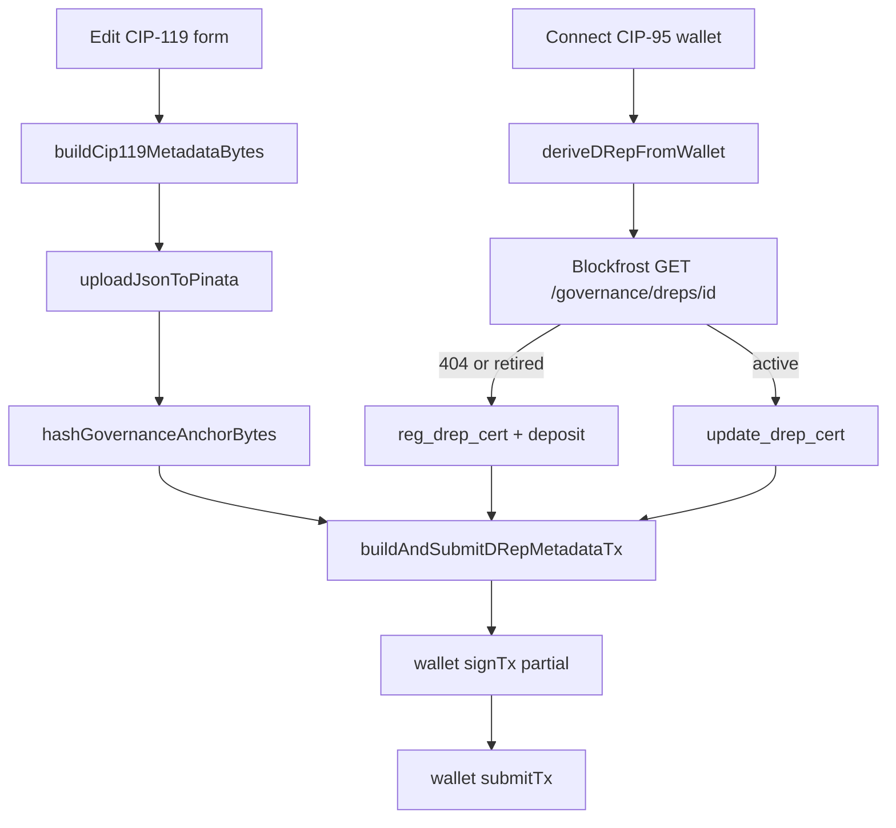

# DRep Metadata Setter Tool

## Goal

New tool at `/drep-metadata` (aliases optional) where a DRep can:

1. Connect a CIP-95 wallet and derive their `drep1` ID
2. Fill in CIP-119 profile fields (or load existing metadata for edits)
3. Build a compliant CIP-100 + CIP-119 JSON-LD document
4. Upload to IPFS via Pinata JWT (or paste a manual anchor URL + hash)
5. Submit **register** (`reg_drep_cert` + key deposit) or **update** (`update_drep_cert`) on mainnet

Credentials: **Blockfrost** (protocol params, DRep status, post-submit links) + **Pinata JWT** (JSON upload), matching existing governance tools.

## Current state (gaps)

| Area | Exists | Missing |
|------|--------|---------|
| CIP-119 **read** | [`drepMetadata.ts`](src/functions/drepMetadata.ts), [`DRepMetadataView.tsx`](src/components/DRepMetadataView.tsx) | **Write** / serialize |
| CIP-100 anchor hashing | [`cip100RationaleDocument.ts`](src/functions/cip100RationaleDocument.ts) | CIP-119 `@context` builder |
| Pinata upload | [`pinataUpload.ts`](src/functions/pinataUpload.ts) | Used only for vote rationale today |
| CML tx + CIP-95 sign | [`bulkVote.ts`](src/functions/bulkVote.ts), [`drepCredential.ts`](src/functions/drepCredential.ts) | `reg_drep_cert` / `update_drep_cert` (CML exposes both; unused in `src/`) |
| Credential storage | [`blockfrostSlice`](src/store/blockfrostSlice.ts), [`pinataSlice`](src/store/pinataSlice.ts), [`toolConfigStorage.ts`](src/utils/toolConfigStorage.ts) | Tool-specific config key |

## Architecture



## Implementation plan

### 1. CIP-119 document builder — new [`src/functions/cip119MetadataDocument.ts`](src/functions/cip119MetadataDocument.ts)

Mirror [`cip100RationaleDocument.ts`](src/functions/cip100RationaleDocument.ts):

- Export `CIP119_INLINE_CONTEXT` using the Blockfrost example shape from [`drepMetadata.test.ts`](src/functions/drepMetadata.test.ts) (lines 4–22)
- `buildCip119MetadataBytes(fields: DrepMetadataFormInput): Uint8Array`
  - Top-level: `@context`, `hashAlgorithm: 'blake2b-256'`, `authors: []` (per [CIP-119 wiki](wiki/pages/drep-metadata-cip119.md))
  - `body`: `givenName` (required for compliant doc), optional narrative fields, `paymentAddress`, `doNotList`, `image`, `references` with `@type` + `@container: @set`
- Reuse `hashGovernanceAnchorBytes` from `cip100RationaleDocument.ts` (export or move to shared `governanceAnchor.ts` if cleaner)
- `validateCip119Form(fields)` — enforce CIP-119 limits: `givenName` ≤80, narratives ≤1000, at least one reference `uri` when present
- Round-trip test: `build` → `parseCip119Metadata` in new `cip119MetadataDocument.test.ts`

### 2. DRep registration status — new [`src/functions/drepRegistrationStatus.ts`](src/functions/drepRegistrationStatus.ts)

`fetchDrepRegistrationStatus(apiKey, drepId)` → `'unregistered' | 'active' | 'retired' | 'expired'`

- `GET /governance/dreps/{drep_id}` via existing mainnet Blockfrost base URL pattern
- 404 → `unregistered`
- Response `retired` / `expired` flags → respective status (UI: retired/expired DReps need re-registration path or clear error)

### 3. On-chain tx builder — new [`src/functions/drepMetadataTx.ts`](src/functions/drepMetadataTx.ts)

Modeled on [`bulkVote.ts`](src/functions/bulkVote.ts) (reuse `buildConfig`, UTxO selection, partial `signTx`, DRep key witness check):

```typescript
export async function buildAndSubmitDrepMetadataTx(options: {
  api: any;
  params: ProtocolParametersSnapshot;
  changeAddressBech32: string;
  drepKeyHashHex: string;
  mode: 'register' | 'update';
  anchor: { url: string; hashHex: string };
}): Promise<{ txHash: string; ... }>
```

- `Credential.new_pub_key(Ed25519KeyHash.from_hex(...))`
- **Register:** `Certificate.new_reg_drep_cert(cred, params.keyDeposit, anchor)` — deposit from [`blockfrostProtocolParams.ts`](src/functions/blockfrostProtocolParams.ts) (`keyDeposit`, default ~2 ADA)
- **Update:** `Certificate.new_update_drep_cert(cred, anchor)`
- `txb.add_certificate(...)` — single cert per tx (HW-friendly per CIP-21)
- No auxiliary metadata label needed (anchor is on the cert)

### 4. UI page — new [`src/pages/DRepMetadataEditor.tsx`](src/pages/DRepMetadataEditor.tsx)

**Credential panel** (copy patterns from [`DRepBulkVote.tsx`](src/pages/DRepBulkVote.tsx)):

- Blockfrost API key: Redux + localStorage + optional `?blockfrostApiKey=` URL param
- Pinata JWT: Redux + extend [`toolConfigStorage.ts`](src/utils/toolConfigStorage.ts) with `DREP_METADATA_CONFIG_STORAGE_KEY` (or reuse bulk-vote Pinata cache with "Load cached JWT" button)
- Wallet connect via `enableWalletWithCip95` + `deriveDRepFromWallet`

**Wizard steps:**

1. **Connect** — wallet + credentials; show derived `drep1` ID and registration status badge
2. **Profile** — form fields matching CIP-119:
   - Required: `givenName`
   - Optional: objectives, motivations, qualifications, paymentAddress, doNotList checkbox
   - References editor: rows of type (`Link` / `Identity`), label, uri (add/remove)
   - Image: URL + optional `sha256` text field (v1: no Pinata image upload; user supplies URL; optional client-side sha256 fetch with CORS failure fallback message)
   - **Load existing** button when status is `active`: `ensureDrepMetadataDocCached` → pre-fill form
3. **Preview** — reuse [`DRepMetadataView.tsx`](src/components/DRepMetadataView.tsx) + raw JSON toggle
4. **Publish** — upload to Pinata → show `ipfs://` URL + blake2b-256 hash; allow manual override of URL/hash (same as bulk vote anchor fields)
5. **Submit** — confirm mode (register vs update), deposit warning for register, build + sign + submit; success links to Cardanoscan + `/drephistory/{drepId}`

Extract reusable credential UI into a small component only if the page grows unwieldy; otherwise inline like bulk vote to keep scope tight.

### 5. Routing and discovery

- Add routes in [`src/index.tsx`](src/index.tsx): `/drep-metadata`, `/set-drep-metadata`, `/drep-profile`
- Add Home card in [`src/pages/Home.tsx`](src/pages/Home.tsx)

### 6. Tests

| File | Coverage |
|------|----------|
| `cip119MetadataDocument.test.ts` | Build bytes, hash, parse round-trip, validation limits |
| `drepRegistrationStatus.test.ts` | Mock fetch: 404, active, retired |
| `drepMetadataTx.test.ts` | Light unit tests for cert mode selection logic (full CML tx build optional / smoke only) |

## Key reuse map

| New piece | Copy from |
|-----------|-----------|
| Pinata JWT UX | [`DRepBulkVote.tsx`](src/pages/DRepBulkVote.tsx) lines 432–487 |
| Anchor URL + hash | [`DRepCastVoteWizardModal.tsx`](src/components/DRepCastVoteWizardModal.tsx) |
| Tx build/sign/submit | [`bulkVote.ts`](src/functions/bulkVote.ts) |
| Wallet + DRep ID | [`drepCredential.ts`](src/functions/drepCredential.ts) |
| Metadata preview | [`DRepMetadataView.tsx`](src/components/DRepMetadataView.tsx) |
| Load existing profile | [`ensureDrepMetadataDocCached`](src/utils/drepMetadataDocFetch.ts) |
| CIP-119 `@context` | [`drepMetadata.test.ts`](src/functions/drepMetadata.test.ts) `blockfrostExample` |

## Out of scope (v1)

- Testnet / preview network toggle (ctools is mainnet-hardcoded)
- Pinata image file upload + automatic sha256
- CIP-100 `authors` witness signing (CIP-119 explicitly uses empty authors)
- Script-hash DReps (wallet key-hash DReps only in v1)
- Wiki ingest (can follow after ship)

## Risks and mitigations

- **Wallet CIP-95 support:** Validate DRep witness after sign (same check as bulk vote); clear reconnect instructions
- **Register deposit:** Show `keyDeposit` ADA prominently; Blockfrost params fetched fresh before submit
- **Retired DRep:** Detect and explain that a new registration tx may be required rather than a simple update
- **Image sha256:** Optional in v1; warn when URL image lacks sha256 (CIP-119 recommends it for remote URLs)

## Post-ship (optional)

- Link from DRep Voting History profile panel: "Edit my metadata" when connected wallet matches page DRep
- Seed metadata cache via `putDrepMetadataDocCache` after successful publish
