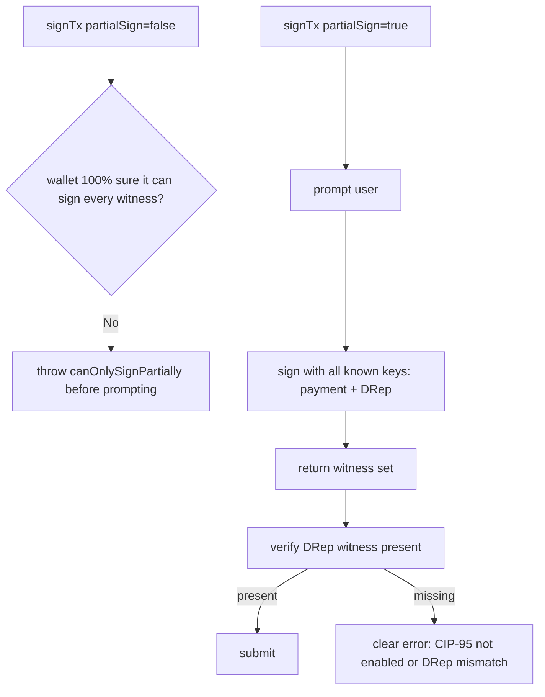

# Fix: Eternl rejects DRep vote tx before showing prompt

## Root cause

[src/functions/bulkVote.ts](src/functions/bulkVote.ts) line 175 calls `api.signTx(unsignedTxHex, false)`. With `partialSign=false`, a CIP-30 wallet must be certain it can supply every required witness, otherwise it returns `canOnlySignPartially` immediately — without prompting the user. Even with CIP-95 enabled, Eternl treats DRep witnesses defensively under strict mode and bails out at the API boundary.

Every working CIP-95 voting dapp (GovTool, sancho, govtool-mobile) uses `partialSign=true` and trusts the wallet to sign with every key it knows about.



## Changes

### 1. Switch to partialSign=true and verify DRep witness

In [src/functions/bulkVote.ts](src/functions/bulkVote.ts):

Replace the current sign block (lines 173-190) with:

```ts
let witnessSetHex: string;
try {
  witnessSetHex = await api.signTx(unsignedTxHex, true);
} catch (err: unknown) {
  const msg = err && typeof err === 'object' && 'message' in err
    ? String((err as { message?: unknown }).message)
    : String(err);
  throw new Error(`Wallet refused to sign: ${msg}`);
}
const walletWits = CML.TransactionWitnessSet.from_cbor_hex(witnessSetHex);
```

Then, before assembling the final tx, check that a vkey witness for our DRep key hash is present in `walletWits`. Add a small helper near the top of the file:

```ts
function witnessSetContainsKeyHash(wits: CML.TransactionWitnessSet, expectedKeyHashHex: string): boolean {
  const vks = wits.vkeywitnesses();
  if (!vks) return false;
  const want = expectedKeyHashHex.toLowerCase();
  for (let i = 0; i < vks.len(); i++) {
    const pub = vks.get(i).vkey();
    const bytes = pub.to_raw_bytes();
    const kh = CML.Ed25519KeyHash.from_raw_bytes(blake2b_224(bytes)).to_hex().toLowerCase();
    if (kh === want) return true;
  }
  return false;
}
```

(Add `import { blake2b_224 } from '@harmoniclabs/crypto';` at the top of [src/functions/bulkVote.ts](src/functions/bulkVote.ts).)

Use it right after parsing `walletWits`:

```ts
if (!witnessSetContainsKeyHash(walletWits, normalizeHashHex(drepKeyHashHex))) {
  throw new Error(
    'The wallet returned signatures but none matches your DRep key. Either the CIP-95 extension was not approved on this connection, or the auto-detected DRep ID does not match the wallet. Reconnect Eternl/Lace, approve CIP-95 when prompted, and try again.'
  );
}
```

That single check covers both real failure modes: wallet declined CIP-95, or the on-chain Voter we built uses a key hash the wallet does not own.

### 2. Tiny page-side polish

Nothing to change in [src/pages/DRepBulkVote.tsx](src/pages/DRepBulkVote.tsx); it already passes the wallet error message through `submitError`.

## Out of scope

- Adding a "Test signing" preflight that builds a 1-vote tx — not needed; the new error message already pinpoints the cause.
- Touching the previous CIP-95 enable / DRep-key derivation work in [src/functions/drepCredential.ts](src/functions/drepCredential.ts) — that is now correct (the user confirms DRep ID loads).