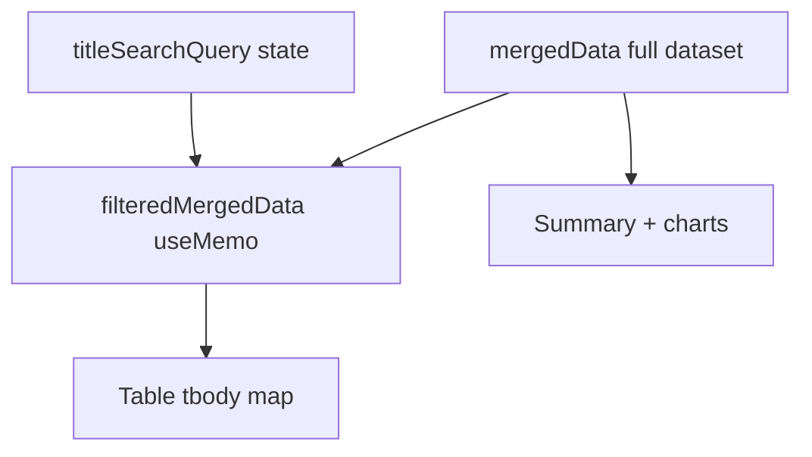

# DRep Voting History Title Search

## Goal

Add a simple client-side search bar on [`src/pages/DRepVotingHistory.tsx`](src/pages/DRepVotingHistory.tsx) that narrows the proposal table as the user types. Filtering happens at the display layer: one shared rule for every row, using the same strings the Action column already shows (or would show if a title were cached).

## Current state

- Rows render from `mergedData` (full Blockfrost merge), mapped directly in the table at ~line 990.
- Cached CIP-108 titles live in `metadataTitleByKey`, resolved per row via `resolveCachedTitle()` (~lines 725–735), and passed to [`src/components/DRepVotingHistoryRow.tsx`](src/components/DRepVotingHistoryRow.tsx) as `cachedTitle`.
- Summary stats and charts intentionally use full `mergedData` (lines 926–975); prefetch/settings counts also use full data — **keep that unchanged**.



## Filter behavior

**Single filter function for all rows** (cached and uncached treated identically):

1. Build a lowercase search haystack from display-relevant fields:
   - `formatGovActionType(row.govActionType)` — always visible as the type badge
   - `resolveCachedTitle(row)` — included when metadata is cached (primary search target)
   - `row.proposalId` — full gov action ID (matches truncated link text too)
2. Trim and lowercase the query; empty query → show all rows.
3. Keep a row when `haystack.includes(query)`.

This matches your “display level” requirement: uncached rows without a title still participate via type label and proposal ID; cached rows additionally match on metadata title.

No new fetches, no changes to [`governanceMetadataDocCache.ts`](src/utils/governanceMetadataDocCache.ts) or prefetch flows.

## UI placement and styling

Insert a compact filter bar **between the charts block and the table** (~line 978), only when `mergedData.length > 0`:

```
[ Search proposals...                    ]  Showing 12 of 340
```

- Reuse existing page input conventions (bordered panel, `padding: 0.5rem`, `border: 1px solid #ccc`) from the DRep ID / Blockfrost key inputs on the same page.
- Add a small CSS class in [`src/pages/DRepVotingHistory.css`](src/pages/DRepVotingHistory.css), e.g. `.drep-voting-history-search-bar`, for layout (`display: flex`, `gap`, full width) — avoid inline-only styles for the bar container.
- Optional clear control: native `type="search"` or a small “Clear” button when query is non-empty.
- Helper hint (only when `uncachedMetadataCount > 0` and query empty): *“Titles appear after metadata is loaded via Settings.”*

## State and derived data

In `DRepVotingHistory.tsx`:

| Addition | Purpose |
|----------|---------|
| `titleSearchQuery: string` state | Controlled input value |
| `filteredMergedData` `useMemo` | `mergedData` filtered by haystack match |
| `useEffect` on `[drepId]` | Reset `titleSearchQuery` to `''` (same as `expandedRowKey`) |
| `useEffect` on `[filteredMergedData, expandedRowKey]` | Collapse expanded row if it falls out of filtered set |

Extract a tiny pure helper near `resolveCachedTitle` (same file, no new util module):

```ts
function actionSearchHaystack(row: MergedProposal, cachedTitle?: string): string
```

`useMemo` deps: `[mergedData, titleSearchQuery, metadataTitleByKey]` (title map affects haystack).

## Table wiring

- Replace `mergedData.map(...)` in the tbody (~line 990) with `filteredMergedData.map(...)`.
- Keep `resolveCachedTitle(row)` call as-is for the `cachedTitle` prop.
- Empty filtered state: if `filteredMergedData.length === 0` but `mergedData.length > 0`, render a single message below the search bar (mirror [`GovernanceActions.tsx`](src/pages/GovernanceActions.tsx) / `DRepBulkVote` pattern): *“No proposals match your search.”*

## What stays unchanged

- Summary counts (`Total proposals`, voted/missed) — still from full `mergedData`
- `DRepVoteSummaryChart` and `DRepVoteMetadataChart` — still full dataset
- Settings prefetch, recache, modals, row expand/collapse behavior (except auto-collapse when filtered away)
- No new dependencies or shared search utility

## Testing checklist

- Empty search shows all rows; typing narrows live (case-insensitive)
- Row with cached title matches on title substring
- Row without cached title still findable by governance type or proposal ID fragment
- Clearing search restores full list
- Changing DRep ID resets search query
- Expanding a row then filtering it out collapses the detail panel
- Summary stats and charts remain based on full proposal set, not filtered subset
