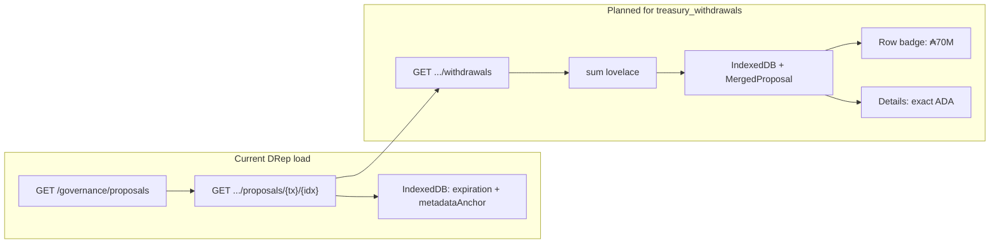

# DRep Voting History: treasury withdrawal amounts

## Context

Treasury withdrawal totals are **on-chain** (credential→lovelace map in the proposal procedure). [Live Governance Actions](src/pages/GovernanceActions.tsx) already fetches them via Blockfrost `/withdrawals` and sums lovelace in [`governanceActionsFetch.ts`](src/functions/governanceActionsFetch.ts). DRep Voting History currently only enriches proposals with **expiration + metadata anchor** via [`fetchSingleProposalEnrichment`](src/utils/governanceExpiration.ts) — no withdrawal data.



## 1. Shared treasury parsing + formatting helpers

**File:** [`src/functions/governanceActionsFetch.ts`](src/functions/governanceActionsFetch.ts)

- Export the existing withdrawal parsing logic (currently private `summarizeWithdrawals` / treasury branch of `parseSummary`) as something like:

```typescript
export interface TreasuryWithdrawalSummary {
  totalLovelace: number;
  recipientCount: number;
}

export function computeTreasuryWithdrawalSummary(
  governanceDescription: unknown,
  preloadedWithdrawals?: { stake_address: string; amount: string }[] | null
): TreasuryWithdrawalSummary
```

- Export a small fetch helper used by both Live Actions and DRep history:

```typescript
export async function fetchProposalTreasuryWithdrawals(
  apiKey: string,
  txHash: string,
  certIndex: number
): Promise<{ stake_address: string; amount: string }[] | null>
```

- Refactor internal `parseSummary` to call `computeTreasuryWithdrawalSummary` (no behavior change for Live Actions).

**New file:** [`src/utils/formatAda.ts`](src/utils/formatAda.ts)

- `formatAdaCompact(lovelace: number): string` — user-requested badge style:
  - `₳70M`, `₳6.3K`, `₳1.2B` (1 decimal for K/M/B when needed; whole number below 1K)
  - Use `₳` prefix consistently
- `formatAdaExact(lovelace: number): string` — full precision for expanded view, e.g. `₳12,345,678` (lovelace / 1_000_000 with `toLocaleString()`)

Add unit tests in [`src/utils/formatAda.test.ts`](src/utils/formatAda.test.ts) for compact tiers and exact formatting.

## 2. Extend proposal enrichment fetch

**File:** [`src/utils/governanceExpiration.ts`](src/utils/governanceExpiration.ts)

Extend `SingleProposalEnrichmentResult`:

```typescript
treasuryWithdrawal: TreasuryWithdrawalSummary | null;
```

In `fetchSingleProposalEnrichment`:

1. After detail JSON is loaded, if `detail.governance_type === 'treasury_withdrawals'`:
   - Call `fetchProposalTreasuryWithdrawals`
   - Fall back to `computeTreasuryWithdrawalSummary(detail.governance_description)` if withdrawals endpoint empty
2. Return `treasuryWithdrawal` in the result
3. **Fix key consistency:** use `proposalCacheKey(txHash, certIndex)` from [`drepVotingHistoryCache.ts`](src/utils/drepVotingHistoryCache.ts) instead of raw `` `${tx_hash}#${cert_index}` `` so fresh fetches align with cache lookups (pre-existing mismatch)

Update `fetchProposalExpirationFields` to also return `treasuryWithdrawalByKey: Map<string, TreasuryWithdrawalSummary>`.

## 3. Cache closed treasury totals

**File:** [`src/utils/drepVotingHistoryCache.ts`](src/utils/drepVotingHistoryCache.ts)

Extend `CachedProposalEnrichment` (optional fields, backward compatible — no DB version bump required):

```typescript
treasuryWithdrawalTotalLovelace?: number;
treasuryWithdrawalRecipientCount?: number;
```

**File:** [`src/utils/drepVotingHistoryRecache.ts`](src/utils/drepVotingHistoryRecache.ts)

Persist treasury fields when writing `proposalCacheWrites` from enrichment results.

## 4. Wire into DRep Voting History load path

**File:** [`src/pages/DRepVotingHistory.tsx`](src/pages/DRepVotingHistory.tsx)

- Extend `MergedProposal` / row data passed to components:

```typescript
treasuryWithdrawalTotalLovelace: number | null;
treasuryWithdrawalRecipientCount: number | null;
```

- In the `needsDetail` loop (~line 536): also refetch when proposal is `treasury_withdrawals` **and** cached entry lacks `treasuryWithdrawalTotalLovelace` (covers legacy cache entries).
- Merge treasury totals from `fetched.treasuryWithdrawalByKey` + proposal cache into each merged row.
- Write treasury fields into `proposalCacheWrites` alongside expiration/metadata.
- Include formatted compact amount in `actionSearchHaystack` so search can match "70M" / "6.3K".

## 5. UI: badge in row, exact in details

**File:** [`src/components/DRepVotingHistoryRow.tsx`](src/components/DRepVotingHistoryRow.tsx)

For `govActionType === 'treasury_withdrawals'` and `treasuryWithdrawalTotalLovelace != null`:

- Render a rounded badge next to the type badge, e.g. `₳70M`, using emerald styling consistent with existing `treasury_withdrawals` type colors (`#022c22` / `#34d399`).

**File:** [`src/components/DRepVotingHistoryRowDetails.tsx`](src/components/DRepVotingHistoryRowDetails.tsx)

In the "Governance action" section (after Type):

- **Withdrawal:** exact formatted amount via `formatAdaExact`
- Optional sub-line: recipient count (matches Live Actions summary semantics)

**File:** [`src/pages/DRepVotingHistory.css`](src/pages/DRepVotingHistory.css)

- Add `.drep-voting-history-treasury-badge` (rounded pill, compact typography, treasury green palette).

## 6. Wiki note (small)

Update [`wiki/pages/ctools-drep-voting-history-blockfrost.md`](wiki/pages/ctools-drep-voting-history-blockfrost.md) to document treasury withdrawal enrichment + display, linking to [`wiki/pages/treasury-withdrawal-governance-amounts.md`](wiki/pages/treasury-withdrawal-governance-amounts.md).

## API / performance notes

- Extra Blockfrost call only for `treasury_withdrawals` proposals (subset of all proposals).
- Totals are immutable once submitted → safe to cache in IndexedDB with closed actions.
- Open treasury actions refetch on each load (existing pattern for non-finalized proposals).

## Out of scope

- Sort/filter by withdrawal amount (Live Actions has this; not requested here).
- Per-recipient breakdown table (only total + count unless user asks later).
- Changes to Cast Vote wizard or Bulk Vote pages.
