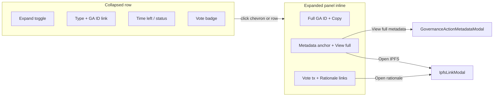

# DRep Vote History Expandable Table Redesign

## Problem

The current table in [`src/pages/DRepVotingHistory.tsx`](src/pages/DRepVotingHistory.tsx) has **9 columns** and a **1200px min-width** ([`src/pages/DRepVotingHistory.css`](src/pages/DRepVotingHistory.css)), forcing horizontal scroll. Several columns overlap in purpose (Details vs Action metadata), and important context (full GA ID, vote tx, rationale) is cramped into narrow cells. Titles only appear inside the metadata modal, not in the list.

## Design Direction (Hybrid)

Keep a **scannable table** for the full proposal list, but collapse secondary details into an **inline expanded panel** per row. Reserve the existing **metadata modal** for full CIP-108 documents (heavy fetch, formatted/JSON toggle, gateway retry).

## Collapsed Table (4 columns)

| Column | Content |
|--------|---------|
| **Expand** | Chevron button (`aria-expanded`, `aria-controls`) |
| **Action** | Type badge (reuse color logic from [`GovernanceActions.tsx`](src/pages/GovernanceActions.tsx)) + truncated GA ID link to Cardanoscan; optionally show cached metadata **title** as a subtitle when available |
| **Time left** | Existing `formatGovernanceTimeRemaining` / color logic |
| **Vote** | Existing colored badge (Yes / No / Abstain / Did Not Vote) |

This removes from the always-visible row: Copy ID, Action metadata link, Rationale, Vote Tx, and the separate Details button.

## Expanded Panel (inline, below row)

A full-width cell (`colSpan={4}`) with a bordered panel using a 2-column CSS grid on desktop, stacked on mobile:

**Governance action section**
- Full governance action ID (monospace, word-break) + Copy button
- Action type (if not already clear from badge)
- Time/status (duplicate is fine for context when scrolled)
- Action metadata: IPFS link via existing `IpfsLinkModal` trigger + **View full metadata** button opening `GovernanceActionMetadataModal`

**Vote section**
- Vote label (same badge styling)
- Vote transaction hash link (or `-`)
- Rationale anchor link via `IpfsLinkModal` (preserving `…` loading state from `anchorLoading`)

Reuse existing handlers (`setMetadataModal`, `setIpfsModal`, `copyGovActionId`) — no API or cache changes.

## Component Extraction

Split UI out of the 930-line page file (data fetching stays in the page):

| New file | Responsibility |
|----------|------------------|
| [`src/components/DRepVotingHistoryRow.tsx`](src/components/DRepVotingHistoryRow.tsx) | Summary `<tr>` + conditional detail `<tr>`; receives `expanded`, `onToggle`, row data, modal callbacks |
| [`src/components/DRepVotingHistoryRowDetails.tsx`](src/components/DRepVotingHistoryRowDetails.tsx) | Expanded panel layout and link/button triggers |
| [`src/pages/DRepVotingHistory.css`](src/pages/DRepVotingHistory.css) | Update column classes; add `.drep-voting-history-row-details` panel styles; drop `min-width: 1200px` (target ~640px) |

Extract small pure helpers already inline in the page (`voteColor`, `voteLabel`, `truncateHash`) into the row component or a tiny shared util only if needed — avoid over-abstracting.

## Interaction Model

- **Single expanded row** at a time: `expandedRowKey: string | null` where key is `` `${proposalTxHash}#${proposalCertIndex}` ``
- Toggle via chevron button; optionally make the summary row clickable (chevron remains the explicit control for accessibility)
- Clicking a different row collapses the previous one
- Modals remain page-level (same `metadataModal` / `ipfsModal` state) — unchanged portal behavior from [`GovernanceActionMetadataModal.tsx`](src/components/GovernanceActionMetadataModal.tsx)

## Optional Enhancement (low cost, no new fetches)

Add `loadAllMetadataDocCache()` to [`src/utils/governanceMetadataDocCache.ts`](src/utils/governanceMetadataDocCache.ts) (mirror `loadAllProposalCache` pattern). On page load, build a `Map<proposalKey, title>` so collapsed rows can show a human-readable title when the user has previously viewed/cached metadata. Rows without cache continue showing type + truncated ID only.

## What Stays Unchanged

- All Blockfrost fetching, merge logic, `enrichAnchors`, IndexedDB caching, recache flow
- Summary stats, CIP-100 anchor percentage, and both charts above the table
- `DRepVotingHistorySettingsModal`, `ReloadingRecacheModal`
- `GovernanceActionMetadataModal` and `IpfsLinkModal` behavior

## Visual Reference

Follow existing dark theme (`#1a1103` / `#33240b` zebra, `#ffa722` accents). Expanded panel: subtle inset border (`#4b5563`), similar to governance cards in [`GovernanceActions.tsx`](src/pages/GovernanceActions.tsx) lines 283–292.

## Testing Checklist

- Load a DRep with mixed votes; verify 4-column table renders without horizontal scroll on ~768px viewport
- Expand/collapse rows; confirm only one open at a time
- From expanded panel: Copy ID, Cardanoscan links, Metadata IPFS link, View full metadata modal, Rationale link (after anchor enrichment finishes)
- Rows with no vote show `—` in vote section; rows with no metadata show `—` / `?` as today
- Charts and recache/settings modals still work
