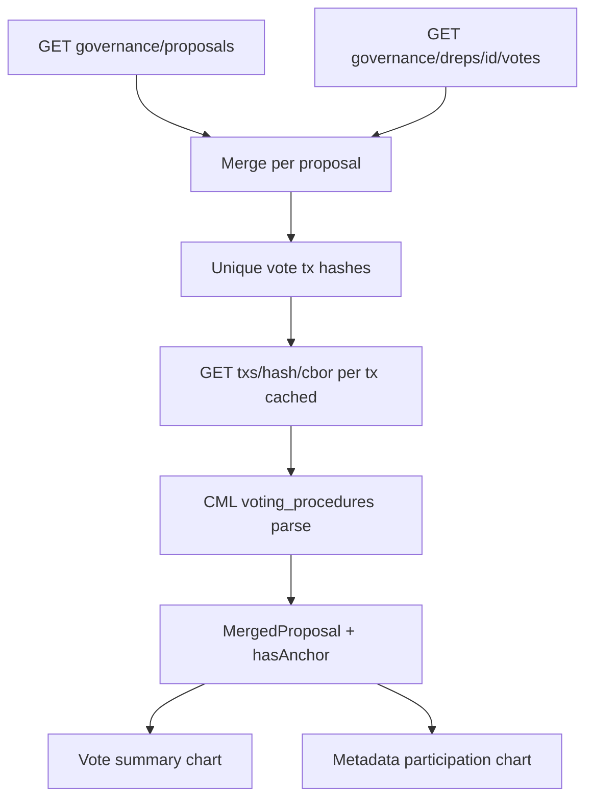

# DRep vote metadata charts and anchor detection

## Goal

On [`src/pages/DRepVotingHistory.tsx`](src/pages/DRepVotingHistory.tsx), show:

1. Existing **vote disposition** chart (unchanged semantics).
2. New **vote rationale (CIP-100 anchor)** chart with three buckets: **Did not vote**, **Voted without anchor**, **Voted with anchor**.
3. **Pie / bar toggle** on both charts (modal + thumbnail uses pie only).
4. Expanded metadata modal: **cross-tab** (Yes/No/Abstain × with/without anchor, voted actions only).
5. Table column linking rationale URL when present.

No off-chain fetch or hash validation—only whether the on-chain `VotingProcedure` includes an anchor ([CIP-100](wiki/pages/governance-metadata-framework-cip100.md), [CIP-1694 votes](wiki/raw/cip1694.md)).

## Why extra work is needed

Blockfrost `GET /governance/dreps/{drep_id}/votes` does **not** expose `metadata_url` / `metadata_hash` (unlike committee votes). Anchor data lives on `voting_procedure.voting_anchor_id` in db-sync but is omitted from the DRep votes SQL. Detection requires **`GET /txs/{hash}/cbor`** + CML parse ([prior analysis](wiki/pages/ctools-drep-voting-history-blockfrost.md)).



## 1. Vote anchor extraction (new module)

**New:** [`src/functions/voteTxAnchors.ts`](src/functions/voteTxAnchors.ts)

Responsibilities:

- **`parseVoteAnchorsFromTxCbor(cborHex, drepCredential)`** — pure function:
  - `CML.Transaction.from_cbor_hex(cborHex)` → `body().voting_procedures()`
  - Find voter matching page DRep via [`resolveManualDRep`](src/functions/drepCredential.ts) (`key` → `as_d_rep_key_hash()`, `script` → `as_d_rep_script_hash()`)
  - Iterate `MapGovActionIdToVotingProcedure.keys()`; for each `GovActionId`, build key `` `${transaction_id().to_hex()}#${gov_action_index()}` ``
  - `hasAnchor = procedure.anchor() !== undefined`; if present, expose `url` via `anchor_url().get()`, `hashHex` via `anchor_doc_hash().to_hex()`
  - Return `Map<string, { hasAnchor: boolean; url?: string; hashHex?: string }>`

- **`fetchVoteTxAnchorMap(apiKey, voteTxHashes, drepId)`**:
  - Deduplicate hashes from voted rows only
  - Concurrency-limited `GET https://cardano-mainnet.blockfrost.io/api/v0/txs/{hash}/cbor` (same header pattern as [`fetchAllPages`](src/functions/governanceActionsFetch.ts))
  - Merge per-tx maps into one global map
  - On per-tx failure: log and treat that tx’s votes as `hasAnchor: unknown` → UI shows “unknown” state (exclude from with/without counts or bucket separately—recommend **exclude from metadata chart counts** and show footnote “N votes could not be checked”)

**Export** `mapWithConcurrency` from [`governanceActionsFetch.ts`](src/functions/governanceActionsFetch.ts) (already used for tx block times) to avoid duplicating the worker pool.

**New test:** [`src/functions/voteTxAnchors.test.ts`](src/functions/voteTxAnchors.test.ts)

- Use CBOR hex from [`eternl-debug-c2b4e67e73f4c28a81c8cf5c71fa45dfa8560cbfd3d3aea69f60f709ca106590-unsigned.json`](eternl-debug-c2b4e67e73f4c28a81c8cf5c71fa45dfa8560cbfd3d3aea69f60f709ca106590-unsigned.json) (`txCbor` field) with known DRep key hash `4281249b...` — assert multiple gov actions parsed, `anchor: null` → `hasAnchor: false`
- Optional second fixture: tiny CML-built tx with one vote + anchor (programmatic in test) to assert `hasAnchor: true` and URL/hash round-trip

## 2. Page data model and enrichment

**Update:** [`src/pages/DRepVotingHistory.tsx`](src/pages/DRepVotingHistory.tsx)

Extend `MergedProposal`:

```ts
voteAnchor: {
  status: 'none' | 'present' | 'absent' | 'unknown'; // none = did not vote
  url?: string;
  hashHex?: string;
} | null;
```

Fetch flow (two-phase UX):

1. **Phase A (existing):** proposals + votes + expiration → render table + vote summary chart immediately.
2. **Phase B:** `fetchVoteTxAnchorMap` for unique `voteTxHash` values → merge into rows by `` `${proposalTxHash}#${proposalCertIndex}` ``.

State: `anchorLoading`, `anchorError` (non-fatal), `anchorCheckFailedCount`.

**Table:** add **Rationale** column — link to anchor URL when `status === 'present'`, “—” when absent, “…” while loading.

**Headline stat** (near existing Voted / Did not vote):  
`X of Y voted actions include a CIP-100 anchor (Z%)` — denominator = voted only.

## 3. Chart components refactor

**Refactor** [`src/components/DRepVoteSummaryChart.tsx`](src/components/DRepVoteSummaryChart.tsx) into shared primitives + two thin wrappers to avoid duplicating modal/pie/bar logic.

Suggested layout:

| File | Role |
|------|------|
| [`src/components/governanceChartShared.tsx`](src/components/governanceChartShared.tsx) | `ChartVariant` (`pie` \| `bar`), `GovernanceChartModal`, `GovernancePie`, `GovernanceBar` (recharts `BarChart`), legend helper, empty state |
| [`src/components/DRepVoteSummaryChart.tsx`](src/components/DRepVoteSummaryChart.tsx) | Keeps `computeVoteSummary`; uses shared renderers; adds pie/bar toggle in modal |
| [`src/components/DRepVoteMetadataChart.tsx`](src/components/DRepVoteMetadataChart.tsx) | New |

**Metadata row type:**

```ts
interface VoteMetadataRow {
  vote: string | null;
  anchorStatus: 'none' | 'present' | 'absent' | 'unknown';
  timeStatus: GovernanceActionTimeStatus;
}
```

**Counts** (`computeVoteMetadataSummary`):

- `didNotVote` — `vote === null`
- `votedWithAnchor` — voted + `anchorStatus === 'present'`
- `votedWithoutAnchor` — voted + `anchorStatus === 'absent'`
- `unknown` / `excluded` — same unfinalized filter as existing chart via `isGovernanceActionFinalized`

Colors: gray / amber / teal (distinct from yes/no/abstain).

**Modal extras (metadata chart only):**

- Subtitle: “CIP-100 vote rationale anchor (on-chain)”
- Cross-tab table (voted rows only, excluding `unknown`):

| | With anchor | Without anchor |
|--|-------------|----------------|
| Yes | n | n |
| No | n | n |
| Abstain | n | n |

**Page layout:** side-by-side chart buttons in the summary row (flex wrap), same “Click to expand” pattern.

## 4. Out of scope (explicit)

- CIP-20 label 674 tx metadata ([wiki](wiki/pages/cip95-wallet-bridge.md)) — separate metric
- Label 1694 auxiliary metadata ([CIP-100](wiki/pages/governance-metadata-framework-cip100.md))
- Off-chain document fetch / hash verification
- Blockfrost API feature request (optional follow-up: extend `dreps/{id}/votes` SQL like committee votes)

## 5. Wiki (small durable note)

After implementation, append a short section to [`wiki/pages/ctools-drep-voting-history-blockfrost.md`](wiki/pages/ctools-drep-voting-history-blockfrost.md): anchor detection via `/txs/{hash}/cbor` + CML; link to new chart behavior. One line in [`wiki/log.md`](wiki/log.md).

## 6. Manual test plan

1. Lookup a DRep with many votes — table loads, then rationale column populates.
2. DRep known to use ctools bulk vote with Pinata — multiple rows share one tx; one CBOR fetch fills many “with anchor” cells.
3. Expand both modals — pie/bar toggle works; unfinalized exclusion applies to both.
4. Metadata modal cross-tab sums match voted counts.
5. DRep with zero votes — empty charts, no CBOR calls.
6. Simulate Blockfrost 404 on one vote tx — unknown footnote, page still usable.
