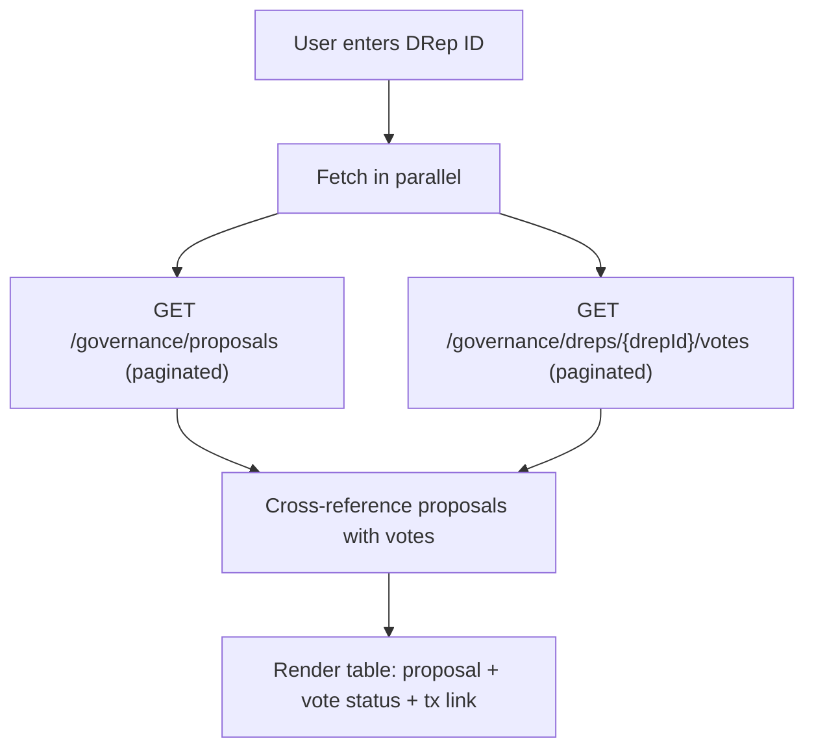

# DRep Voting History Page

## Approach

Create a new page component that takes a DRep ID from the URL, calls Blockfrost directly via `fetch` (consistent with how `Playground.tsx` calls GitHub), and displays a table of all governance actions with the DRep's vote status for each.

The page will **not** require wallet connection -- it is a read-only lookup tool. It only requires the Blockfrost API key (from Redux state or URL param, same pattern as existing pages).

## Blockfrost Endpoints Needed

All calls go to `https://cardano-mainnet.blockfrost.io/api/v0` with header `project_id: <apiKey>`.

1. **`GET /governance/proposals`** -- paginated list of all governance actions. Returns array of objects with `tx_hash`, `cert_index`, `gov_action_type`, etc. Must paginate (100 per page) to get all proposals.
2. **`GET /governance/dreps/{drep_id}/votes`** -- paginated list of all votes cast by the DRep. Returns array of `{ tx_hash, cert_index, gov_action_tx_hash, gov_action_index, vote }`.
3. **`GET /governance/proposals/{tx_hash}/{cert_index}`** -- details for a specific proposal (used to enrich display with type, metadata, etc).

## Data Flow



For each governance proposal, we check if the DRep's votes list contains a matching `gov_action_tx_hash + gov_action_index`. If found, we show the vote (Yes/No/Abstain) and link to the vote transaction. If not found, we mark it as "Missed".

## Files to Create / Modify

### New: `src/pages/DRepVotingHistory.tsx`
- URL parameter: `:drepId` via `useParams` from `react-router`
- Reads `apiKey` from Redux store (`state.blockfrost.apiKey`) or allows entering one
- Contains a helper to paginate Blockfrost calls (fetch all pages)
- Fetches all proposals and DRep votes in parallel on load
- Displays a table with columns:
  - **Governance Action** (type + tx_hash truncated)
  - **Action Type** (e.g. `ParameterChange`, `HardForkInitiation`, etc.)
  - **Vote** (Yes / No / Abstain / Missed) with color coding
  - **Vote Tx** (link to CardanoScan/Blockfrost for the vote tx hash)
- Loading, error, empty states following existing patterns (see [TokenList.tsx](src/components/TokenList.tsx))
- Include a `ConnectWallet` component or at minimum a Blockfrost API key input if no key is set, since this page requires Blockfrost but not a wallet

### Modify: `src/index.tsx`
- Import `DRepVotingHistory`
- Add route: `<Route path="drep/:drepId" element={<DRepVotingHistory />} />`

## UI Design

Following existing patterns from [Tools.tsx](src/pages/Tools.tsx) and [TokenList.tsx](src/components/TokenList.tsx):

- Centered layout with max-width 800px container
- `<h1>` title showing the DRep ID (truncated with full ID in a `<code>` block)
- If no Blockfrost API key, show a prompt to configure it (reuse `ConnectWallet` or just the Blockfrost key input)
- HTML `<table>` with Tailwind classes matching `TokenList` style (`min-w-full`, zebra rows with `odd:/even:` bg colors)
- Color-coded vote badges: green for Yes, red for No, yellow for Abstain, gray for Missed
- Vote tx links open CardanoScan in a new tab: `https://cardanoscan.io/transaction/{tx_hash}`

## Pagination Helper

Blockfrost returns max 100 items per page. We need a reusable async function:

```typescript
async function fetchAllPages<T>(baseUrl: string, apiKey: string): Promise<T[]> {
  const results: T[] = [];
  let page = 1;
  while (true) {
    const res = await fetch(`${baseUrl}?page=${page}&count=100`, {
      headers: { project_id: apiKey }
    });
    if (res.status === 404) break;
    if (!res.ok) throw new Error(`Blockfrost error: ${res.status}`);
    const data: T[] = await res.json();
    results.push(...data);
    if (data.length < 100) break;
    page++;
  }
  return results;
}
```

## Key Decisions

- **Direct `fetch` to Blockfrost** rather than going through Lucid -- Lucid is a transaction-building library and doesn't expose governance query APIs. This is consistent with how `Playground.tsx` does direct `fetch` to GitHub.
- **No wallet required** -- this is purely a read-only data display page. Only needs a Blockfrost API key.
- **Route with DRep ID in URL** (`/drep/:drepId`) -- makes pages linkable/bookmarkable. Could also add a landing variant at `/drep` with an input field to enter a DRep ID.
