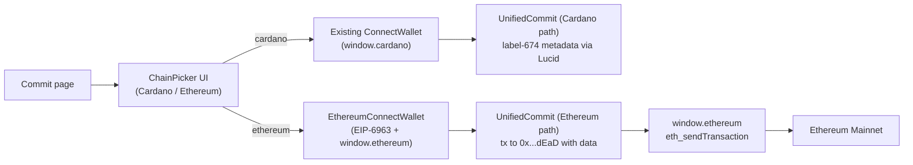

## Goals & non-goals

- Add Ethereum mainnet wallet flow scoped to the commit tool only ([src/pages/Commit.tsx](src/pages/Commit.tsx)).
- IDM = a regular ETH transaction with `to = 0x000000000000000000000000000000000000dEaD`, `value = 0`, `data = 0x<utf8/hex bytes of the commit payload>`.
- Do NOT touch other tools' wallet logic, the existing Cardano flow, or the global `ConnectWallet` component used elsewhere.

## Architecture



## Key decisions

- Library: use raw `window.ethereum` JSON-RPC (`eth_chainId`, `wallet_switchEthereumChain`, `eth_sendTransaction`) plus EIP-6963 (`eip6963:announceProvider`) for multi-wallet discovery. No new heavy deps; if helpful for hex/utf8 conversion we already have `buffer`. Avoids adding `viem`/`ethers`/`wagmi`.
- Mainnet only. Enforce chainId `0x1`; if mismatched, prompt the wallet to switch via `wallet_switchEthereumChain`.
- Chain selection is page-local state in `Commit.tsx`. The connected ETH account lives in a new Redux slice (`ethWalletSlice`) so it follows the same pattern as the existing Cardano `walletSlice` and `isWalletConnectedSlice` (see [src/store/walletSlice.ts](src/store/walletSlice.ts) and [src/store/store.ts](src/store/store.ts)). The provider object itself is NOT stored in Redux (non-serializable); it's resolved on demand via `getEthProvider(rdns)` in `src/functions/ethereum.ts` which keeps a module-level Map keyed by EIP-6963 `info.rdns`.
- All four commit types are supported on ETH (`plain`, `hash`, `aes`, `filehash`). Token attachment is hidden when chain = ethereum (Cardano-specific). The "tip to $computerman" stays available on ETH as a second tx (or skipped to keep MVP simple - see todo).

## Data encoding (IDM payload)

For each commit type, build the same logical bytes that today go into Cardano metadata 674, then hex-encode for `data`:

- `plain`: UTF-8 bytes of the message (no chunking - chunking is a Cardano metadata limit, not ETH).
- `hash`: ASCII bytes of the hex SHA-256 digest (already hex - prefix with `0x`).
- `aes`: UTF-8 bytes of the ciphertext string produced by `encryptAES` ([src/QuickAES.ts](src/QuickAES.ts) - same function the Cardano path uses).
- `filehash`: ASCII bytes of the hex SHA-256 of the file.

Helper: `toHexData(input: string | Uint8Array): \`0x${string}\`` lives in a new `src/functions/ethereum.ts`.

## Files to add

- `src/functions/ethereum.ts` - provider discovery (EIP-6963 + fallback to `window.ethereum`), `connectEthWallet()`, `ensureMainnet()`, `sendIDM({from, dataHex, providerRdns})`, `toHexData()`, mainnet etherscan link helper, plus a module-level `Map<string, EIP1193Provider>` keyed by `info.rdns`.
- `src/store/ethWalletSlice.ts` - new Redux slice with `selectedWalletName: string | null` (e.g. "MetaMask"), `providerRdns: string | null` (EIP-6963 identifier), `address: string | null`, `chainId: string | null`, plus `setEthWallet`, `setEthChainId`, `resetEthWallet` actions. Mirrors [src/store/walletSlice.ts](src/store/walletSlice.ts).
- `src/components/EthereumConnectWallet.tsx` - lists discovered EIP-6963 providers, lets user pick one, calls `eth_requestAccounts`, dispatches `setEthWallet`+`setIsWalletConnected(true)`. Subscribes to `accountsChanged` and `chainChanged` events to keep Redux in sync.
- `src/components/ChainPicker.tsx` - small two-button UI ("Cardano" / "Ethereum") used only on the commit page.
- `src/types/ethereum.d.ts` - minimal `window.ethereum` and EIP-6963 event typings.

## Files to change

- [src/store/store.ts](src/store/store.ts): register the new reducer (`ethWallet: ethWalletReducer`).
- [src/pages/Commit.tsx](src/pages/Commit.tsx): introduce `chain` state (`'cardano' | 'ethereum'`), render `ChainPicker`, then either the existing `<ConnectWallet />`+`<UnifiedCommit />` or the new `<EthereumConnectWallet />`+`<UnifiedCommit chain="ethereum" />`. Reset `isWalletConnected` when the user toggles chains so the two flows do not collide. Update copy in the connect prompt to reflect the chosen chain.
- [src/components/UnifiedCommit.tsx](src/components/UnifiedCommit.tsx):
  - Accept a new optional prop `chain: 'cardano' | 'ethereum'` (default `'cardano'`).
  - On `chain === 'ethereum'`:
    - Read `address` and `providerRdns` from the new `ethWallet` slice instead of `wallet`.
    - Hide the `attachToken` UI block (Cardano-only) - it depends on `lucid.wallet().getUtxos()`.
    - In `handleCommit`, branch: build `dataHex` per commit type using the helpers above, call `ensureMainnet(providerRdns)`, then `sendIDM({ from: address, dataHex, providerRdns })` instead of building a Lucid tx.
    - In the downloaded JSON record, replace `cardanoscan` with `etherscan: \`https://etherscan.io/tx/${txHash}\``, and include `chain: 'ethereum'`, `to: '0x000000000000000000000000000000000000dEaD'`, `dataHex`.
    - The "tip" checkbox: for the MVP, hide it on Ethereum (sending a separate ETH tx makes the UX awkward). Re-enable later if desired.

## Wallet discovery (EIP-6963)

```ts
window.dispatchEvent(new Event('eip6963:requestProvider'));
window.addEventListener('eip6963:announceProvider', (event) => {
  const { info, provider } = (event as any).detail;
});
```

Fallback to `window.ethereum` if no providers announced within ~300ms (covers older MetaMask-only setups).

## Send flow (mainnet IDM)

```ts
await ensureMainnet(provider);
const txHash: string = await provider.request({
  method: 'eth_sendTransaction',
  params: [{
    from,
    to: '0x000000000000000000000000000000000000dEaD',
    value: '0x0',
    data: dataHex,
  }],
});
```

Surface `txHash` in the existing success alert and downloaded JSON. No need to wait for confirmation - matches current Cardano UX.

## Risks / things to watch

- Some wallets reject very large `data` payloads or hit 128 KB call-data limits; not an issue for short commits but worth noting in the description copy when chain=ethereum.
- EIP-6963 discovery race: dispatch the request event AFTER the listener is attached, and keep listening across renders.
- Mainnet gas: include a one-line warning under the chain picker that ETH commits cost real gas (~$1-5+ per commit at typical mainnet prices).
- TypeScript: `window.ethereum` needs typings; add a minimal ambient declaration in `src/types/ethereum.d.ts`.