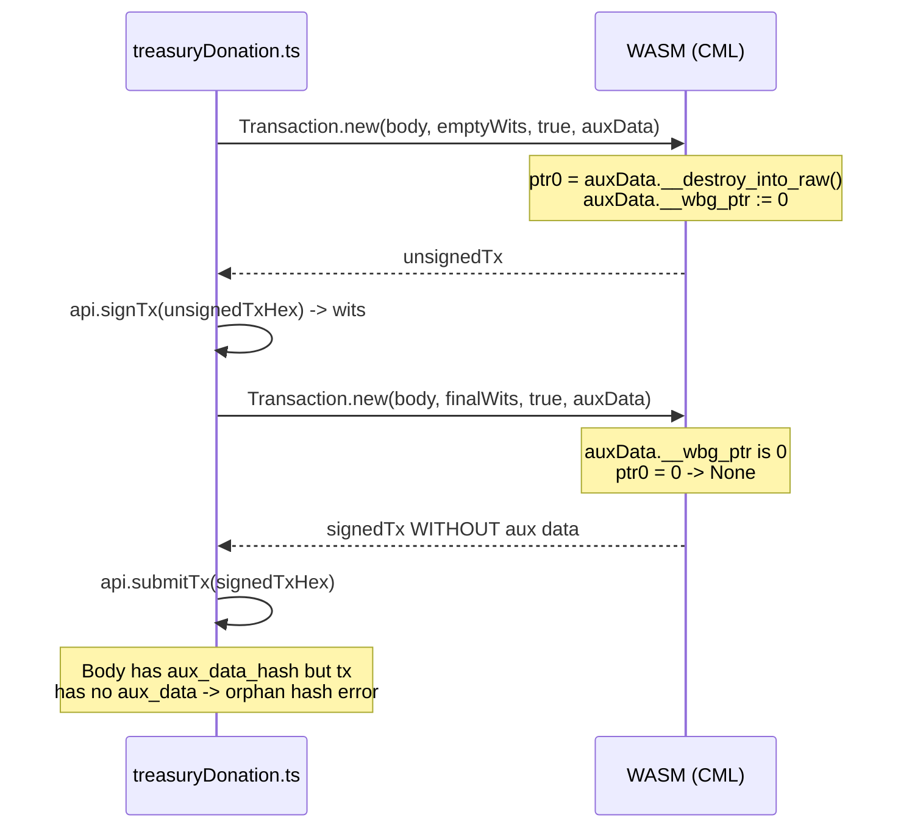

## Problem

When the user submits a treasury donation with the "Attach CIP-20 metadata note" checkbox enabled (the default), the network rejects the transaction with:

```
No metadata corresponding to a specified metadata hash. ... The field 'data.metadata.hash' contains the orphan hash found in the body.
```

### Root cause

In [src/functions/treasuryDonation.ts](src/functions/treasuryDonation.ts) the same `auxData` AuxiliaryData object is reused across two `CML.Transaction.new` calls:

```344:355:src/functions/treasuryDonation.ts
const unsignedTx = CML.Transaction.new(finalBody, emptyWits, true, auxData);
const unsignedTxHex = unsignedTx.to_cbor_hex();

const witnessSetHex: string = await api.signTx(unsignedTxHex, false);
const walletWits = CML.TransactionWitnessSet.from_cbor_hex(witnessSetHex);

const witsBuilder = CML.TransactionWitnessSetBuilder.new();
witsBuilder.add_existing(walletWits);
const finalWits = witsBuilder.build();

const signedTx = CML.Transaction.new(finalBody, finalWits, true, auxData);
```

The WASM wrapper for `Transaction.new` consumes its `auxiliary_data` argument via `__destroy_into_raw()` (`node_modules/@anastasia-labs/cardano-multiplatform-lib-browser/cardano_multiplatform_lib_bg.js:36176–36186`):

```js
static new(body, witness_set, is_valid, auxiliary_data) {
    _assertClass(body, TransactionBody);
    _assertClass(witness_set, TransactionWitnessSet);
    let ptr0 = 0;
    if (!isLikeNone(auxiliary_data)) {
        _assertClass(auxiliary_data, AuxiliaryData);
        ptr0 = auxiliary_data.__destroy_into_raw();   // zeroes auxData.__wbg_ptr
    }
    const ret = wasm.transaction_new(body.__wbg_ptr, witness_set.__wbg_ptr, is_valid, ptr0);
    return Transaction.__wrap(ret);
}
```

After the first call, `auxData.__wbg_ptr === 0`. The second call's `__destroy_into_raw()` returns `0`, which WASM treats as `None`, so the signed transaction is built with no auxiliary data — even though `finalBody` still carries `auxiliary_data_hash` (set earlier via `finalBody.set_auxiliary_data_hash(builtAuxHash)` at line 328). The network sees an orphan hash and rejects.

`body` and `witness_set` are not consumed (the binding only reads `__wbg_ptr`), so reusing them across the two calls is fine — only `auxData` needs a fresh instance.



## Fix

Capture the auxiliary data as CBOR hex once, then rehydrate a fresh `AuxiliaryData` instance for each `CML.Transaction.new` call. This is the same pattern already used elsewhere in the codebase (e.g. round-tripping witness sets in [src/functions/index.tsx](src/functions/index.tsx)).

### Change in [src/functions/treasuryDonation.ts](src/functions/treasuryDonation.ts)

Around line 291–294, capture the CBOR once after constructing the aux data:

```ts
let auxData: CML.AuxiliaryData | undefined;
let auxDataCborHex: string | undefined;
if (metadata && metadata.length > 0) {
  auxData = buildAuxiliaryData(metadata);
  auxDataCborHex = auxData.to_cbor_hex();
  txb.add_auxiliary_data(auxData);
}
```

(`txb.add_auxiliary_data` only borrows `auxData` — see the binding at `cardano_multiplatform_lib_bg.js:36989–36992` — so capturing the CBOR before or after is fine.)

Then replace both `Transaction.new` calls (lines 344 and 354) with rehydrated instances:

```ts
const auxForUnsigned = auxDataCborHex
  ? CML.AuxiliaryData.from_cbor_hex(auxDataCborHex)
  : undefined;
const unsignedTx = CML.Transaction.new(finalBody, emptyWits, true, auxForUnsigned);
const unsignedTxHex = unsignedTx.to_cbor_hex();

// ...sign...

const auxForSigned = auxDataCborHex
  ? CML.AuxiliaryData.from_cbor_hex(auxDataCborHex)
  : undefined;
const signedTx = CML.Transaction.new(finalBody, finalWits, true, auxForSigned);
const signedTxHex = signedTx.to_cbor_hex();
```

The `auxData` local that was used for `txb.add_auxiliary_data` is no longer reused for transaction assembly, so we can drop the outer `auxData` variable (or keep it, untouched) — only `auxDataCborHex` is needed downstream.

### Why this works

- `AuxiliaryData.from_cbor_hex` returns a brand-new wrapper with a fresh WASM pointer; consuming it via `__destroy_into_raw()` no longer poisons anything we still need.
- The metadata bytes (and therefore the hash) are identical across both rehydrations, so the `auxiliary_data_hash` already set on `finalBody` matches the rehydrated aux data — the signed transaction is internally consistent.
- The unsigned tx still carries the metadata, so wallets like Eternl/Lace continue to display the CIP-20 note during signing.

## Out of scope

- No README/wiki updates.
- No new tests (project has no test harness for this page).
- The pre-existing `placeholderIndexInUserAdditions` / output-swap dance for the donation field is unrelated and left alone.

## Verification

After the change, retry a donation with the "Attach CIP-20 metadata note" checkbox enabled. The submitted transaction should be accepted by the network, and the on-chain tx should contain both the body-level `auxiliary_data_hash` and the matching label-674 metadata payload. Donations with the note checkbox disabled were never affected and should continue to work.