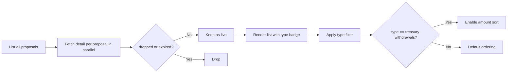

## New Page: `GovernanceActions`

Create [src/pages/GovernanceActions.tsx](src/pages/GovernanceActions.tsx) modeled on [src/pages/DRepVotingHistory.tsx](src/pages/DRepVotingHistory.tsx) (same Blockfrost API-key UX, same wrapper layout, same `fetchAllPages` helper, same Tailwind table styling).

### Data fetching
- List endpoint: `GET /governance/proposals` (already used in `DRepVotingHistory`) — returns `{ tx_hash, cert_index, governance_type }[]`.
- Detail endpoint (one call per proposal, parallelized with concurrency cap of ~8): `GET /governance/proposals/{tx_hash}/{cert_index}` — returns fields including `ratified_epoch`, `enacted_epoch`, `dropped_epoch`, `expired_epoch`, `deposit`, `return_address`, `governance_description` (the parsed action JSON).
- "Live" filter (looser interpretation per user): keep proposals where `dropped_epoch === null && expired_epoch === null`. This retains ratified-but-not-yet-enacted actions.



### Governance types (per Blockfrost / CIP-1694)
- `hard_fork_initiation`
- `info_action`
- `new_committee`
- `new_constitution`
- `no_confidence`
- `parameter_change_action`
- `treasury_withdrawals`

### Type-specific display
Each row/card shows: proposal-id link to `cardanoscan.io/govAction/{id}`, a colored type badge, and a short summary derived from `governance_description`:
- `treasury_withdrawals`: total ADA across all withdrawal entries (sum of the lovelace values) plus count of recipients.
- `parameter_change_action`: list of parameter keys being changed.
- `new_committee`: count of members added/removed + new threshold.
- `new_constitution`: anchor URL/hash.
- `hard_fork_initiation`: target protocol version.
- `info_action` / `no_confidence`: short label only.
- Fallback: raw JSON in a collapsible `<details>`.

### Filtering & sorting UI
- A `<select>` with options `All` + each of the 7 types. Labels formatted via existing `formatGovActionType` pattern.
- When the selected type is `treasury_withdrawals`, reveal a second `<select>` with `Sort: None | Amount ascending | Amount descending` that re-orders by the computed total lovelace.
- Display counts per type in a summary strip similar to `DRepVotingHistory` (`Total live: N`, breakdown by type).

### Routing
Add routes in [src/index.tsx](src/index.tsx) next to the existing `drephistory` group:

```tsx
<Route path="governance-actions" element={<GovernanceActions />} />
<Route path="governanceactions" element={<GovernanceActions />} />
<Route path="gov-actions" element={<GovernanceActions />} />
<Route path="live-actions" element={<GovernanceActions />} />
```

### Shared helper extraction (optional, small)
`fetchAllPages`, `truncateHash`, and `formatGovActionType` are currently private to `DRepVotingHistory.tsx`. Plan: copy them into the new file (keeps the diff small and matches existing code style). If you'd rather DRY them up front, I can pull them into a `src/utils/blockfrost.ts` instead — say the word.

### Out of scope
- No writes / tx building.
- No pagination UI — `fetchAllPages` already walks all pages.
- No caching across visits (each page load refetches).