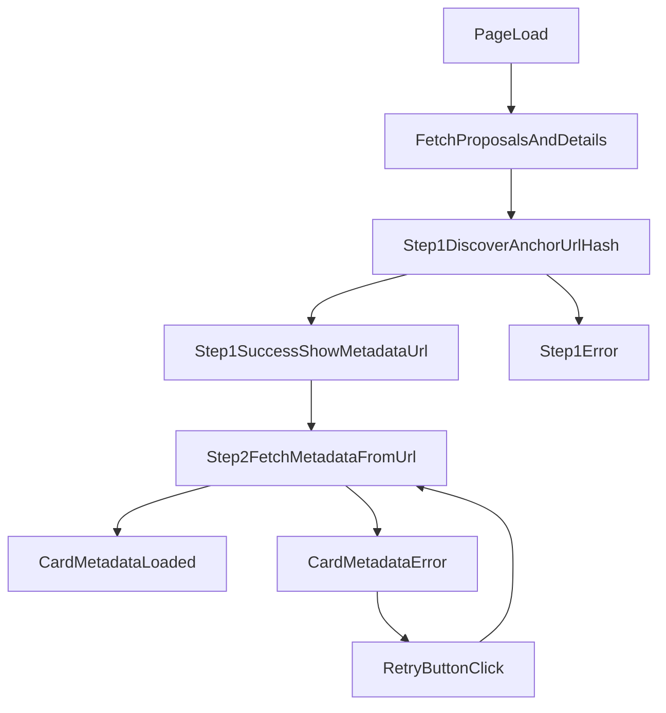

# Per-Action Governance Metadata Loading Plan

## What to change
Update [`/home/william/projects/ctools/src/pages/GovernanceActions.tsx`](/home/william/projects/ctools/src/pages/GovernanceActions.tsx) so each action has its own metadata-loading lifecycle instead of one all-or-nothing fetch path.

Grounding from wiki:
- CIP-108 metadata fields to render/validate: `title`, `abstract`, `motivation`, `rationale`, `references` (with optional hash details) from [`/home/william/projects/ctools/wiki/pages/governance-action-metadata-cip108.md`](/home/william/projects/ctools/wiki/pages/governance-action-metadata-cip108.md).
- CIP-108 extends CIP-100 and relies on metadata anchors (`uri` + hash verification model), so metadata fetch should be treated as off-chain, fallible I/O with actionable errors from [`/home/william/projects/ctools/wiki/pages/source-cip108.md`](/home/william/projects/ctools/wiki/pages/source-cip108.md) and [`/home/william/projects/ctools/wiki/pages/cardano-governance-cip1694.md`](/home/william/projects/ctools/wiki/pages/cardano-governance-cip1694.md).

## Data-model updates
In `GovernanceActions.tsx`, extend `LiveGovernanceAction` with per-item metadata state:
- `metadataStep1Status: 'idle' | 'loading' | 'success' | 'error'` for anchor discovery from on-chain detail
- `metadataStep2Status: 'idle' | 'loading' | 'loaded' | 'error'` for off-chain URL fetch/parse
- `metadata: { title?: string; abstract?: string; motivation?: string; rationale?: string; references?: ... } | null`
- `metadataError: { message: string; statusCode?: number; source?: string; retryable: boolean } | null`
- `metadataUrl: string | null` and `metadataHash: string | null` (if discoverable from governance description)

Keep existing action-level summary fields so cards still render even when metadata fails.

## Fetching flow refactor
Split loading into two stages:
1. **Stage A (Step 1)**: Fetch proposals + proposal details as today, discover metadata URL/hash from on-chain content, and record `metadataStep1Status`.
2. **Stage B (Step 2)**: For each action where Step 1 succeeded and URL exists, fetch off-chain metadata independently (concurrency-limited), updating only that action’s Step 2 state.

Implementation approach:
- Replace the current `Promise.all`-style fatal behavior in `mapWithConcurrency` usage with per-item `try/catch` envelopes and partial results.
- Add a dedicated `loadActionMetadata(action, apiKey)` helper that:
  - discovers an anchor URL/hash from `governance_description` (support nested container keys used elsewhere in this file),
  - fetches metadata JSON when URL exists,
  - maps CIP-108 fields if present,
  - normalizes fetch/parse failures into `metadataError`.
- Preserve a top-level page error only for hard failures that block the list itself (e.g., cannot fetch proposals at all).

## Retry behavior
Add a per-card retry button that only re-runs metadata loading for that action:
- `Retry metadata` button shown when `metadataStep2Status === 'error'` (Step 1 succeeded but Step 2 failed).
- Button sets that action to `loading`, clears prior error, reruns `loadActionMetadata`, then updates only that item.
- Disable retry while request is in progress to prevent duplicate calls.

## UI changes on each action card
In the card render section of `GovernanceActions.tsx`:
- Add explicit two-step metadata indicators:
  - Step 1 indicator: `On-chain metadata anchor` (loading/success/error).
  - Step 2 indicator: `Metadata document fetch` (loading/loaded/error/skipped).
- When Step 1 succeeds, always display the discovered `metadataUrl` on the card (clickable link).
- On error, show:
  - human-readable message,
  - known diagnostics such as whether failure occurred in Step 1 or Step 2, HTTP status, parse failure, missing URL/hash mismatch when applicable,
  - retry button.
- On success, show structured CIP-108 content when present:
  - prefer metadata `title` over heuristic extracted title,
  - display `abstract` preview,
  - optional expandable section for `motivation`, `rationale`, and `references`.
- Keep `Show action JSON` section for debugging regardless of metadata status.

## Error diagnostics strategy
Normalize errors into a small taxonomy for useful user feedback:
- `anchor_discovery_failed` (could not parse/discover metadata location from on-chain detail)
- `anchor_missing` (Step 1 succeeded but no URI is present)
- `network_error` (fetch failed)
- `http_error` (non-2xx with status)
- `invalid_json` (response not parseable)
- `schema_mismatch` (JSON present but CIP-108 fields absent/malformed)
- optionally `hash_mismatch` if hash checking is implemented now

Display the normalized reason on the card and keep raw technical detail available in a secondary line.

## Verification
- Manual pass on `Live Governance Actions` with a valid Blockfrost key:
  - list still appears if some metadata calls fail,
  - only failed cards show error indicator,
  - retry updates only targeted card,
  - successful cards show CIP-108 fields.
- Run lint diagnostics for edited file.

