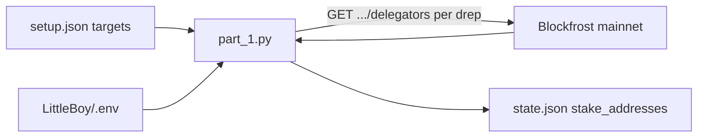

# LittleBoy Part 1: DRep Delegator Enumeration

## Wiki-grounded context

- **DRep IDs** are CIP-129 Bech32 identifiers with prefix `drep1` ([`wiki/pages/governance-identifiers-cip129.md`](wiki/pages/governance-identifiers-cip129.md)).
- **Delegation model:** Ada holders delegate voting power to DReps separately from stake-pool delegation; voting power is stake-weighted ([`wiki/pages/cardano-governance-cip1694.md`](wiki/pages/cardano-governance-cip1694.md)).
- **Blockfrost pattern in ctools:** mainnet base URL `https://cardano-mainnet.blockfrost.io/api/v0`, auth via `project_id` header (not query string) ([`wiki/pages/ctools-drep-voting-history-blockfrost.md`](wiki/pages/ctools-drep-voting-history-blockfrost.md)).
- **Target API:** `GET /governance/dreps/{drep_id}/delegators` — paginated list of `{ address, amount }` where `address` is a Bech32 **stake** address ([Blockfrost docs](https://docs.blockfrost.io/#tag/Cardano-Governance/paths/~1governance~1dreps~1{drep_id}~1delegators/get)).

## Data flow



## Files to create

| File | Purpose |
|------|---------|
| [`LittleBoy/setup.json`](LittleBoy/setup.json) | Static config: `{ "targets": [ ...3 drep ids... ] }` |
| [`LittleBoy/part_1.py`](LittleBoy/part_1.py) | Fetch delegators for all targets, write `state.json` |
| [`LittleBoy/requirements.txt`](LittleBoy/requirements.txt) | `python-dotenv`, `requests` |
| [`LittleBoy/state.json`](LittleBoy/state.json) | Generated output (created on first run) |

**Existing:** [`LittleBoy/.env`](LittleBoy/.env) with `BLOCKFROST_API_KEY` — already present; root [`.gitignore`](.gitignore) line `.env` keeps it untracked repo-wide.

## setup.json

```json
{
  "targets": [
    "drep1ygr9tuapcanc3kpeyy4dc3vmrz9cfe5q7v9wj3x9j0ap3tswtre9j",
    "drep1y2200we9c904un36tzaearntzzl63snffuul9qsk0te4utqfkke0w",
    "drep1ytvlwvyjmzfyn56n0zz4f6lj94wxhmsl5zky6knnzrf4jygpyahug"
  ]
}
```

Trim whitespace on each target when loading (one of the provided IDs had a trailing space).

## part_1.py behavior

1. Resolve paths relative to script directory (`LittleBoy/`).
2. `load_dotenv(LittleBoy/.env)` and require `BLOCKFROST_API_KEY`; exit with a clear message if missing.
3. Load `setup.json` and read `targets` (must be a non-empty list of strings).
4. For each DRep ID, paginate Blockfrost delegators — mirror ctools [`fetchAllPages`](src/functions/governanceActionsFetch.ts) logic:
   - `GET {BASE}/governance/dreps/{drep_id}/delegators?page={n}&count=100&order=asc`
   - Header: `project_id: {BLOCKFROST_API_KEY}`
   - Stop when page returns fewer than 100 rows or HTTP 404 (no delegators / unknown DRep).
   - Raise on other non-2xx responses with status + body text.
5. Collect the `address` field from each row into a **set** (union across all targets, deduplicated).
6. Write `state.json`:

```json
{
  "stake_addresses": ["stake1...", "..."]
}
```

Sorted lexicographically for stable diffs. Pretty-print with 2-space indent.

7. Print a short summary to stdout: target count, total unique stake addresses, output path.

**CLI:** runnable as `python LittleBoy/part_1.py` from repo root (or `python part_1.py` from `LittleBoy/`).

## Implementation sketch

Core pagination helper (stdlib + requests only):

```python
BLOCKFROST_BASE = "https://cardano-mainnet.blockfrost.io/api/v0"

def fetch_delegator_addresses(drep_id: str, api_key: str) -> set[str]:
    addresses: set[str] = set()
    page = 1
    while True:
        url = f"{BLOCKFROST_BASE}/governance/dreps/{drep_id}/delegators"
        res = requests.get(url, headers={"project_id": api_key},
                           params={"page": page, "count": 100, "order": "asc"}, timeout=60)
        if res.status_code == 404:
            break
        res.raise_for_status()
        rows = res.json()
        for row in rows:
            addresses.add(row["address"])
        if len(rows) < 100:
            break
        page += 1
    return addresses
```

## Git / secrets

- **Do not commit** `LittleBoy/.env` (already covered by root `.gitignore`).
- **`state.json`:** generated artifact; leave untracked unless you want snapshot commits. No `.gitignore` change required unless you prefer to explicitly ignore `LittleBoy/state.json`.
- **Security note:** the open `.env` file contains a live API key — do not reference or echo it in code, logs, or commits.

## How to run (after implementation)

```bash
cd LittleBoy
python3 -m venv .venv && source .venv/bin/activate
pip install -r requirements.txt
python part_1.py
```

## Out of scope (part 1)

- Testnet / preview network toggle
- Storing delegation `amount` in `state.json` (only addresses for now)
- Rate-limit retry/backoff (can add later if Blockfrost 429s appear)
- Subsequent pipeline parts beyond writing `state.json`

## Risks

- **Large delegator sets:** three active DReps may return thousands of rows; pagination handles this but runtime may be minutes on free-tier rate limits.
- **API key exposure:** keep `.env` local only; same caution as ctools URL-key pattern documented in wiki.
