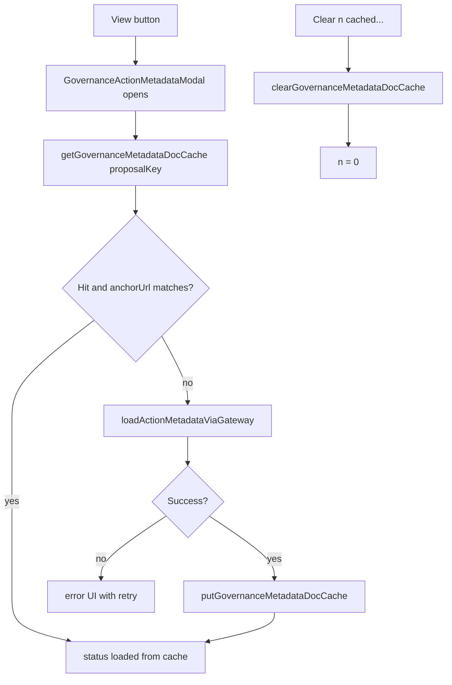

# Governance metadata document cache

## Goal

When a user opens **View** on DRep Voting History and metadata loads successfully, store the full document in browser IndexedDB. Re-opening the same action shows cached content immediately (no gateway fetch). A page button reads **Clear {n} cached governance metadata documents** where `n` is the current count; clicking it wipes the cache. After a clear, metadata is only fetched again when the user clicks **View** again.

**Cache successes only** — failed gateway loads are not stored and still offer retry on the next open.

## Architecture



## 1. IndexedDB module

**New file:** [`src/utils/governanceMetadataDocCache.ts`](src/utils/governanceMetadataDocCache.ts)

Reuse the same IDB open/put/get patterns as [`src/utils/drepVotingHistoryCache.ts`](src/utils/drepVotingHistoryCache.ts).

**DB:** extend existing `ctools-drep-voting-history` — bump `DREP_VOTING_HISTORY_DB_VERSION` from `1` → `2` and add object store `metadataDocs` in `onupgradeneeded`.

**Cache key:** `proposalCacheKey(txHash, certIndex)` (already exported from drep cache module — import and reuse).

**Entry shape:**

```ts
interface CachedGovernanceMetadataDoc {
  metadata: GovernanceMetadata;
  rawPayload: unknown;
  anchorUrl: string;
  hashHex?: string;
  cachedAtSec: number;
}
```

**Exported API:**

| Function | Purpose |
|----------|---------|
| `getGovernanceMetadataDocCache(key)` | Read one entry or `null` |
| `putGovernanceMetadataDocCache(key, entry)` | Write after successful fetch |
| `countGovernanceMetadataDocCache()` | Return `n` for button label |
| `clearGovernanceMetadataDocCache()` | Delete all entries in `metadataDocs` |

**Cache hit rule:** return cached data only when `entry.anchorUrl ===` current row anchor URL (if anchor changes on-chain, treat as miss and refetch on View).

All IDB failures log `console.warn` and degrade gracefully (fetch from network as today).

## 2. Modal: cache-first load path

**File:** [`src/components/GovernanceActionMetadataModal.tsx`](src/components/GovernanceActionMetadataModal.tsx)

**New props:**

```ts
cacheKey: string;           // proposalCacheKey(txHash, certIndex)
onCacheUpdated?: () => void; // parent refreshes count after write
```

**Open flow (replace unconditional `fetchMetadata(0)`):**

1. Set `loading`
2. `getGovernanceMetadataDocCache(cacheKey)` — if hit + anchor match → set `metadata`, `rawPayload`, `status: 'loaded'`, done
3. Else → existing gateway fetch; on success call `putGovernanceMetadataDocCache` then `onCacheUpdated?.()`

**Retry / gateway change:** unchanged — only runs when not served from cache (or after cache miss). Cached opens skip network entirely; user must clear cache to force a refetch.

**Close reset:** keep clearing UI state on close; do not clear IndexedDB.

## 3. DRep Voting History wiring

**File:** [`src/pages/DRepVotingHistory.tsx`](src/pages/DRepVotingHistory.tsx)

**Extend `MetadataModalState`:**

```ts
interface MetadataModalState {
  url: string;
  hashHex?: string;
  proposalId: string;
  proposalTxHash: string;
  proposalCertIndex: number;
}
```

Pass `cacheKey={proposalCacheKey(row.proposalTxHash, row.proposalCertIndex)}` to the modal.

**Page state:**

```ts
const [cachedMetadataDocCount, setCachedMetadataDocCount] = useState(0);
```

- On mount (when `drepId` + data area visible): `countGovernanceMetadataDocCache()` → set count
- `refreshMetadataDocCount` callback passed to modal as `onCacheUpdated`
- **Clear button** in summary bar (near existing **Reload closed actions** ~line 633):

```tsx
<Button
  onClick={() => void handleClearMetadataDocCache()}
  disabled={cachedMetadataDocCount === 0 || loading || recaching}
>
  Clear {cachedMetadataDocCount} cached governance metadata documents
</Button>
```

`handleClearMetadataDocCache`: `clearGovernanceMetadataDocCache()` → `setCachedMetadataDocCount(0)`.

## 4. Tests

**File:** [`src/utils/governanceMetadataDocCache.test.ts`](src/utils/governanceMetadataDocCache.test.ts) (new)

Mirror existing lightweight tests in [`src/utils/drepVotingHistoryCache.test.ts`](src/utils/drepVotingHistoryCache.test.ts): key reuse / anchor-match helper if extracted as pure function (e.g. `isGovernanceMetadataDocCacheHit(entry, anchorUrl)`).

No network or full IDB round-trip required unless `fake-indexeddb` is trivial to add; pure logic tests are sufficient.

## Files touched

| File | Change |
|------|--------|
| [`src/utils/drepVotingHistoryCache.ts`](src/utils/drepVotingHistoryCache.ts) | Bump DB version; add `metadataDocs` store in upgrade |
| [`src/utils/governanceMetadataDocCache.ts`](src/utils/governanceMetadataDocCache.ts) | New cache read/write/count/clear API |
| [`src/components/GovernanceActionMetadataModal.tsx`](src/components/GovernanceActionMetadataModal.tsx) | Cache-first open; persist on success |
| [`src/pages/DRepVotingHistory.tsx`](src/pages/DRepVotingHistory.tsx) | Pass cache key; count state; clear button |
| [`src/utils/governanceMetadataDocCache.test.ts`](src/utils/governanceMetadataDocCache.test.ts) | Cache-hit validation tests |

## Out of scope

- Caching metadata on Live Governance Actions page (auto-fetch on load)
- Caching failed fetches
- TTL / automatic expiry
- Per-document delete (clear-all only)
