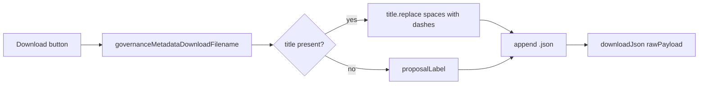

# Governance metadata download button

## Context

The DRep Voting History page opens [`GovernanceActionMetadataModal`](src/components/GovernanceActionMetadataModal.tsx) when a user clicks "View full metadata". The modal already:

- Fetches and caches metadata via `ensureGovernanceMetadataDocCached`
- Stores the parsed `GovernanceMetadata` (including `title`) and the original `rawPayload`
- Renders a toolbar with **Wider view**, **Formatted**, and **View JSON**

No changes are needed in [`DRepVotingHistory.tsx`](src/pages/DRepVotingHistory.tsx) — `proposalLabel` (truncated action ID) is already passed as a prop.

## Implementation

### 1. Filename helper

Add a small pure function (either at the top of the modal file or in a tiny util like `src/functions/governanceMetadataDownload.ts`):

```ts
export function governanceMetadataDownloadFilename(
  title: string | null | undefined,
  proposalLabel: string,
): string {
  const base = (title?.trim() || proposalLabel).replace(/ /g, '-');
  return `${base}.json`;
}
```

- Spaces → dashes only (per your spec; no extra sanitization)
- `.json` extension appended
- Fallback to `proposalLabel` when title is null/empty

Add a focused unit test (e.g. `governanceMetadataDownload.test.ts`) covering: titled action, spaces in title, missing title fallback.

### 2. Download button in modal toolbar

In [`GovernanceActionMetadataModal.tsx`](src/components/GovernanceActionMetadataModal.tsx):

- Import existing [`downloadJson`](src/functions/downloadJson.ts) (same pattern as [`DRepBulkVote.tsx`](src/pages/DRepBulkVote.tsx) and [`TreasuryDonation.tsx`](src/pages/TreasuryDonation.tsx))
- Add a **Download** button to the `status === 'loaded'` toolbar (after **View JSON**)
- On click: `downloadJson(rawPayload, governanceMetadataDownloadFilename(metadata.title, proposalLabel))`
- Disable the button when `rawPayload === null` (should not happen in loaded state, but keeps it safe)
- Reuse existing `governance-metadata-toolbar-btn` class — no CSS changes required

Optionally mirror the same button in the **error** state toolbar when `rawPayload` is available (partial fetch / schema mismatch), using `metadata?.title ?? null` for the filename. This is a small consistency win since "View JSON" already appears there.



### 3. Scope boundaries

- **In scope:** `GovernanceActionMetadataModal` only (governance action metadata popup)
- **Out of scope:** `VoteRationaleMetadataModal` (vote rationale popup) — can be added later with the same pattern if desired

## Files to touch

| File | Change |
|------|--------|
| [`src/components/GovernanceActionMetadataModal.tsx`](src/components/GovernanceActionMetadataModal.tsx) | Import helpers; add Download button + handler |
| `src/functions/governanceMetadataDownload.ts` (new) | Filename helper |
| `src/functions/governanceMetadataDownload.test.ts` (new) | Unit tests for filename logic |

## Verification

- Open DRep Voting History → expand a row with metadata → **View full metadata**
- Confirm **Download** appears in the toolbar once loaded
- Downloaded file is valid JSON matching the raw metadata document
- Filename uses dashes for spaces (e.g. `Cardano-Governance-Voting.json`)
- Actions without a title download as `{truncated-proposal-id}.json`
- Run unit tests for the filename helper
