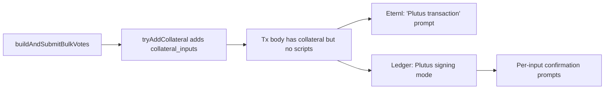

## Root cause

[src/functions/bulkVote.ts](src/functions/bulkVote.ts) unconditionally attaches `collateral_inputs` to the vote tx (line 166, helper at lines 97-123). A CIP-1694 DRep vote runs no Plutus script and needs no collateral. The presence of `collateral_inputs` makes:

- Eternl / Lace label the tx as a "Plutus transaction" in their signing UI.
- Ledger's Cardano app switch out of `ORDINARY_TX` mode into Plutus-aware signing, which requires per-input confirmation.

The treasury donation path does not call any collateral helper, which is why donations sign normally.

## Change (single file: [src/functions/bulkVote.ts](src/functions/bulkVote.ts))

1. Delete the `tryAddCollateral` helper (lines 97-123).
2. Delete the call `await tryAddCollateral(api, txb);` inside `buildAndSubmitBulkVotes` (line 166).

That leaves the build flow as: add votes -> add wallet UTxOs -> `add_change_if_needed` -> `build` -> sign -> submit, with no Plutus-era fields populated.

## Verification

After the change, the unsigned tx body should contain only `inputs`, `outputs`, `fee`, `voting_procedures`, and (for now) the `is_valid: true` byte that all post-Alonzo txs require. No `collateral_inputs`, no `script_data_hash`, no `reference_inputs`. Eternl should show a normal vote prompt and Ledger should aggregate inputs instead of asking per-input.

## Out of scope

- [src/functions/treasuryDonation.ts](src/functions/treasuryDonation.ts): already correct, no collateral path.
- [src/types/cardano.d.ts](src/types/cardano.d.ts): keep `getCollateral` typing - it is a standard CIP-30 surface even if we no longer call it here.
- The canonical-CBOR work tracked in [.cursor/plans/canonical_cbor_for_vote_tx_3a4e30f1.plan.md](.cursor/plans/canonical_cbor_for_vote_tx_3a4e30f1.plan.md) stays as-is.