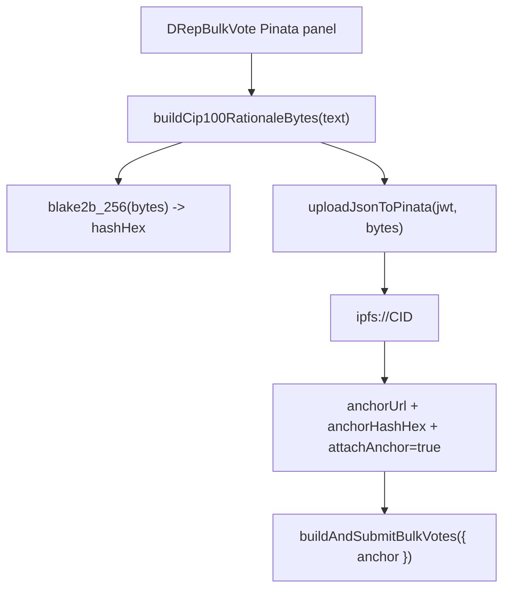

# Pinata IPFS rationale upload for DRep bulk vote

## Goal

Extend [`src/pages/DRepBulkVote.tsx`](src/pages/DRepBulkVote.tsx) so a DRep can:

1. Provide a **Pinata JWT** (stored like Blockfrost keys: Redux + optional URL param)
2. Enter **rationale text**
3. **Upload** a CIP-100 JSON document to IPFS via Pinata
4. **Auto-populate** the existing CIP-100 anchor (`anchorUrl` + `anchorHashHex`) that [`buildAndSubmitBulkVotes`](src/functions/bulkVote.ts) already attaches to every vote procedure

This does **not** touch CIP-20 label 674 metadata.

## Current state

```558:594:src/pages/DRepBulkVote.tsx
<h2 style={{ marginTop: 0, fontSize: '1.1rem' }}>Optional CIP-100 anchor (shared)</h2>
<label ...>
  <input type="checkbox" checked={attachAnchor} ... />
  <span>Attach the same rationale anchor to every vote</span>
</label>
{attachAnchor && (
  // manual URL + 64-char hex hash inputs
)}
```

- Anchor hash must be **blake2b-256 of raw uploaded bytes** ([CIP-100](wiki/pages/governance-metadata-framework-cip100.md))
- [`bulkVote.ts`](src/functions/bulkVote.ts) already validates URL + 64-hex hash and builds `CML.Anchor`
- No Pinata/IPFS code exists in the repo; `blake2b_256` is already available via `@harmoniclabs/crypto`

## Architecture



## Implementation

### 1. Pinata state (mirror Blockfrost slice)

Add [`src/store/pinataSlice.ts`](src/store/pinataSlice.ts):

- Shape: `{ usePinata: boolean; jwt: string | null }`
- Actions: `setUsePinata`, `setPinataJwt`, `setPinataConfig`, `resetPinata` — same pattern as [`src/store/blockfrostSlice.ts`](src/store/blockfrostSlice.ts)
- Register reducer in [`src/store/store.ts`](src/store/store.ts)

**URL param:** `pinataJwt` (read on mount, written on **Set Key** via `history.replaceState`), matching [`DRepVotingHistory.tsx`](src/pages/DRepVotingHistory.tsx) / [`GovernanceActions.tsx`](src/pages/GovernanceActions.tsx) Blockfrost flow — **not** auto-synced on every keystroke (only when user clicks Set Key), to avoid leaking partial tokens into the URL.

Show the same security warning as Blockfrost when the JWT is stored in the URL.

### 2. Upload + document helpers (new functions)

**[`src/functions/cip100RationaleDocument.ts`](src/functions/cip100RationaleDocument.ts)**

Build deterministic UTF-8 bytes for a minimal unsigned CIP-100 document:

```ts
{
  hashAlgorithm: 'blake2b-256',
  body: { rationale: '<user text>' }
}
```

- Serialize once with `JSON.stringify(doc)` (compact, no pretty-print) and return `Uint8Array`
- Same bytes are used for **both** Pinata upload and hash computation (critical for anchor validity)
- Export `buildCip100RationaleBytes(rationale: string): Uint8Array`
- Export `hashGovernanceAnchorBytes(bytes: Uint8Array): string` using `blake2b_256` → lowercase hex (64 chars)

**[`src/functions/pinataUpload.ts`](src/functions/pinataUpload.ts)**

- `uploadJsonToPinata(jwt: string, bytes: Uint8Array, filename: string): Promise<{ cid: string; url: string }>`
- Use Pinata **v3** browser upload: `POST https://uploads.pinata.cloud/v3/files`
  - `Authorization: Bearer <jwt>`
  - `FormData`: `file` (Blob/File from bytes, `application/json`), `network: public`
- Parse `data.cid` from response; return `url: ipfs://${cid}`
- Surface Pinata HTTP errors with readable messages

No new npm dependency — native `fetch` + `FormData` + `Blob` (same approach as Pinata browser docs).

### 3. DRepBulkVote UI + wiring

Update [`src/pages/DRepBulkVote.tsx`](src/pages/DRepBulkVote.tsx):

**New panel** — insert **above** the existing “Optional CIP-100 anchor” section (or merge into it as a sub-section “Publish via Pinata”):

| Control | Behavior |
|---------|----------|
| Pinata JWT input + **Set Key** | Dispatches `setPinataConfig`; writes `pinataJwt` to URL |
| Textarea | Rationale text (multi-line) |
| **Upload to IPFS** button | Requires JWT + non-empty rationale; disabled while uploading |
| Status area | Shows upload progress, errors, resulting `ipfs://…` link, and computed hash |

**On successful upload:**

- `setAnchorUrl(ipfsUrl)`
- `setAnchorHashHex(hashHex)`
- `setAttachAnchor(true)`
- Manual URL/hash fields remain visible and editable (user can override after upload)

**Submit validation:** unchanged — if `attachAnchor` is on, URL + 64-hex hash are required (auto-filled after upload satisfies this).

**Receipt extension** (optional, small): add `rationaleUploadedViaPinata: boolean` and `rationaleIpfsUrl: string | null` to `BulkVoteReceipt` for auditability.

### 4. UX details

- Pinata panel is **independent** of ConnectWallet (unlike Blockfrost on this page, which is only in the wallet dialog). This matches how [`GovernanceActions.tsx`](src/pages/GovernanceActions.tsx) exposes Blockfrost inline — better for a compose-and-upload workflow.
- Re-uploading replaces anchor URL/hash (user may revise rationale before voting).
- If user disables `attachAnchor` after upload, submit proceeds without anchor (existing behavior).
- Link to [Pinata developer API keys](https://app.pinata.cloud/developers/api-keys) in the panel help text; label field “Pinata JWT” (Pinata’s credential name, not a legacy API key/secret pair).

## Files touched

| File | Change |
|------|--------|
| `src/store/pinataSlice.ts` | **New** — Pinata JWT state |
| `src/store/store.ts` | Register `pinata` reducer |
| `src/functions/cip100RationaleDocument.ts` | **New** — JSON bytes + blake2b-256 hash |
| `src/functions/pinataUpload.ts` | **New** — Pinata v3 file upload |
| `src/pages/DRepBulkVote.tsx` | Pinata panel, upload handler, anchor auto-fill, receipt fields |

## Out of scope (v1)

- CIP-100 author witnesses / wallet `signData` on `body` (unsigned metadata is acceptable; same as the original bulk-vote plan’s “user supplies URL + hash” follow-up)
- Pinata key in ConnectWallet dialog
- Auto-upload on submit (explicit **Upload** button first so user can verify hash)
- Wiki updates (unless you want them in a follow-up)

## Manual test plan

1. Open `/drep-bulk-vote` (or current route), set Blockfrost via ConnectWallet, connect CIP-95 wallet.
2. Set Pinata JWT → confirm `?pinataJwt=…` appears after **Set Key**; refresh restores it.
3. Enter rationale, click **Upload to IPFS** → anchor checkbox turns on; URL is `ipfs://…`; hash is 64 hex chars.
4. Select votes, submit → Cardanoscan shows vote procedures with anchor; receipt includes IPFS URL.
5. Upload revised rationale → new CID/hash replace old values; submit again with new anchor.
6. Upload failure (bad JWT) → inline error, anchor fields unchanged.
7. Enable anchor manually without Pinata → existing manual URL/hash flow still works.
