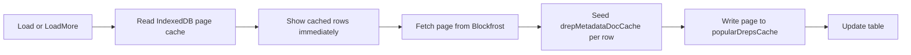

# Popular DReps Page

## Approach

Use Blockfrost's enriched list endpoint (June 2026) so each row includes voting power and embedded CIP-119 metadata in one call — no per-DRep N+1 fetches.



Same philosophy as DRep Voting History and Conch: **lists stay live, enrichment is cached and shared**.

## Caching (mirror DRep history / Conch patterns)

### A. Leaderboard page cache — new [`src/utils/popularDrepsCache.ts`](src/utils/popularDrepsCache.ts)

IndexedDB database separate from DRep vote cache (different domain, like [`conchHistoryCache.ts`](src/utils/conchHistoryCache.ts)):

| Constant | Value |
|----------|-------|
| DB name | `ctools-popular-dreps` |
| DB version | `1` |
| Store | `pages` |

**Key:** `popularDrepsPageCacheKey({ retired, expired, page, count })` — encodes filter + pagination (always `order_by=amount&order=desc`).

**Entry:**

```ts
interface CachedPopularDrepsPage {
  rows: PopularDrepRow[];
  cachedAtSec: number;
}
```

**API:** `getPopularDrepsPageCache(key)`, `putPopularDrepsPageCache(key, entry)`, `countPopularDrepsPageCache()`, `clearPopularDrepsPageCache()`.

### B. Shared DRep metadata doc cache — reuse [`src/utils/drepMetadataDocCache.ts`](src/utils/drepMetadataDocCache.ts)

After each successful page fetch, **seed** the existing `STORE_DREP_METADATA_DOCS` store (same DB as DRep history) so Popular DReps pre-warms profile data for [`DRepVotingHistory`](src/pages/DRepVotingHistory.tsx) and [`DRepMetadataModal`](src/components/DRepMetadataModal.tsx):

- New helper `seedDrepMetadataDocFromListItem(item)` in [`src/utils/drepMetadataDocFetch.ts`](src/utils/drepMetadataDocFetch.ts) or `popularDrepsFetch.ts`:
  - Read `metadata.url`, `metadata.hash`, `metadata.json_metadata` from list item
  - Skip write when `isDrepMetadataDocCacheHit(existing, anchorUrl)` already matches
  - Otherwise `putDrepMetadataDocCache` with parsed `parseCip119Metadata(json_metadata)` (same shape as `ensureDrepMetadataDocCached` persist path)

### C. Cache-first profile display

When mapping rows, resolve display name / avatar with priority:

1. `getDrepMetadataDocCache(drepId)` (shared IndexedDB — may have richer doc from history page visits)
2. Embedded list `metadata.json_metadata` from Blockfrost
3. Truncated `drep_id`

Add `getDrepMetadataDocCacheBatch(drepIds)` to [`drepMetadataDocCache.ts`](src/utils/drepMetadataDocCache.ts) (batch read pattern from Conch's `getConchTxCacheBatch`) to avoid 50 serial IDB reads per page.

### D. Stale-while-revalidate load flow — in fetch layer

`loadPopularDrepsPage(apiKey, opts)` returns `{ rows, fromCache, fetchedFromNetwork }`:

1. **Initial load / filter change:** read page-1 cache → render immediately if hit; always fetch page 1 from Blockfrost in background → update cache + UI
2. **Load more:** read cache for page N+1 first; on miss, fetch then cache
3. Track `cachedPageCount` / `fetchedPageCount` for settings modal (like Conch's `cachedTxCount` / `fetchedTxCount`)

### E. API key persistence — reuse [`src/utils/toolConfigStorage.ts`](src/utils/toolConfigStorage.ts)

Match DRep history: on mount read `?blockfrostApiKey=` **or** `getBlockfrostApiKeyFromStorage()`; on set call `saveBlockfrostApiKeyToStorage()`.

### F. Settings gear modal — new [`src/components/PopularDrepsSettingsModal.tsx`](src/components/PopularDrepsSettingsModal.tsx)

Lighter version of [`DRepVotingHistorySettingsModal.tsx`](src/components/DRepVotingHistorySettingsModal.tsx) / Conch settings:

- Cached leaderboard pages: `countPopularDrepsPageCache()`
- Shared DRep metadata docs: `countDrepMetadataDocCache()` (cross-tool benefit)
- **Refresh** — bypass page cache, re-fetch loaded pages from Blockfrost
- **Clear cached leaderboard pages** — `clearPopularDrepsPageCache()` only (do not clear shared metadata docs unless user is on DRep history settings)

Gear button in page header; reuse `IpfsLinkModal.css` overlay pattern.

## Files to add

### 1. Fetch + types — [`src/functions/popularDrepsFetch.ts`](src/functions/popularDrepsFetch.ts)

- Export `BlockfrostDrepListItem` matching the enriched response: `drep_id`, `hex`, `amount` (string lovelace), `has_script`, `retired`, `expired`, `last_active_epoch`, `metadata` (same shape as existing `BlockfrostDrepMetadataResponse` in [`src/utils/drepMetadataDocFetch.ts`](src/utils/drepMetadataDocFetch.ts)).
- Export `PopularDrepRow` (parsed view model): `drepId`, `amountLovelace`, status flags, `profile: DrepMetadata | null`, `displayName` (givenName or truncated drep_id).
- Constants: `SPECIAL_DREP_IDS = ['drep_always_abstain', 'drep_always_no_confidence']` — exclude from leaderboard.
- `fetchPopularDrepsPageFromBlockfrost(apiKey, { page, count, retired?, expired? })` — direct network fetch only.
- `loadPopularDrepsPage(apiKey, opts)` — cache-first wrapper: read IndexedDB → optional immediate return → network fetch → seed metadata docs → write page cache.
- `mapBlockfrostDrepToRow(item, metadataDocCache?)` — parse `amount`; resolve profile via cache-first rules above.
- `filterLeaderboardDreps(rows)` — drop special system DReps only (no `doNotList` filtering per your preference).
- `seedDrepMetadataDocsFromListItems(items)` — batch metadata doc cache writes after page fetch.

### 2. Page — [`src/pages/PopularDreps.tsx`](src/pages/PopularDreps.tsx)

Mirror patterns from [`src/pages/GovernanceActions.tsx`](src/pages/GovernanceActions.tsx) + caching from [`src/pages/DRepVotingHistory.tsx`](src/pages/DRepVotingHistory.tsx):

- **Blockfrost key**: Redux + `toolConfigStorage` localStorage + optional `?blockfrostApiKey=` URL param.
- **State**: `rows`, `page`, `hasMore`, `loading`, `loadingMore`, `refreshing`, `error`, `cachedPageCount`, filter toggles for `retired` / `expired` (default: active only).
- **Initial load**: show cached page 1 instantly if present; background-refresh page 1; reset list on filter change.
- **Load more**: cache-first for next page; append rows; update `cachedPageCount`.
- **Table columns**: rank (#), name (+ optional 32px avatar from `metadata.image.contentUrl`), voting power via [`formatAdaCompact`](src/utils/formatAda.ts), status chips (`retired` / `expired`), truncated `drep_id`, actions.
- **Row actions**:
  - Link to [`/drephistory/:drepId`](src/index.tsx) (existing DRep Voting History page).
  - "Profile" button opening [`DRepMetadataModal`](src/components/DRepMetadataModal.tsx) — hits shared `ensureDrepMetadataDocCached` / IndexedDB cache.
- **Settings gear** → [`PopularDrepsSettingsModal`](src/components/PopularDrepsSettingsModal.tsx) with cache stats, Refresh, Clear leaderboard cache.
- **Empty / error states**: same tone as Governance Actions.

No new CSS file unless needed — reuse inline styles + existing `main-section` / `governance-metadata-*` classes for consistency.

## Files to update

### 3. Routing — [`src/index.tsx`](src/index.tsx)

Add routes (matching existing alias style):

- `/popular-dreps` (primary)
- `/top-dreps`
- `/dreps`

### 4. Home link — [`src/pages/Home.tsx`](src/pages/Home.tsx)

Add entry near other governance tools:

> **Popular DReps** — Browse DReps ranked by delegated voting power.

## Tests

[`src/functions/popularDrepsFetch.test.ts`](src/functions/popularDrepsFetch.test.ts):

- `filterLeaderboardDreps` excludes special system DReps.
- `mapBlockfrostDrepToRow` prefers cached metadata doc over embedded list metadata.
- `seedDrepMetadataDocsFromListItems` skips when `isDrepMetadataDocCacheHit` matches anchor.

[`src/utils/popularDrepsCache.test.ts`](src/utils/popularDrepsCache.test.ts):

- `popularDrepsPageCacheKey` is stable for same filter/page params.

## Out of scope (can add later)

- Wiki ingest for the new page (not requested).
- Client-side re-sort (API already sorts by amount).
- `doNotList` filtering or de-emphasis (show normally per your choice).

## API example

```http
GET /governance/dreps?order_by=amount&order=desc&count=50&page=1&retired=false&expired=false
Header: project_id: <apiKey>
```

Each uncached page = 1 Blockfrost request. Cached pages skip network until Refresh.
