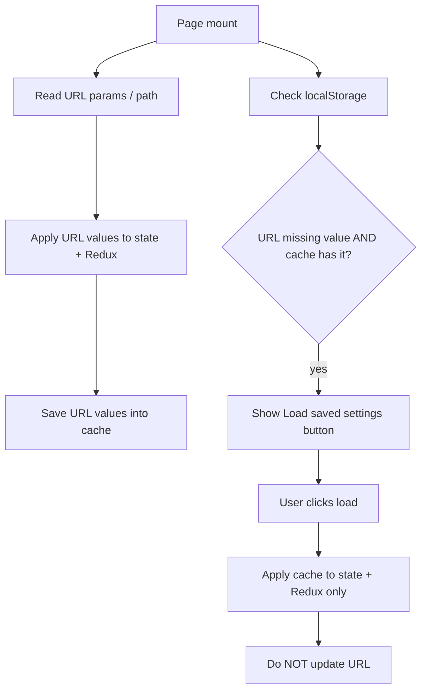

# Tool Config Browser Storage

## Problem

Both tools encode sensitive or personal values in shareable URLs today:

| Tool | URL state |
|------|-----------|
| [DRepBulkVote.tsx](src/pages/DRepBulkVote.tsx) | `blockfrostApiKey` (via [ConnectWallet.tsx](src/components/ConnectWallet.tsx)), `pinataJwt`, `anchor` / `anchorUrl` / `anchorHash` |
| [DRepVotingHistory.tsx](src/pages/DRepVotingHistory.tsx) | `drepId` (path segment), `blockfrostApiKey` (query) |

You want clean public links like `/bulk-vote` and `/drephistory` while still supporting URL bookmarks for private use. **Loading from cache must never write secrets back to the URL** (confirmed).

Gov action metadata uses **IndexedDB** for large CIP-108 documents ([governanceMetadataDocCache.ts](src/utils/governanceMetadataDocCache.ts)). Tool secrets are small strings — use **`localStorage`** instead (none exists in `src/` today). Same graceful-degradation pattern: `try/catch`, return `null` when unavailable.

## Storage design

New module: [src/utils/toolConfigStorage.ts](src/utils/toolConfigStorage.ts)

| Key | Contents |
|-----|----------|
| `ctools:blockfrost-api-key` | Shared Blockfrost project id (used by both tools) |
| `ctools:tool-config:bulk-vote` | `{ pinataJwt?, anchor?: { attachAnchor, anchorUrl, anchorHashHex }, savedAtSec }` |
| `ctools:tool-config:drep-history` | `{ drepId?, savedAtSec }` |

API surface (mirroring existing cache utils):

- `getBlockfrostApiKeyFromStorage()` / `saveBlockfrostApiKeyToStorage(key)`
- `getBulkVoteConfigFromStorage()` / `saveBulkVoteConfigToStorage(partial)`
- `getDRepHistoryConfigFromStorage()` / `saveDRepHistoryConfigToStorage(partial)`
- All wrapped in `typeof localStorage !== 'undefined'` guards

**Write triggers** (always update cache, never require a separate “save” action):

- Blockfrost: when Redux `apiKey` becomes non-empty (after URL load, Set Key, ConnectWallet entry, or cache load)
- Pinata: in `handleApplyPinataJwt`
- Anchor: when anchor fields change and `attachAnchor` is true (debounced via existing anchor `useEffect`, or save inside `syncAnchorToUrl` only when values are non-empty)
- DRep ID: on successful Lookup (`handleLookup`) and when loaded from URL path

**Read priority on mount**: URL still wins (existing behavior unchanged). After URL apply, persist those values into cache so the cache stays fresh.

## URL sync changes (critical)

Today, [ConnectWallet.tsx](src/components/ConnectWallet.tsx) writes `blockfrostApiKey` to the URL on **every** Redux `apiKey` change (lines 50–59). That would immediately re-expose a key loaded from cache.

### Blockfrost URL persistence flag

Add `persistBlockfrostInUrl` state to ConnectWallet, initialized `true` only when the page loaded with `?blockfrostApiKey=` already present; otherwise `false`.

- Replace the unconditional URL-sync `useEffect` with one that runs **only when `persistBlockfrostInUrl` is true**
- Add a checkbox in the Blockfrost section: “Save API key to URL (survives refresh)” — same UX as the existing anchor checkbox in bulk vote
- Export a small helper `applyBlockfrostFromCache(dispatch, apiKey)` used by load buttons; it dispatches Redux config but does **not** set `persistBlockfrostInUrl`

[DRepVotingHistory.tsx](src/pages/DRepVotingHistory.tsx) `handleApplyKey` already writes URL explicitly — keep that, but also save to shared `ctools:blockfrost-api-key` storage. Add the same `persistBlockfrostInUrl` pattern locally (init from URL presence) so a cache load on `/drephistory` does not call `replaceState`.

### Pinata and anchor (bulk vote)

- Pinata: add `persistPinataInUrl` (init `true` if `?pinataJwt=` on load). `handleApplyPinataJwt` writes URL only when flag is on; always saves to cache.
- Anchor: existing `persistAnchorInUrl` checkbox already gates URL writes — extend to also save/load anchor blob from `ctools:tool-config:bulk-vote` when values are set.

## UI: “Load saved settings” button

Show **one button per page** near the top config area when **any** cached value is available that is not already active **and** was not supplied by the current URL.

### Bulk vote ([DRepBulkVote.tsx](src/pages/DRepBulkVote.tsx))

Placement: below the intro paragraph, above wallet connect / Blockfrost gate.

Button label: **“Load saved settings from this browser”**

On click, apply all available cached values without URL writes:

- Blockfrost → Redux via `setBlockfrostConfig`
- Pinata → Redux + `localPinataJwt`
- Anchor → `attachAnchor`, `anchorUrl`, `anchorHashHex`

Hide button when `blockfrostReady && pinataReady` (if pinata was cached) and anchor is satisfied, or when URL already provided everything.

Update existing security notices (Pinata panel ~line 703, ConnectWallet ~line 194) to mention **browser storage** in addition to URL.

### DRep history ([DRepVotingHistory.tsx](src/pages/DRepVotingHistory.tsx))

Placement: below `<h1>`, above the Blockfrost key panel.

Same button label and behavior:

- Blockfrost → Redux + `localApiKey` (no `replaceState`)
- DRep ID → new `loadedDrepId` state (see below)

Hide when both `apiKey` and active DRep are set.

## DRep ID without polluting the URL path

`drepId` today comes only from `useParams` and Lookup navigates to `/drephistory/:drepId`, which exposes the id in the path.

For cache loads on clean `/drephistory`:

- Add `loadedDrepId: string | null` state
- `activeDrepId = drepId ?? loadedDrepId`
- Change the fetch effect (~line 246) to use `activeDrepId`
- Sync `drepInput` from `activeDrepId`
- Cache load sets `loadedDrepId` and `drepInput` but **does not** `navigate()`
- Lookup button keeps current behavior (path-based URL for private bookmarks)

Reset `loadedDrepId` when route `drepId` changes (user navigated via Lookup).

## Files to change

| File | Changes |
|------|---------|
| [src/utils/toolConfigStorage.ts](src/utils/toolConfigStorage.ts) | **New** — localStorage read/write helpers |
| [src/utils/toolConfigStorage.test.ts](src/utils/toolConfigStorage.test.ts) | **New** — unit tests with mocked `localStorage` |
| [src/components/ConnectWallet.tsx](src/components/ConnectWallet.tsx) | `persistBlockfrostInUrl` flag, conditional URL sync, save to storage on key set, updated security notice |
| [src/pages/DRepBulkVote.tsx](src/pages/DRepBulkVote.tsx) | Cache read/write hooks, load button, `persistPinataInUrl`, anchor cache integration |
| [src/pages/DRepVotingHistory.tsx](src/pages/DRepVotingHistory.tsx) | `loadedDrepId`, cache read/write, load button, `persistBlockfrostInUrl` for Set Key |

No route changes needed — `/bulk-vote` and `/drephistory` already exist without params.

## Out of scope

- Governance Actions, Asset Cip20, and other pages that reuse `blockfrostApiKey` in URL (can adopt shared storage later)
- “Clear saved settings” UI (can add to DRep history Settings modal later if wanted)
- IndexedDB for secrets (unnecessary for small strings)

## Testing checklist

- Visit `/bulk-vote` with no params after previously using the tool → load button appears → click loads Blockfrost/Pinata/anchor → URL stays clean
- Visit `/bulk-vote?blockfrostApiKey=…` → URL value applied, no load button for that field, value saved to cache
- ConnectWallet “Save API key to URL” checkbox toggles URL presence without affecting cache
- Visit `/drephistory` with cached drep + key → load button fetches history without changing path to `/drephistory/drep1…`
- Lookup still navigates to path-based URL for private bookmarking
- `localStorage` unavailable → no throw; button hidden; URL path still works
