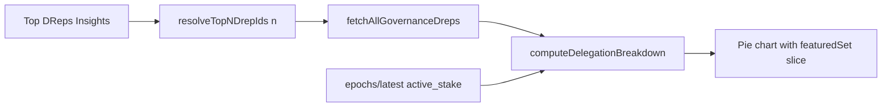

# Top DReps Insights

## Goal

Add a **Top DReps Insights** button next to **Emergo Insights** on [`src/pages/PopularDreps.tsx`](src/pages/PopularDreps.tsx). Opens a popup with the same pie chart + visibility checkboxes (undelegated, always abstain, no confidence), but the featured slice is **top N DReps by voting power** instead of the fixed Emergo ID list.

Default **N = 10**; user can change N in the modal and reload.

## Refactor first (avoid duplicate modal)

Both insights popups share ~95% of UI and math. Generalize before adding the new feature.

### 1. Generalize breakdown logic — [`src/functions/emergoInsights.ts`](src/functions/emergoInsights.ts)

Rename bucket `emergoSet` → `featuredSet` in types (internal; Emergo remains a specific featured set).

| Change | Detail |
|--------|--------|
| `DelegationBucketKey` | `featuredSet` replaces `emergoSet` |
| `DelegationBreakdownLovelace` | `featuredSet: number` |
| `classifyDrepDelegation(drepId, featuredSet)` | Auto buckets first; then if ID in `featuredSet` → `featuredSet`; else `otherDrep` |
| `computeDelegationBreakdown(dreps, activeStake, featuredSet)` | Parameterized featured ID set |
| `delegationBucketMeta(featuredLabel)` | Returns slice meta; featured label is `"Emergo set"` or `"Top 10 DReps"` etc. |
| `breakdownToCounts(breakdown, visibility, featuredLabel?)` | Unchanged checkbox behavior |

Keep existing exports as thin wrappers:

- `fetchEmergoInsightsBreakdown(apiKey)` → featured set = `EMERGO_INSIGHTS_DREP_IDS`
- `EMERGO_DELEGATION_BUCKET_META` = `delegationBucketMeta('Emergo set')`

Add top-N helpers:

```typescript
export const DEFAULT_TOP_DREPS_INSIGHTS_N = 10;

/** Top N active DReps by voting power; excludes special auto DReps. */
export async function resolveTopNDrepIds(apiKey: string, n: number): Promise<Set<string>>

export async function fetchTopDrepsInsightsBreakdown(
  apiKey: string,
  n: number
): Promise<{ breakdown: DelegationBreakdownLovelace; topDrepIds: string[] }>
```

**`resolveTopNDrepIds` algorithm** (matches leaderboard semantics):

1. Paginate `GET /governance/dreps?order_by=amount&order=desc&retired=false&expired=false` via existing [`fetchPopularDrepsPageFromBlockfrost`](src/functions/popularDrepsFetch.ts)
2. Skip `drep_always_abstain` / `drep_always_no_confidence` (reuse `SPECIAL_DREP_IDS` / `filterLeaderboardDreps` pattern)
3. Collect IDs until `n` reached (clamp N to 1–100 in UI)
4. Return normalized ID set + ordered list (for label: `"Top ${n} DReps"`)

**Breakdown fetch** (same as Emergo today):

1. `active_stake` from `/epochs/latest`
2. `fetchAllGovernanceDreps` (full pagination — required for accurate `otherDrep` + auto buckets)
3. `computeDelegationBreakdown(dreps, activeStake, topNSet)`



### 2. Shared modal — [`src/components/DelegationInsightsModal.tsx`](src/components/DelegationInsightsModal.tsx)

Extract from [`EmergoInsightsModal.tsx`](src/components/EmergoInsightsModal.tsx):

**Props:** `open`, `onClose`, `title`, `description`, `featuredSetLabel`, `loading`, `error`, `breakdown`

**Behavior (unchanged):** visibility checkboxes, pie + legend, ADA tooltips, reset visibility on open.

[`EmergoInsightsModal.tsx`](src/components/EmergoInsightsModal.tsx) becomes a thin wrapper passing `title="Emergo Insights"` and `featuredSetLabel="Emergo set"`.

### 3. Top-N modal — [`src/components/TopDrepsInsightsModal.tsx`](src/components/TopDrepsInsightsModal.tsx)

Wraps `DelegationInsightsModal` + controls:

- Number input for **N** (default 10, min 1, max 100)
- **Apply** button (or Enter) triggers refetch with new N
- `featuredSetLabel` = `Top ${n} DReps` (dynamic)
- Optional footnote listing count of resolved top IDs if fewer than N exist on-chain

Parent ([`PopularDreps.tsx`](src/pages/PopularDreps.tsx)) owns fetch state (`loading`, `error`, `breakdown`, `topN`) and calls `fetchTopDrepsInsightsBreakdown` on open / Apply.

### 4. Wire into page — [`src/pages/PopularDreps.tsx`](src/pages/PopularDreps.tsx)

Next to **Emergo Insights**:

```tsx
<Button onClick={handleOpenTopDrepsInsights} disabled={topInsightsLoading}>
  Top DReps Insights
</Button>
```

Separate modal state from Emergo (`topInsightsModalOpen`, etc.) so both can coexist without shared loading flags.

## Tests

Update [`src/functions/emergoInsights.test.ts`](src/functions/emergoInsights.test.ts):

- `classifyDrepDelegation` / `computeDelegationBreakdown` use explicit `featuredSet` argument
- `emergoSet` assertions → `featuredSet`

Add cases in same file or `topDrepsInsights.test.ts`:

- `resolveTopNDrepIds` logic (unit-test pure helper `collectTopNIdsFromRankedPages(items, n)` if fetch is mocked)
- Top-N IDs exclude auto DReps even when highly ranked
- `featuredSet` sums only IDs in the resolved top-N set

## Out of scope

- Caching top-N breakdown by N (can add later; Emergo doesn't cache either)
- Checkbox to hide Emergo/top-N featured slice (only the three existing toggles)
- Wiki ingest
