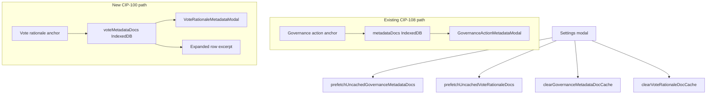

# DRep vote rationale metadata cache and in-app rendering

## Context

The page already has a full pipeline for **governance action metadata** (CIP-108):

- IndexedDB store `metadataDocs` in [`src/utils/governanceMetadataDocCache.ts`](src/utils/governanceMetadataDocCache.ts)
- Fetch/cache helpers in [`src/utils/governanceMetadataDocFetch.ts`](src/utils/governanceMetadataDocFetch.ts)
- Settings buttons in [`src/components/DRepVotingHistorySettingsModal.tsx`](src/components/DRepVotingHistorySettingsModal.tsx)
- Collapsed-row titles + `GovernanceActionMetadataModal` for full in-app view

**Vote rationale** (CIP-100) is different:

- Anchor pointers live in the `drepVotes` store ([`CachedVoteAnchorInfo`](src/utils/drepVotingHistoryCache.ts))
- Expanded rows only open [`IpfsLinkModal`](src/components/IpfsLinkModal.tsx) (external gateway links)
- [`loadActionMetadataViaGateway`](src/functions/governanceActionsFetch.ts) parses **CIP-108 only** (`body.title`, `body.rationale`, etc.) and returns `schema_mismatch` for CIP-100 docs (`body.comment`) — so vote rationale needs its own parser and fetch path



## Design decisions

| Decision | Choice |
|----------|--------|
| Cache store | New IndexedDB object store `voteMetadataDocs` in the same DB (`ctools-drep-voting-history`), bump version **2 → 3** |
| Cache key | `drepVoteCacheKey(drepId, proposalKey)` — rationale is per-DRep per-proposal ([`src/utils/drepVotingHistoryCache.ts`](src/utils/drepVotingHistoryCache.ts)) |
| Cache hit rule | Same as governance: entry exists **and** `entry.anchorUrl === row.voteAnchor.url` |
| Parse target | Primary: `body.comment`; fallback: `body.rationale` for legacy/bad-format anchors |
| Inline display | **Expanded row only** (user choice): truncated markdown excerpt when cached + modal for full view; keep existing IPFS link button |
| Errors | Never cache fetch failures (same rule as governance docs) |

## Implementation

### 1. CIP-100 parse + fetch primitives

**Extend** [`src/functions/cip100RationaleDocument.ts`](src/functions/cip100RationaleDocument.ts):

```typescript
export interface VoteRationaleMetadata {
  comment: string | null;
}

export function parseCip100RationaleMetadata(payload: unknown): VoteRationaleMetadata | null
```

- Walk `root.body` (or root) for `comment`, then fallback `rationale`
- Return `null` if no non-empty text found

**New file:** [`src/utils/voteRationaleDocFetch.ts`](src/utils/voteRationaleDocFetch.ts)

Mirror [`governanceMetadataDocFetch.ts`](src/utils/governanceMetadataDocFetch.ts):

- Reuse `resolveMetadataFetchUrl` + `IPFS_GATEWAYS` + `parseIpfsLink` for gateway resolution
- `fetchVoteRationaleDocWithGatewayFallback(anchorUrl)` — HTTP fetch + `parseCip100RationaleMetadata`
- `ensureVoteRationaleDocCached({ cacheKey, anchorUrl, hashHex, gatewayIndex? })` → `'cached' | 'fetched' | 'failed'`
- `prefetchUncachedVoteRationaleDocs(items, { concurrency: 6, onProgress })`

Add unit tests in [`src/utils/voteRationaleDocFetch.test.ts`](src/utils/voteRationaleDocFetch.test.ts) (gateway fallback, progress counts, legacy `body.rationale` parsing).

### 2. IndexedDB cache layer

**New file:** [`src/utils/voteRationaleDocCache.ts`](src/utils/voteRationaleDocCache.ts)

Mirror [`governanceMetadataDocCache.ts`](src/utils/governanceMetadataDocCache.ts):

```typescript
export interface CachedVoteRationaleDoc {
  metadata: VoteRationaleMetadata;
  rawPayload: unknown;
  anchorUrl: string;
  hashHex?: string;
  cachedAtSec: number;
}
```

Exports: `getVoteRationaleDocCache`, `putVoteRationaleDocCache`, `loadAllVoteRationaleDocCache`, `countVoteRationaleDocCache`, `clearVoteRationaleDocCache`, `isVoteRationaleDocCacheHit`.

**Update** [`src/utils/drepVotingHistoryCache.ts`](src/utils/drepVotingHistoryCache.ts):

- `DREP_VOTING_HISTORY_DB_VERSION = 3`
- `export const STORE_VOTE_METADATA_DOCS = 'voteMetadataDocs'`
- Create store in `onupgradeneeded`

Add tests in [`src/utils/voteRationaleDocCache.test.ts`](src/utils/voteRationaleDocCache.test.ts).

### 3. In-app view modal

**New file:** [`src/components/VoteRationaleView.tsx`](src/components/VoteRationaleView.tsx)

- Render `metadata.comment` via existing [`MarkdownContent`](src/components/MarkdownContent.tsx)
- Reuse governance modal CSS classes (`governance-metadata-panel`, toolbar, JSON view)

**New file:** [`src/components/VoteRationaleMetadataModal.tsx`](src/components/VoteRationaleMetadataModal.tsx)

Mirror [`GovernanceActionMetadataModal.tsx`](src/components/GovernanceActionMetadataModal.tsx):

- Props: `open`, `cacheKey`, `anchorUrl`, `hashHex`, `proposalLabel`, `onClose`, `onCacheUpdated`
- Cache-first via `ensureVoteRationaleDocCached`
- Formatted / JSON toggle, wide view, IPFS gateway retry on error
- Title: **Vote rationale**

### 4. Expanded row UI

**Update** [`src/components/DRepVotingHistoryRowDetails.tsx`](src/components/DRepVotingHistoryRowDetails.tsx):

In the **Rationale** field, when anchor is present:

- If `cachedRationaleExcerpt` is set: show truncated preview (e.g. first ~200 chars, `word-break`)
- **View full rationale** button → new `onOpenVoteRationaleModal` callback
- Keep existing **Rationale** text button → `IpfsLinkModal` (raw IPFS/URL access)

Add `VoteRationaleModalRequest` type (url, hashHex, proposalId, proposalTxHash, proposalCertIndex).

**Update** [`src/components/DRepVotingHistoryRow.tsx`](src/components/DRepVotingHistoryRow.tsx) to pass through new props.

### 5. Page state, handlers, and settings buttons

**Update** [`src/pages/DRepVotingHistory.tsx`](src/pages/DRepVotingHistory.tsx):

New state (parallel to governance metadata):

- `voteRationaleDocCache: Map<string, CachedVoteRationaleDoc>`
- `voteRationaleExcerptByKey: Map<string, { excerpt: string; anchorUrl: string }>`
- `cachedVoteRationaleDocCount`, `prefetchingVoteRationale`, `votePrefetchModalOpen`, `votePrefetchProgress`
- `voteRationaleModal: VoteRationaleModalRequest | null`

New helpers:

- `refreshVoteRationaleDocCacheState()` — load all docs for current `drepId` prefix, build excerpt map
- `uncachedVoteRationaleCount` memo — rows with `vote && voteAnchor.status === 'present' && url` and cache miss
- `resolveCachedRationaleExcerpt(row)` — anchor URL match check
- `handleLoadUncachedVoteRationale` — build items with `cacheKey: drepVoteCacheKey(drepId, proposalKey(...))`, run `prefetchUncachedVoteRationaleDocs`, refresh state
- `handleClearVoteRationaleDocCache` — clear store + reset local state

Wire `VoteRationaleMetadataModal` at page level (same pattern as `GovernanceActionMetadataModal`).

**Update** [`src/utils/drepVotingHistoryRecacheHelpers.ts`](src/utils/drepVotingHistoryRecacheHelpers.ts):

```typescript
export const VOTE_RATIONALE_PREFETCH_MODAL_TITLE = 'Loading vote rationales';
export function formatVoteRationalePrefetchDescription(current, total, failed): string
```

**Update** [`src/components/DRepVotingHistorySettingsModal.tsx`](src/components/DRepVotingHistorySettingsModal.tsx):

Add a second section below governance metadata stats:

| Stat / button | Props |
|---------------|-------|
| Vote rationale documents cached: **{n}** | `cachedVoteRationaleDocCount` |
| Uncached vote rationale documents: **{n}** | `uncachedVoteRationaleCount` |
| Load {n} uncached vote rationale documents | `onLoadUncachedVoteRationale` |
| Clear {n} cached vote rationale documents | `onClearVoteRationaleDocs` |

Disable while `loading || anchorLoading || recaching || prefetchingMetadata || prefetchingVoteRationale`.

Update modal description copy to mention both document types.

## Files touched

| File | Change |
|------|--------|
| [`src/functions/cip100RationaleDocument.ts`](src/functions/cip100RationaleDocument.ts) | Add `VoteRationaleMetadata` type + `parseCip100RationaleMetadata` |
| [`src/utils/voteRationaleDocCache.ts`](src/utils/voteRationaleDocCache.ts) | **New** — IndexedDB CRUD |
| [`src/utils/voteRationaleDocFetch.ts`](src/utils/voteRationaleDocFetch.ts) | **New** — fetch + bulk prefetch |
| [`src/utils/drepVotingHistoryCache.ts`](src/utils/drepVotingHistoryCache.ts) | DB v3 + `voteMetadataDocs` store |
| [`src/components/VoteRationaleView.tsx`](src/components/VoteRationaleView.tsx) | **New** — markdown render |
| [`src/components/VoteRationaleMetadataModal.tsx`](src/components/VoteRationaleMetadataModal.tsx) | **New** — full in-app viewer |
| [`src/components/DRepVotingHistoryRowDetails.tsx`](src/components/DRepVotingHistoryRowDetails.tsx) | Excerpt + View full rationale |
| [`src/components/DRepVotingHistoryRow.tsx`](src/components/DRepVotingHistoryRow.tsx) | Pass new props |
| [`src/components/DRepVotingHistorySettingsModal.tsx`](src/components/DRepVotingHistorySettingsModal.tsx) | Vote rationale stats + buttons |
| [`src/pages/DRepVotingHistory.tsx`](src/pages/DRepVotingHistory.tsx) | State, handlers, modal wiring |
| [`src/utils/drepVotingHistoryRecacheHelpers.ts`](src/utils/drepVotingHistoryRecacheHelpers.ts) | Vote prefetch modal copy |
| `*.test.ts` | Cache, fetch, parse tests |

## Testing checklist

- Settings shows correct cached/uncached vote rationale counts after page load
- **Load uncached** populates IndexedDB; expanded rows show excerpt without opening modal
- **Clear** removes excerpts and resets counts; uncached count increases accordingly
- **View full rationale** modal: cache hit is instant; miss fetches via IPFS gateway fallback
- Legacy anchors with `body.rationale` (not `comment`) still parse and display
- Buttons disabled while anchor enrichment, recache, or either metadata prefetch is running
- Existing governance metadata cache/prefetch/clear behavior unchanged

## Out of scope

- Collapsed-row vote rationale excerpt (user chose expanded-only)
- Cancelling mid-prefetch
- Wiki page update (optional follow-up)
